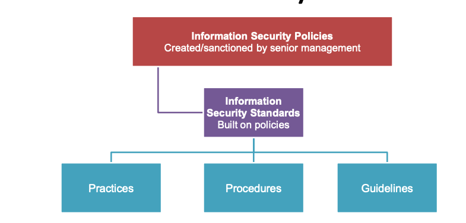

# Week 5 - Security Dimensions

## Operations security

How an enterprise goes about there business mostly about procedures and processes,
access controls, authorisations, and protective measures

### Defence Strategy

- Think like a criminal
- What is valuable to the organisation
- What methods would be used

Then

- Develop methods to counter criminal activities
- Training and prevention programs

### Potential sources information gathering for criminals

- Observations e.g. looking over shoulder
- Openly available information e.g. passwords on notes
- Dumpster Diving, inappropriate dumping of information
- Compromising systems through known holes
- Compromising people

### Prevention through monitoring

Activities that can be monitored are :

- Login attempts/Timing of logins
- Workstations logged in at
- Password management
- Email Security
- Systems usage (CPU, processes etc)
- Network communications
- Websites accessed

Random check is more effective

### Staff Training

Updating polices and reminders about security issues

### Data Backups

Performed on a regular basis hourly, daily, weekly etc

- **Full backup**
- **Incremental backup**
- **Differential backup** - files that have been changed

At least one off-site backup, with recovery options being very well documented and texted

### Computer Security Plan

- Plan that documents all the safeguards in place to protect a enterprises information security
- Reviewed annually, plan may become action plans and should be tested from time to time

### Disaster Recovery

Pertains to business continuity

- Emergency plan
- Backup plan
- Recovery Plan
- Test Plan

### Emerging Issues

- Increasing security requires greater level of administration and controls
- Increasing flexibility requires fewer
  administrative measures and controls

Some control measure issues include:

- **Access**
- **Identification**
- **Authentication**
- **Authorisation**

Business IS resonsibilities

- **Accountability** – associates activities with the person responsible
- **Awareness** – users need to be aware of
  security issues
- **Administration** – the security of the
  information business asset must be managed

---

## Information Security Plan

### Inspection

- Identify qey corporate functions
- Identify capabilities needed
- Get security needed

### Protection

- Pro-active risk reduction
- Decisions on protecting, level of protection and how to implement protection
- Result of security design

### Detection

- Reactive risk reduction
- Detection of security breaches
- Examining attacker, methods of attack and technology used

### Reaction

- Plan to react on security breaches
- Identify, document and test the responses

### Reflection and Review

- When an incident occurs
- How to improve
