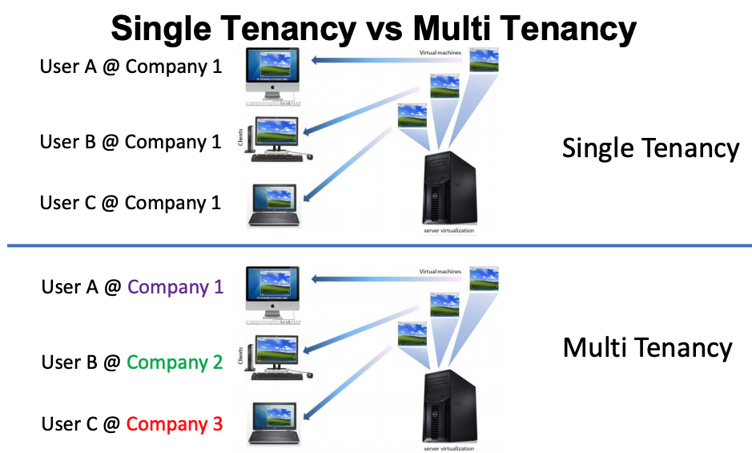
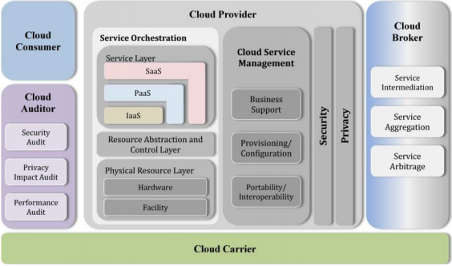
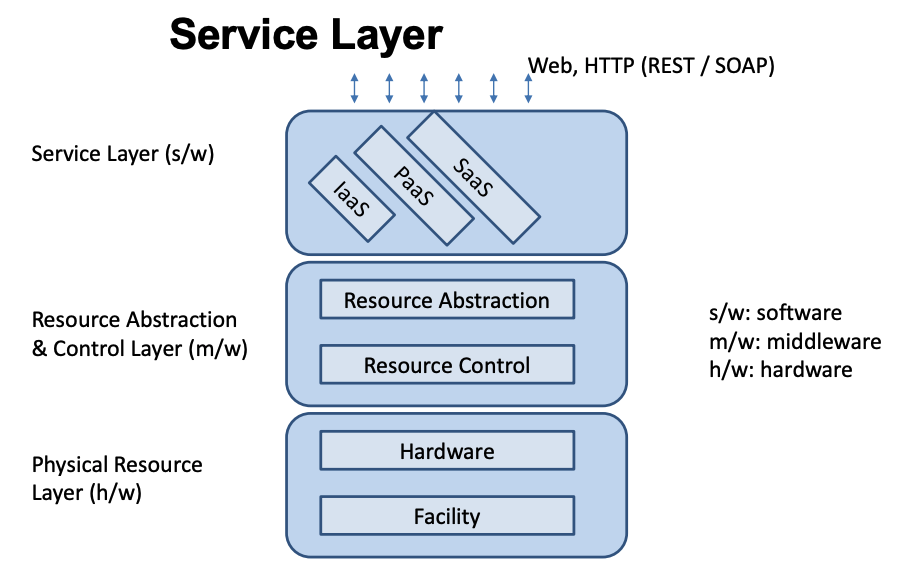

# Cloud Computing 3 - Cloud Architecture

Cloud computing is required to meet the requirement of **scalability**,**cost efficiency**, **legal agreement** & **business**

## Architecture for Elasticity (Scale)

- Vertical Scale-Up - Adding more power e.g. adding more CPU, RAM etc
- Horizontal Scale Out - Adding more machines e.g. distributed databases

## [National Institute of Standards and Technology (NIST) Cloud Computing Reference Architecture](https://www.nist.gov/publications/nist-cloud-computing-reference-architecture)

- On demand self-service
- Broad network access
- Resource pooling
- Rapid elasticity
- Measured service

**Cloud Service Orchestration** - Composition of system components to support Cloud
Providers activities in arrangement, coordination and management of computing resources in order to provide cloud services to Cloud Consumers

## Actors in Cloud Computing

- **Cloud Consumer** A Person or Organisation That Maintains a Business Relationship with, & Uses Service From, Cloud Providers
- **Cloud Provider** A Person, Organisation, Or Entity Responsible for Making A Service Available to Interested Parties
- **Cloud Auditor** A Party That Can Conduct Independent Assessment of Cloud Services, Information System Operations, Performance &Security Of The Cloud Implementation
- **Cloud Broker** An Entity That Manages The Use, Performance & Delivery Of Cloud Services, & Negotiates Relationships Between Cloud Providers & Cloud Consumers
- **Cloud Carrier** An Intermediary That Provides Connectivity & Transport Of Cloud Services From Cloud Providers to Cloud Consumers
