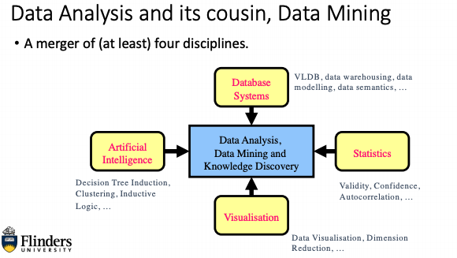
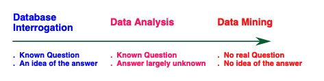
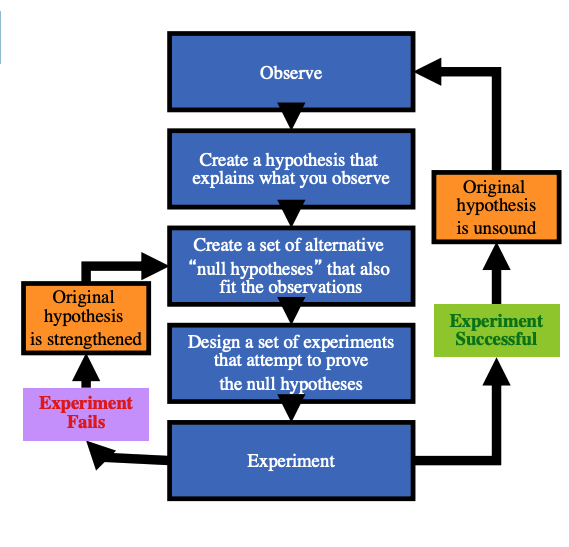

# Week8 Intro to Data Analysis and Data Mining

---

- **Database queries** - Return answers to well formed questions
- **Data analysis** - Gives answers to questions which might require some discussion or when the answer is first vague
- **Data mining** - Allows question itself to be ill-formed "Tell me something interesting about"

## Terms:

- **Data Analysis** is the term used to describe the process used to interrogate a dataset
- **Data Mining** is the term used to describe the algorithms/routines used to discover interesting aspects about a dataset
- **Knowledge Discovery** is the term used to describe the overarching discovery architecture

## Reasons of increase of Data analysis and Data Mining

Technology:

- Cheaper storage
- More processing power

Socio-Economic and Logistical Drivers:

- Value of information recognised
- Staff shortages and staff turnover
- Complexity of data

## Deductive Logic

Process of Reasoning from one or more statements to reach a logical conclusion. Example Bob is father of Mary

## Inductive knowledge

Learn from our experiences and learn from them e.g. bus arrives around 9am (not exact by close to)

## Scientific Induction

Observation that creates a hypothesis and methods used, also design a set of experiments that prove the hypothesis

