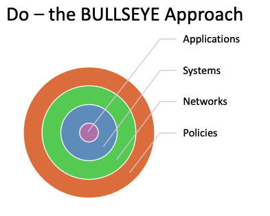

# Week 12 Implementation

- [Week 12 Implementation](#week-12-implementation)
  - [Review and Assess](#review-and-assess)
  - [Plan](#plan)
    - [Other factors](#other-factors)
  - [Implementation Issues](#implementation-issues)
  - [Certification](#certification)
  - [Maintaining Security](#maintaining-security)
  - [Security Roles](#security-roles)

---

To implement “new” security into information
systems, strategy similar to Risk Management

## Review and Assess

- Action plan
- Identify activities

## Plan

Planning stage same as for any project

- Identification of tasks
- Budgets
- Timelines & Sequences
- Work allocations
- Controls

- Policies, Define ground rules to be followed
- Networks, Internet has opened up opportunities for many new vulnerabilities
- Systems,have become larger and more complex, now have polices procedures and ongoing issues
- Application,Applications are running in a contextual environment, so the environment needs to be sound before worrying too much about the applications. Also many packages are 3rd party provided

### Other factors

- Governance,planning around obsolescence and updates
- Change controls, changes to policy, environments, systems andd application
- Cultural change in organisations, improving systems for security.Basic approach is the Lewin model
  - Unfreeze old notions
  - Move to new ideas and approaches
  - Refreeze with new attitudes

## Implementation Issues

- Technical issues, hardware and software implementation which includes purchase, install, configure, update, maintain etc
- Non-technical issues, are more complex and involve organisational changes and change of culture
  - **Communicate** – inform and discuss
  - **Educate** – focussed attention for specific cases, training
  - **Engage** – show employees that they are valued, and concern for their well-being is felt

## Certification

- Often chosen by enterprises to indicate an
  external accreditation of their actions and
  implementation.
- Largely marketing driven – improve brand image
- May be a requirement in order to engage with some
  other business enterprises
- May increase confidence level of customers in doing business with the enterprise

## Maintaining Security

Continuous process, arising from matters such as

- Acquisition and disposal of assets
- Change in business activities, priorities, processes
- Formation or dissolution of alliances with other
  enterprises
- Staff changes – particularly senior staff

## Security Roles

- **Small**, part time task role handled by IT department
- **Medium**, part time role handled by IT department
- **Large**, full time roles such as Security engineers and
