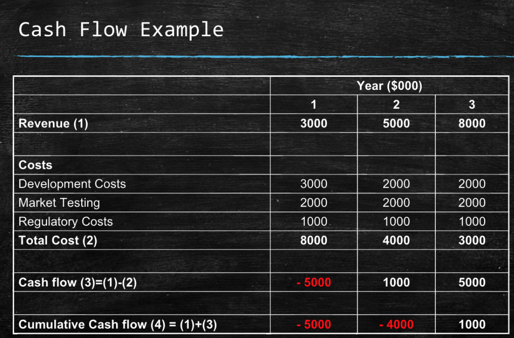
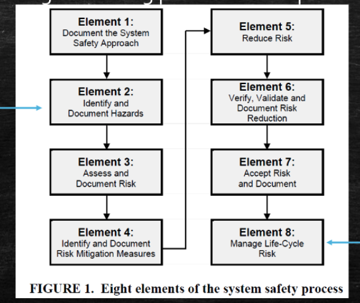
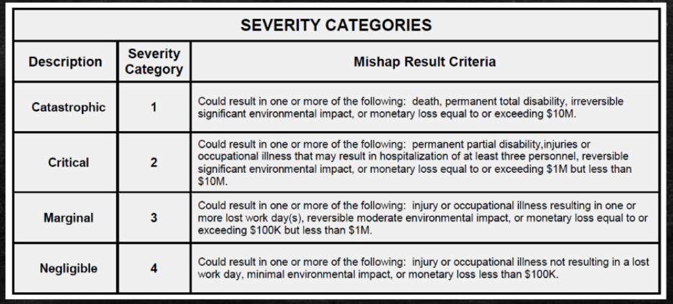

# Week10 Project Finance and Validation

## Financial Projections

## EOU

## Break-even analysis

## ROI

## NPV

## Cash-Flow Analysis

- Examines the direction, size and pattern of cash flow associated with the business
- Helps determine when to borrow money and when to pay bills

### Example

## Profit and Lost

Sales - Cost of Sales = Gross Profit

--

## Design for Safety

- Considering safety in the design phase
- Early in design: 
  - Identify hazards that can be controlled
  - Identify ways the design can be modified to prevent them

- Safety review program during product development: 

### Military Standard 882
  

"Consider and use mishap data; relevant environmental and occupational health data; user physical characteristics; user knowledge, skills, and abilities; and lessons learned from legacy and similar system life-cycle and potential impacts to personnel, infrastructure, defence systems, the public and the environment. Identified hazards are well documented"

## Products Liability

- Duties-based
- Conflict of interest
- Safety is paramount
- Check regulations to make sure product is compliant

### Most Common Defence

- Customer misuse
- Modification of product
