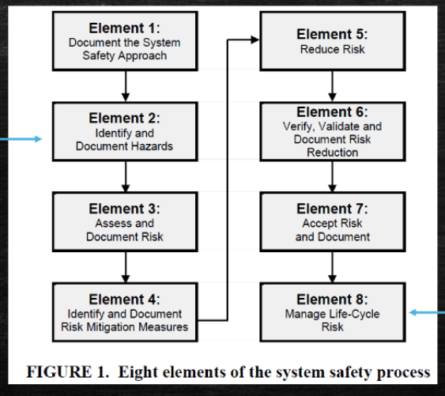

# Week11 Project planing and control

## Design/Safety Reviews

- Periodic design and safety reviews

## How to determine safety

- Brainstorming
- design failure documents
- testing regime
- past projects/products
- Recalls/warranty
- Injury with competitors

## Defence

- Misuse
- Modification

---
Project planing and control

## Project Monitoring

- Plan the work, then work the plan
- Measuring actual progress against planned progress on a timely and regular manner
- If corrective actions are required, decisions must be made regarding scope, time and cost
