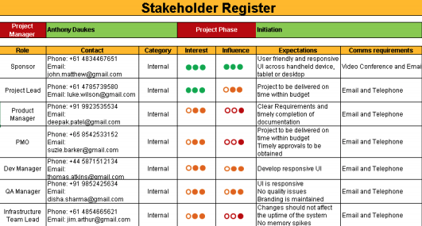
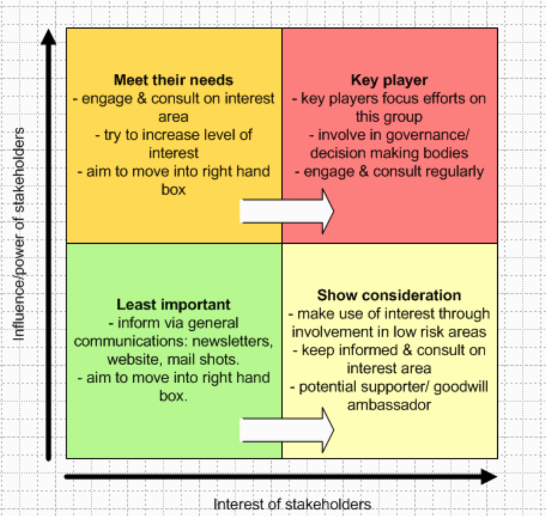
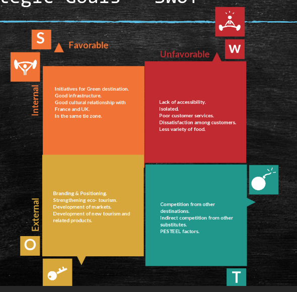
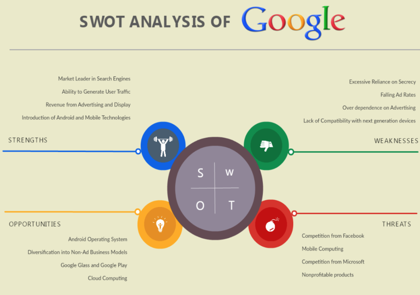
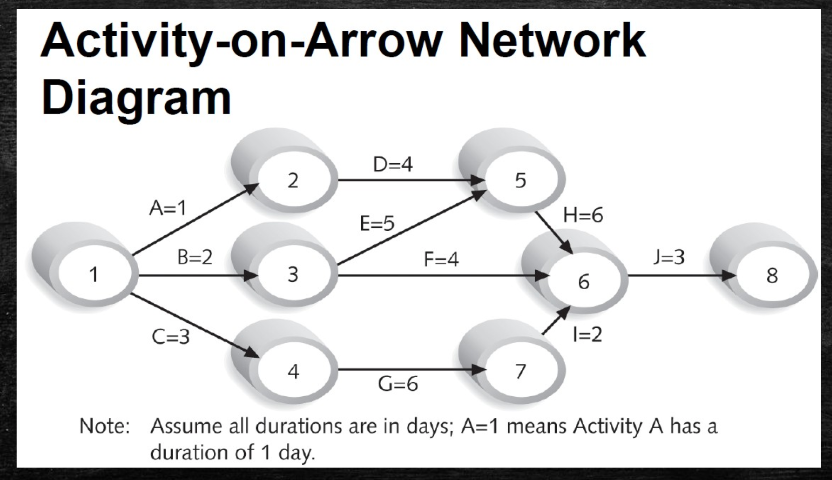
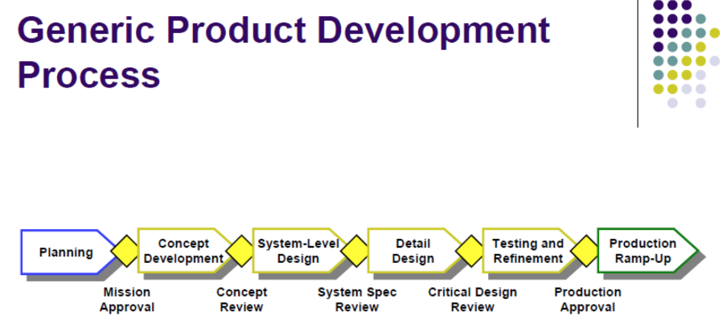
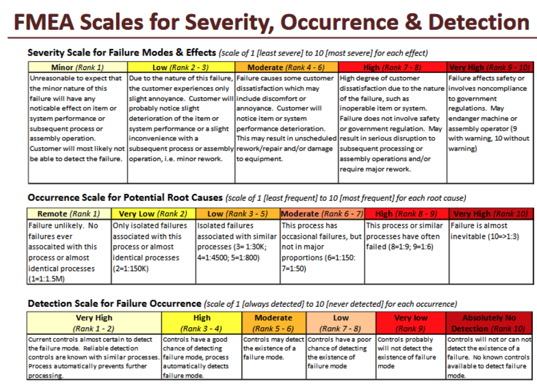

# Week 2 Team Management and Innovation Management

- [Week 2 Team Management and Innovation Management](#week-2-team-management-and-innovation-management)
  - [High level design](#high-level-design)
  - [Phase 1 : Design](#phase-1--design)
  - [Stakeholder Register](#stakeholder-register)
    - [Stakeholder Analysis](#stakeholder-analysis)
  - [The market and customer](#the-market-and-customer)
  - [Strategic Goals - SWOT Analysis](#strategic-goals---swot-analysis)
  - [Network Diagram](#network-diagram)
  - [FMEA (Failure Modes and Effect Analysis)](#fmea-failure-modes-and-effect-analysis)
    - [Benefits fo FMEA](#benefits-fo-fmea)
    - [FMEA measurements](#fmea-measurements)
  - [Example](#example)

## High level design

Think about the different stakeholders, try focus on the customer.

The market and the customer:

- Needs
- Wants
- Market
- User

## Phase 1 : Design

Find what the customer needs:

- Insight
- Experience
- Surveys
- Interviews
- Focus Groups

Differentiate needs from wants, the wants can drive competition and innovative edge.

## Stakeholder Register

Who are all the stakeholders in this project, so that we can consider
their needs, wants, or solicit their input?

Parties that are:

- Affected by project decisions.
- Have a stake in the success or failure of the project.
- May be involved in the project at different times, may or may not be team
  members. All of the team members (constant or sporadic) are stakeholders.

### Stakeholder Analysis

## The market and customer

Main questions:

- What would someone be willing to pay?(Demand)
- Value proposition
- What is the market?
- Competition?
- What problem does it solve?
- Cost of manufacturing

## Strategic Goals - SWOT Analysis

- Look internally and external
- What are you trying to do vs what can you do

## Network Diagram

- A schematic display of the logical relationships among, or sequencing of, project
  activities.
- Activities are represented by arrows and connected at
  points called nodes(starting and ending point of an activity)
- Allows for critical path management (CPM)

## FMEA (Failure Modes and Effect Analysis)

- FMEA - Brainstorm all the ways our product can fail and prevent it from failing
- What are the intended functions of the component and how could it fail

### Benefits fo FMEA

- Higher reliability
- Better quality
- Increased safety
- Enhanced customer satisfaction
- Contributes to cost savings.
- Decreases development time and re-design costs
- Decreases warranty costs
- Decreases waste, non-value added operations
- Contributes to continuous improvement
- RPN: Risk Priority Number

### FMEA measurements

## Example

> A new Ghana truck manufacture called kantaka is being established. What are the need and strategic goals? also what questions should be asked? and what would there mission statement be?

Questions:

- Terrain - capability
- Roads - durability
- Gas – siphon?
- Local incomes?
- Local Manufacturing base? How to manage foreign manufacturing? Make/buy decisions?
- Parts supply. Standard parts? Modules for easy replacement if mechanic is not available?
  Easy to diagnose?
- Long range, long distances without gas stations
- Few local competitors – capitalize on
- Low local labor rates – leverage
- Brand is unknown/untested – how to raise awareness?
- No regulations, no IP enforcement
- Financial facilities for capital investment
