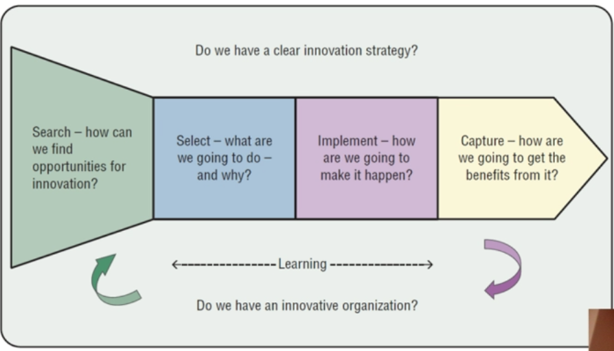

# Week3 Innovation Management

- [Week3 Innovation Management](#week3-innovation-management)
  - [Work Breakdown Structure (WBS)](#work-breakdown-structure-wbs)
    - [Example](#example)
  - [Task Delegation](#task-delegation)
    - [The project manager encourages this by](#the-project-manager-encourages-this-by)
  - [Innovation Management](#innovation-management)

## Work Breakdown Structure (WBS)

- Breaks down work of a project int smaller manageable tasks in a logical hierarchy abd depicted in a graphical format
- Can be done as a product focus or person focus
- Start with high level task and break them down into sub-tasks

### Example

1. Electrical Control Model
   1. PCB
      1. Board
      2. Connector
   2. Software
      1. Software Design
      2. Software Coding
      3. Software Testing
   3. Case hardware

## Task Delegation

**Tannenbaum/Schmidt Continuum** - If the project team is experience d the team will become more self-sufficient

### The project manager encourages this by

- Allowing for more delegation the team to generate solution
- Encourage and enable the team to generate solutions
- Work to remove roadblock's and barrie's in front of team
- Marshall resources to support the team

- In large projects, each team member should have management documents (timelines)
- Supervision with documents to allow team members to account for their activity and plans

## Innovation Management

**Intrapraneurship** - Promoting ideas and providing finding for new product ideas within the company

- Consider ideas outside of the line of business
- Use revenue sharing of profitable ideas
- Encourage employees to continuously monitor direct competitors and indirect competitors
- Build time into the program for team members to innovate (eg google spends 20%)

