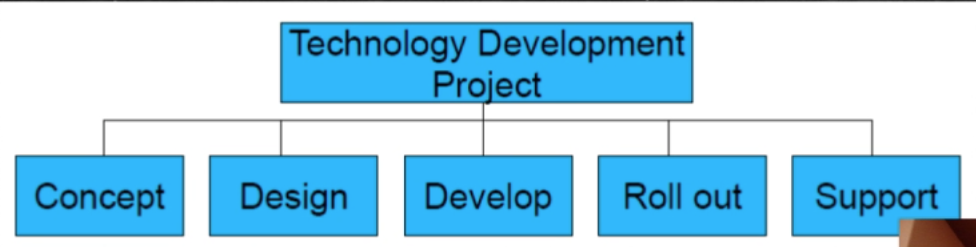

# Week3 Innovation Management

- [Week3 Innovation Management](#week3-innovation-management)
  - [Work Breakdown Structure (WBS)](#work-breakdown-structure-wbs)
    - [Example](#example)

## Work Breakdown Structure (WBS)

- Breaks down work of a project int smaller manageable tasks in a logical hierarchy abd depicted in a graphical format
- Can be done as a product focus or person focus
- Start with high level task and break them down into sub-tasks

### Example

1. Electrical Control Model
   1. PCB
      1. Board
      2. Connector
   2. Software
      1. Software Design
      2. Software Coding
      3. Software Testing
   3. Case hardware
