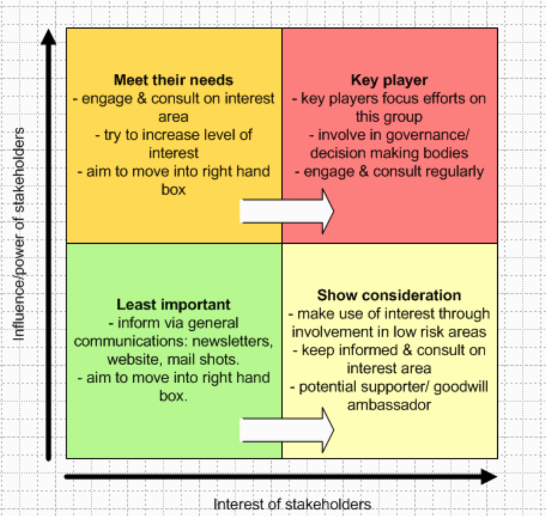
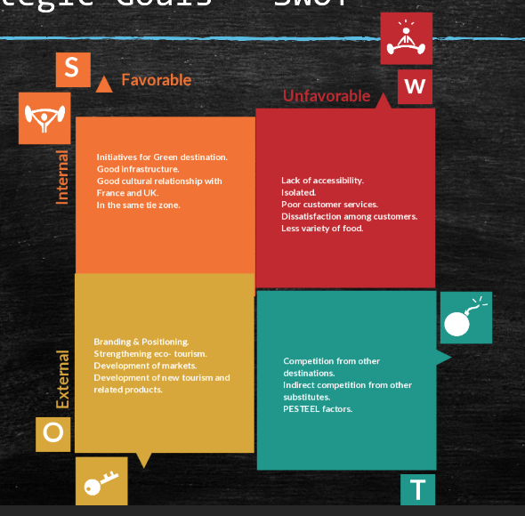
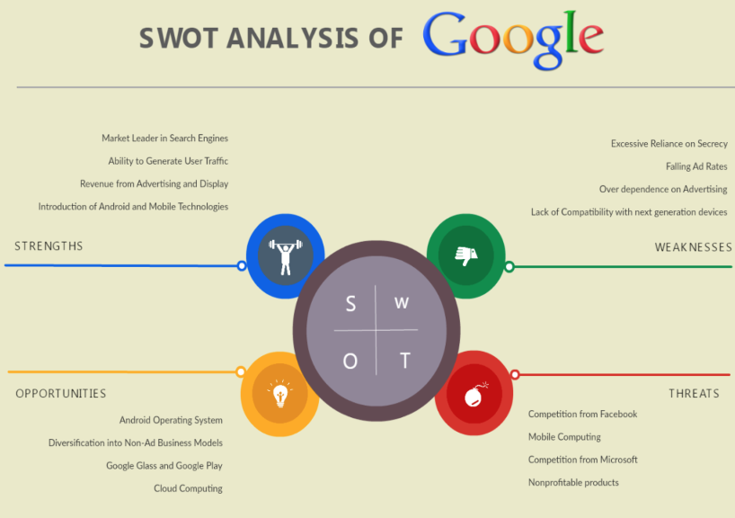
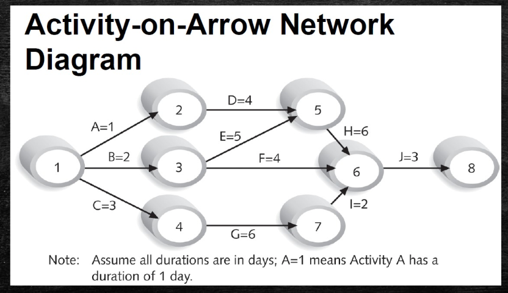
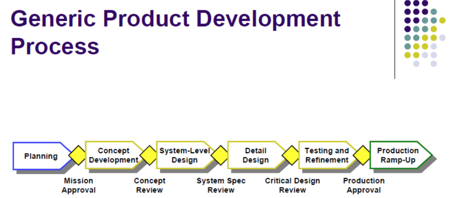

# Week3 Team Management and Innovation Management

## High level design

Think about the different stakeholders, try focus on the customer.

The market and the customer:

- Needs
- Wants
- Market
- User

## Phase 1 : Design

Find what the customer needs:

- Insight
- Experience
- Surveys
- Interviews
- Focus Groups

Differentiate needs from wants, the wants can drive competition and innovative edge.

## Stakeholder Register

### Stakeholder Analysis

## The market and customer

Main questions:

- What would someone be willing to pay?(Demand)
- Value proposition
- What is the market?
- Competition?
- What problem does it solve?
- Cost of manufacturing

## Strategic Goals - SWOT Analysis

- Look internally and external
- What are you trying to do vs what can you do

## Network Diagram

Find the critical path

## FMEA (Failure Modes and Effect Analysis)

FMEA (Failure ) - Brain storm all the ways our product can fail and prevent it from failing

Questions to ask:

- What are the intended functions of the component and how could it fail
-

### Benefits fo FMEA:

- Higher reliability
- Better quality
