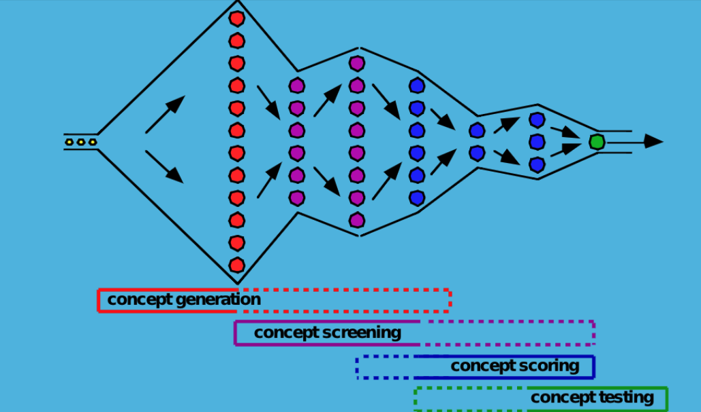
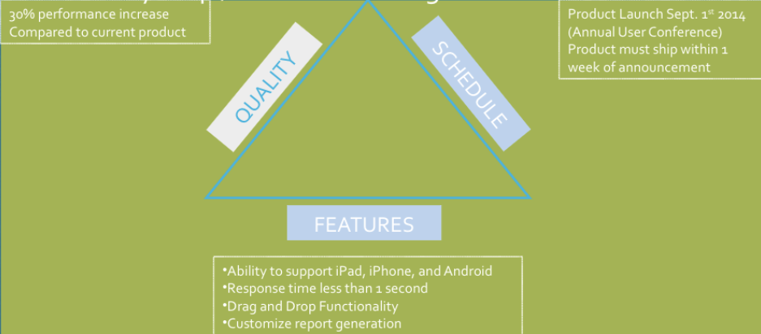
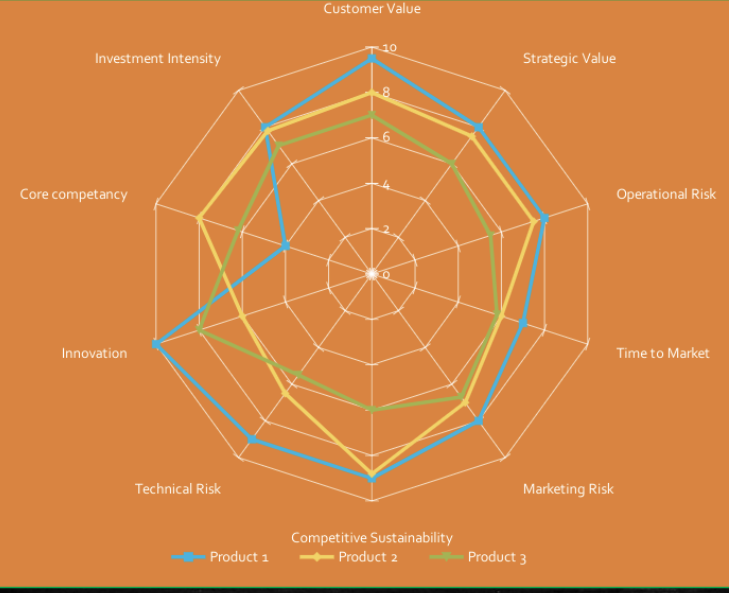

# Week5 Intellectual Property and Competition Strategy

- [Week5 Intellectual Property and Competition Strategy](#week5-intellectual-property-and-competition-strategy)
  - [1. Brainstorming](#1-brainstorming)
  - [2. 635 Brain writing](#2-635-brain-writing)
  - [3. Ringii](#3-ringii)
    - [Concept Workflow](#concept-workflow)
  - [Concept Selection Tools](#concept-selection-tools)
    - [1. Boundary Map/ Constraint Triangle](#1-boundary-map-constraint-triangle)
    - [2. Radar Chart](#2-radar-chart)
  - [Concept Decision](#concept-decision)
  - [Futuring](#futuring)
  - [Problem Re-framing Matrix](#problem-re-framing-matrix)
  - [SCAMPER Method](#scamper-method)
  - [Benchmarking](#benchmarking)
    - [Intellectual Property](#intellectual-property)
  - [Patents](#patents)
    - [Types of Patents](#types-of-patents)
      - [Provisional](#provisional)
      - [Non-Provisional](#non-provisional)

## 1. Brainstorming

## 2. 635 Brain writing

- Building ideas using online tools

## 3. Ringii

- Ringii is a japanese concept where a problem is presented to a group and add an idea or solution to it, where the idea is building on the idea

### Concept Workflow

## Concept Selection Tools

- Gradually selecting a solution
- sing objective decision measures, because people tend to get invested in their ideas and advocate for them

### 1. Boundary Map/ Constraint Triangle

Use three metrics that are the most important

### 2. Radar Chart

Ranking and weighting multiple ideas based on the ket criteria for the technology

## Concept Decision

After a concept with the most potential is selected the design work will commence

--

## Futuring

- Group asks "what if" questions such as what is the system could do this
- What are characteristics of an ideal solution?
- What would make the system better even if infeasible at the moment?

## Problem Re-framing Matrix

Helps find a new perspective when you are stuck

- Draw a matrix with the problem in the middle
- Decide on the perspectives
- Develop factors for each perspective
- Customer, Company, Competitive, Technology perspectives

## SCAMPER Method

- Idea generator for creative solutions
  - **Substitute**, different materials that can be used, different approaches
  - **Combine**, can i use combine new materials
  - **Adapt**, what ideas are related to this, different markets, different concepts, what could be copied
  - **Modify**, What if i scale up or down, what if i make changes on the system
  - **Put to other use**, what else is this used for
  - **Eliminate**, can i dived, do without, reduce wastage
  - **Reverse**, what if i do the opposite, do it backwards

Examples

- Substitute: Copper cables for Optical fibre
- Combine
- Adapt
- Modify
- Put to other use
- Eliminate
- Reverse

## Benchmarking

- Patents
- Journals
- Competitors

---

### Intellectual Property

## Patents

- Any idea for system, machine, article of manufacturing, material, process or method
- important to competition
- 20 yeas of exclusive use from the filing date
- Must be:
  - Novel
  - Not obvious
  - First to file wins

### Types of Patents

#### Provisional

- A quick, non-formal specification filed to preserve your filing date
- No claims
- Only lasts 1 year

#### Non-Provisional

- Formal patent application that lasts 20 years
