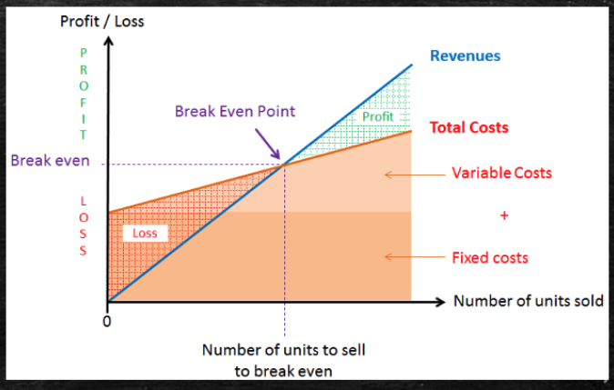
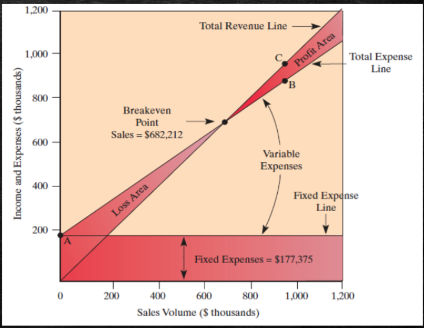
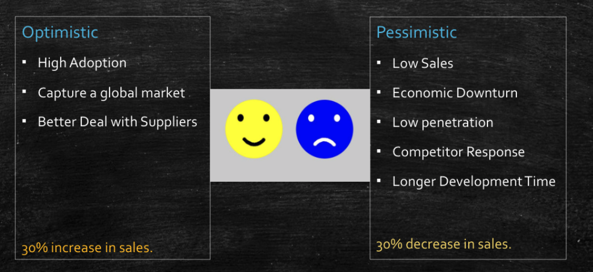
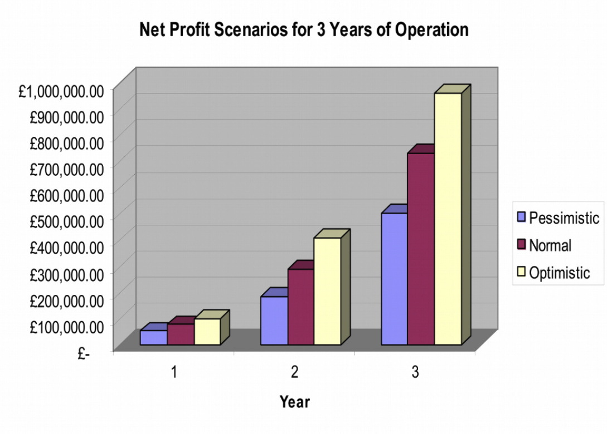
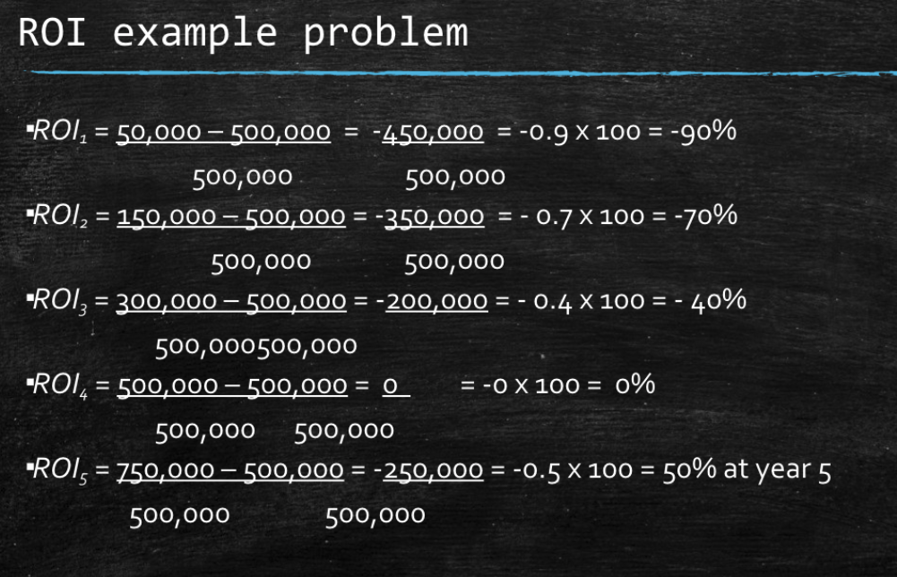

# Week8 Project Finance and Feasibility

Things to consider:

- Product cost - capital investment cost, material costs, labour costs
- Development Costs - Labour, equipment, R&D, maintenance costs etc

## Financial Plan

- The budget of the projects
- Projected income and when its cash flow positive
- Show investors, managers, the plan and financials

### Budgeting

pro-formas financials include pre-production and post-launch

### Pre-production

- Employee costs
- Facilities (Rent and utilities)
- Prototype costs
- Testing
- Equipment, computers
- Manufacturing equipment
- marketing costs
- Legal costs
- Regulatory costs

### Post-launch

- Inventory costs
- Costs of marketing
- Taxes
- cost of sales activities
- cost of materials
- Employees
- Facilities

## Sales Forecasting

- Contracts of a certain volume
- Compare with competitors in the same industries
- Compare established companies and project a percentage of their sales

## Economics of One Unit (EOU)

- The total cost of one unit (materials, manufacturing, labour, packaging and shipping)

## Break-even Analysis

- The value of sales against costs needed to meet the break even cost
- Show a graph
- Use best case and worst case, either low/high sales prices etc
- Tracking progress of actual vs projected

## Financial Projection Scenarios

## Return on Investment (ROI)

Quantifies the project value

### Example

Company purchases machine for 500 K which makes 50 K income every year.

