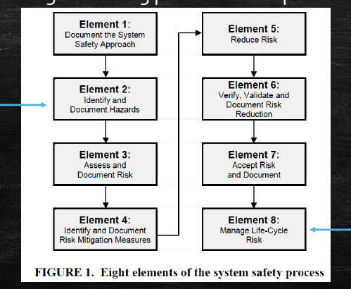
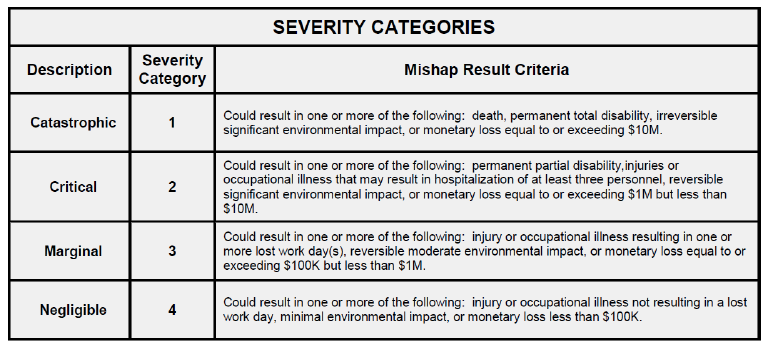
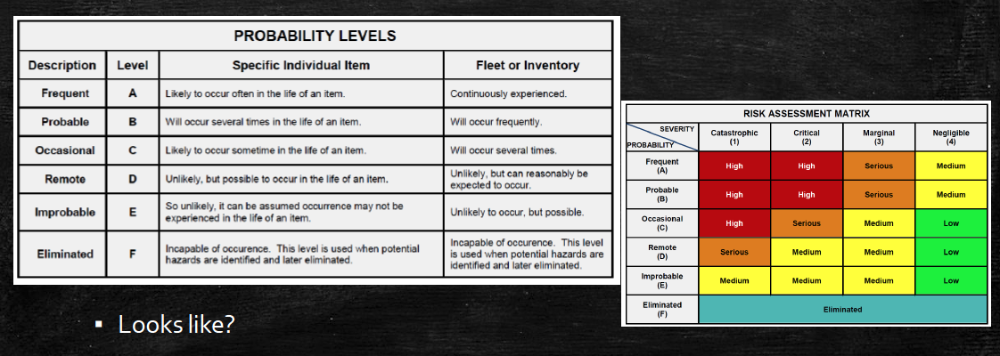

# Week3 Product Liability

## Design for Safety

- The earlier we consider safety in the design, the more effective the design will be.
- Consider safety in the design phase

### Early in design

- Identify controllable hazards
- Identify ways the design can be modified to prevent hazards
- Brainstorm hazards using failure modes
- Tests may identify hazards

### Safety Review Program

- Consider using accident data, environmental data, occupational health data, user knowledge, lessons learned from legacy or similar systems

### Severity Categories

### Probability levels and Risk Assessment Matrix

