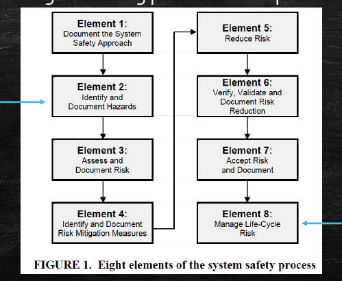
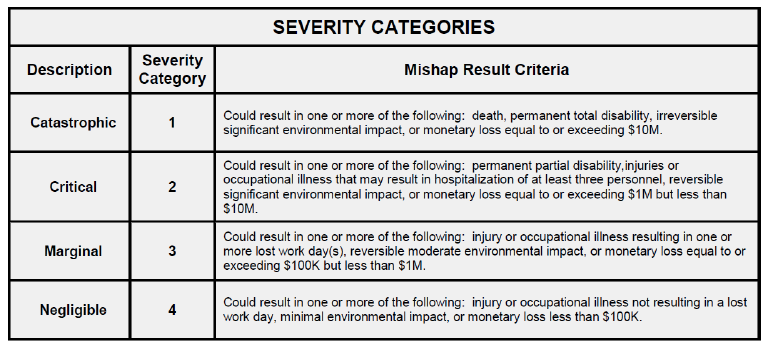
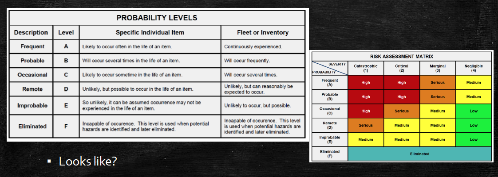

# Week3 Safety and Product Liability

## Design for Safety

- The earlier we consider safety in the design, the more effective the design will be.
- Consider safety in the design phase

### Early in design

- Identify controllable hazards
- Identify ways the design can be modified to prevent hazards
- Brainstorm hazards using failure modes
- Tests may identify hazards

### Safety Review Program

- Consider using accident data, environmental data, occupational health data, user knowledge, lessons learned from legacy or similar systems

### Severity Categories

### Probability levels and Risk Assessment Matrix

- Legal liability if somebody is injured by your product in normal use.

- Defect in:

  - Design
  - Manufacturing
  - Warning/instructions

- Regulation/statute if you’re not in compliance, you’re liable.
  Liability is established de facto, if the regulation is related to the
  failure.

- Check:
  - Federal law
  - State law
  - Regulatory agencies (standards)
  - Professional associations (standards)

> Q: What are reasonable customer expectations?

### Common Defences for Product liability

- **Misuse** of product
- **Modification** of product

Safety vs Cost Effectiveness

Examples:

- Samsung Note 7 Battery Failure
