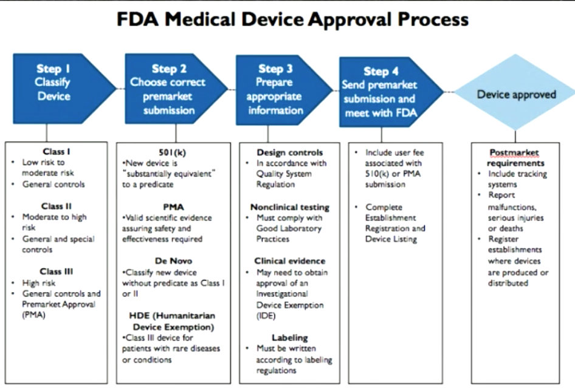
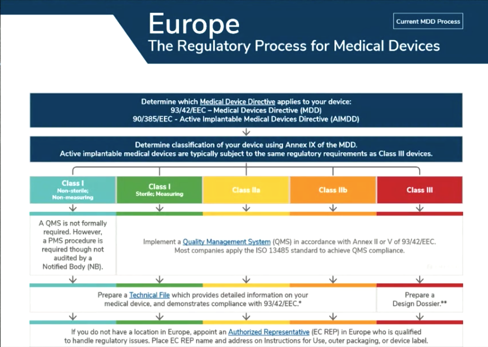
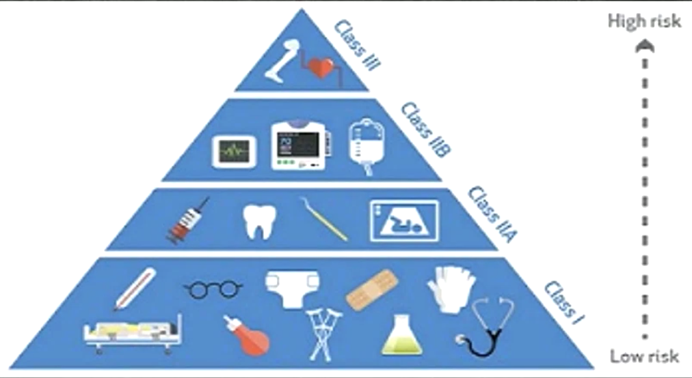
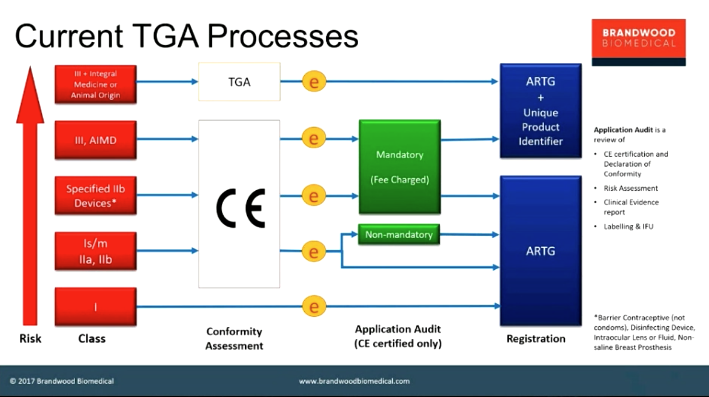
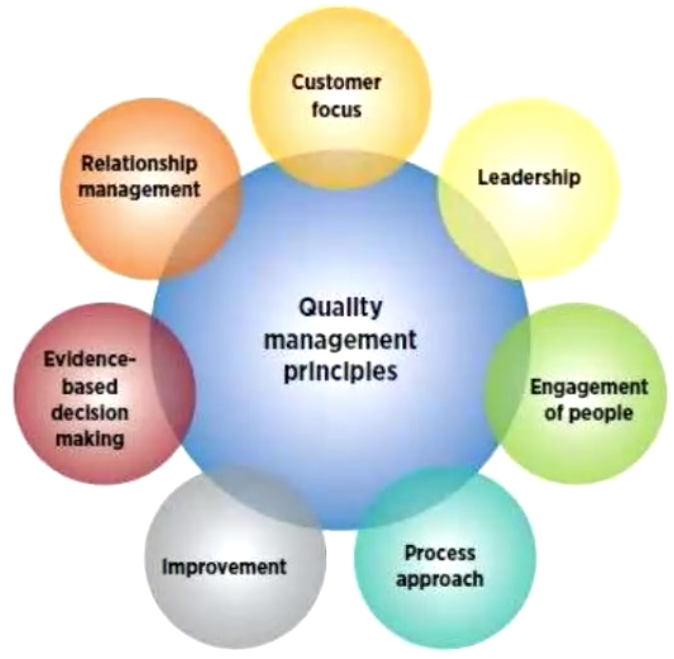

# Week5 Regulatory Frameworks

- [Week5 Regulatory Frameworks](#week5-regulatory-frameworks)
  - [Examples of Regulatory review processes](#examples-of-regulatory-review-processes)
  - [Common Links](#common-links)
  - [Quality Management Systems](#quality-management-systems)

---

## Examples of Regulatory review processes

US market

European market

Australian market

## Common Links

- Classifying devices
- Design controls and quality processes
- Monitoring plan to determine malfunctions in the field

They want to see a responsible disciplined process that protect the health and well being of the users

## Quality Management Systems

- Ensures that their is a disciplined, organised process to ensure quality
- ISO9000
- ISO9001

Multidisciplinary standards

- **ISO14001** - Environment Management, tools for companies to manage their environmental impact
- **ISO27001** - Cyber Security
- **ISO277701** - Data Security and Privacy
- **ISO9000** - Supply Chains
