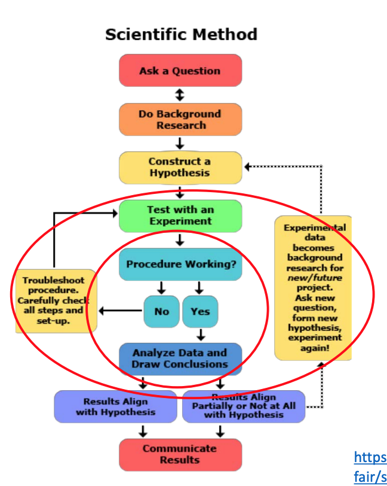

# Week 2 What is Research

## Definition

Science is understood by many to include the body of findings and understanding discovered through the practice
of science (research). (R. Snieder and K. Larner 2009)

Elements of research:

- Logic
- Curiosity
- Insight, intuition, inspiration
- Asking questions
- Solving problems
- Repeatability and testability
- Falsifiability (possibility to be proven wrong)

### Deductive reasoning (Aristotle):

Theory -> Hypothesis -> Observations -> Confirmation/Rejection

### Inductive reasoning (Sherlock):

Observations -> Pattern -> Hypothesis -> Theory

## Interdisciplinary research

Mode of research by teams or individuals that integrates information, data, techniques, tools, perspectives, concepts, and/or theories from two or more disciplines or bodies of specialized knowledge to advance fundamental understanding or to solve problems whose solutions are beyond the scope of a single discipline or area of research practice.

## Types of research

- Basic research
- Applied research
- Research and Development (R&D)

## Normative science principles

- Science is a system of methods for solving problems
- Science is rational
- Science uses experiments, investigations or studies to test solutions to problems
- Science is characterized by an attitude that values intellectual honesty, integrity and open mindedness, and exhibits a measured skepticism which embraces criticism and rejects dogmatism

**Falsifiability** - "If it cannot be falsified, it is not science". - Popper (1963 ) ability to test and question

**Unknown Unknowns** - we know there are some things we do not
know. But there are also unknown unknowns

## What counts as Science?

- Develops Testable hypotheses
- Limits the influence of ideology and stops Pseudoscience
  - Makes itself vulnerable to disproof through falsifiable hypotheses
  - Ensures an open social interaction between scientists
- **Definite and Communicable**, It says something about how reality works AND it can be explained in a way that others can understand
- **Systematic and Iterative**, can be repeated by someone else
- **Allows Prediction**, Hypotheses generate predictions of future outcomes or of the existence of as-yet
  unobserved phenomena

## (Ideal) Values for Science: Merton’s Norms

- **Communalism** - Share knowledge for the greater good
- **Universalism** - Everyone’s scientific work is assessed equally
- **Disinterestedness** - Don’t do science for monetary or political gain
- **Organised Scepticism** - Survive scrutiny of facts
