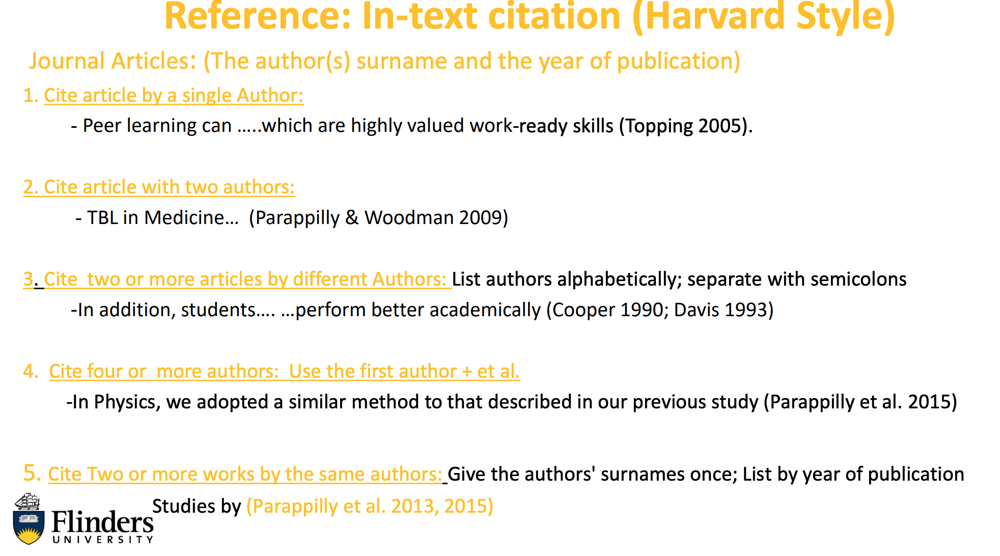
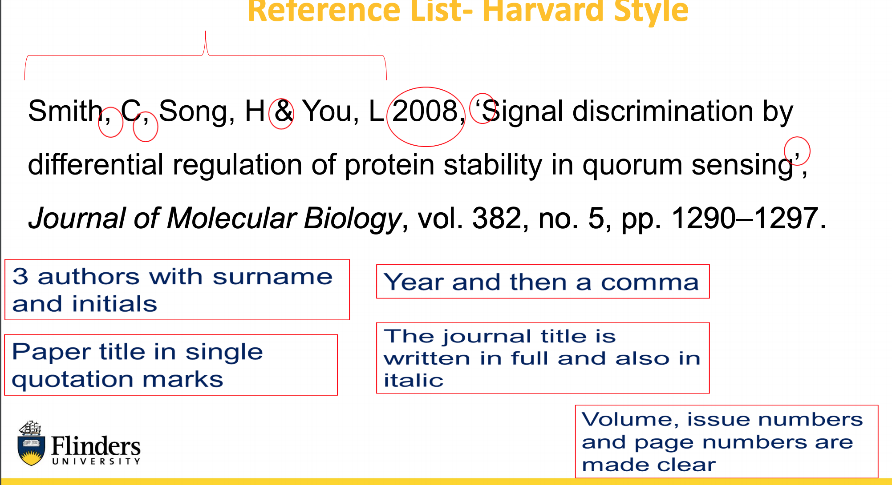

# Week3 Mechanics of Referencing

## Referencing

**Referencing** is a standard convention within the academic work to inform the
reader of the sources of information used in a piece of written work

### Factors of Good Scientist

- Ability to come-up with new Scientific Ideas, by building upon previous work
- Ability to Conduct the Research: Using new methods or building upon previous
established methods.
- Ability to Carry out Scientific Investigations; observation and analysis of data to
test hypotheses.
- Ability to present the outcomes (either in written form or oral form)

### Why Referencing

- Acknowledge the ideas, words and works of the person who created them
- Show an element of research and understating of material read

Common styles include **APA, Harvard, MLA and Vancouver**

### What I need to reference

- Other People’s Ideas: very specific information
- Other people’s exact words (Always use quotation marks); Written Phases
- Datasets generated by you or others

### Importance of Referencing

- Gives you and your writing credibility, integrity and trustworthiness
- Shows the extent that you read/enquire to base your ideas
- Makes better research reporting.
- Removes any question of plagiarism. (Copying, using, or the misuse of other people’s ideas,
words or concepts, without proper referencing is plagiarism)
- Shows that you are not bias towards one argument
- Enables your audience to make a sound judgement on your work and then follow up on
further ideas

### Reference Principles

You should always provide a reference to all material that you:

- **Quote** - When you write the exact wording of an author
- **Paraphrase** - When you write an idea from the literature into your own words for
your own logic/argument
- **Summarise** - When you write an idea from the literature into your own words,
keeping to the author’s logic argument

### Examples

1. According to **Parappilly (2005, p. 35)** “The developmental nature of ….”
2. **Parappilly (2018, p.70)** state that “ For students from a non-science background the difference
between robots and standard lab equipment is less distinct”
3. **In 2018, Parappilly (p.70)** found that “For students from a non-science background the
difference between robots and standard lab equipment is less distinct”
4. According to **Parappilly (2005)**

## Harvard Referencing

- In-text citation format: author-date referencing style
- Reference format: Full reference list at end of doc, arranged in alphabetical order

**Rule: Author(s) Surname, initial (s), Year of Publication, 'Article title’, Journal title
(with no full stop at the end) in italics ,Volume of journal, issue number of journal,
Page range of article.**

Example:

> Parappilly, M, Hassam, C, & Woodman, RJ 2018, ‘Race to improve student understanding of uncertainty: using lego race cars in the physics lab’, American Journal of Physics, vol. 86, no. 1, pp. 68–76. 

### Cite Journal article with DOI (Digital Object Identifier) 

Example:

> Parappilly, M, Hassam, C, & Woodman, RJ 2018, ‘Race to improve student understanding of uncertainty: using lego race cars in the physics lab’, American Journal of Physics, vol. 86, no. 1, pp. 68–76. DOI: https://doi.org/10.1119/1.5003812.

