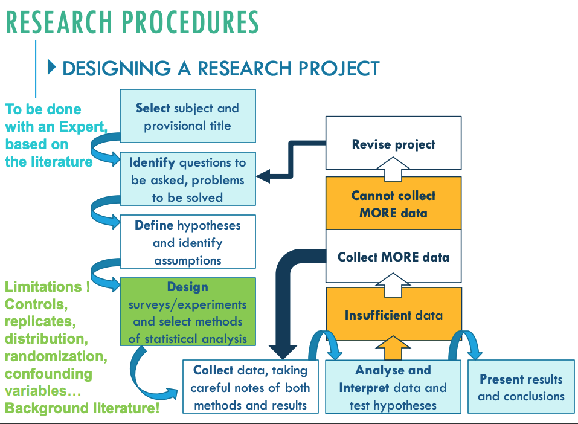

# Week5 Experimental Design

- [Week5 Experimental Design](#week5-experimental-design)
  - [Observations](#observations)
  - [Develop Models, Theories and Hypotheses](#develop-models-theories-and-hypotheses)
    - [Example](#example)

## Observations

Projects always start with observations

- Patterns
- Variety and scale
- Widespread/Local
- Short-term/ long-term

Observations are made to:

- Prove th existence of a pattern/phenomena
- Corroborate models, theories or explanations
- Represent reality, get a better understanding of the subject to be studied

## Develop Models, Theories and Hypotheses

Models or theories explaining the observation are based on:

- Environmental constraints
- Competition
- Behaviors
- Predation
- Reproduction
- Disease
- Anthropogenic impact

### Example

Creating a mind map of observations, theories

- REPLICATION
  - Using more than one sampling or experimental unit per treatment or
    comparison group
- CONTROLS
  - Knowing what would have happened without the experimental treatment
- BALANCE
  - Same number of replicates per treatment
- RANDOMISATION
  - Ensuring populations are randomly sampled and treatments are randomly allocated to experimental units
- REDUCE UNEXPLAINED/RESIDUAL VARIATION
  - Standardise your data, record covariates
