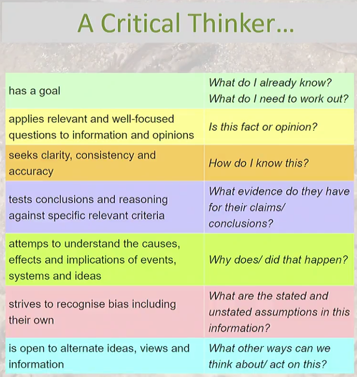
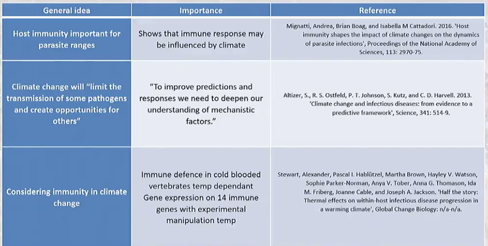
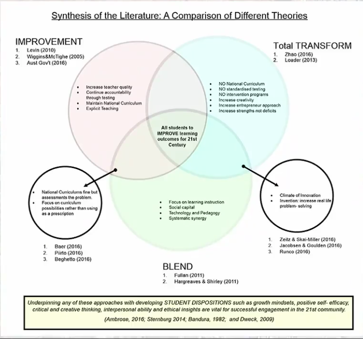

# Week 7 Literature Review

**Literature review** - a critical of what has been published in a research field by academic scientists or other types of researchers

- conveys what knowledge ad idea's have been established
- The current strengths and weaknesses
- Guiding concept - a question, perspective, idea, problem or hypothesis
- Describes, summarises, evaluates and clarify what is published
- Summarises what is unknown and not known and needs further research
- Identifies areas of controversy in the literature
- Formulate questions or isolate problems that need to be addressed

## Main points of a Literature Review:

1. Convey to the reader what knowledge and ideas have been established on a topic
2. What their strengths and weaknesses are
3. Further research needed

## Readers of a literature review look for

1. New ideas
2. Literature relevant to the ideas, and
3. Specific information that clarifies these ideas

Things to note of an article:

- Read the title
- Who are th authors and there institutional affiliations
- Is it highly cited
- Is it peer reviewed
- Skim the abstract and paper for key information

## Example

Venn Diagram

