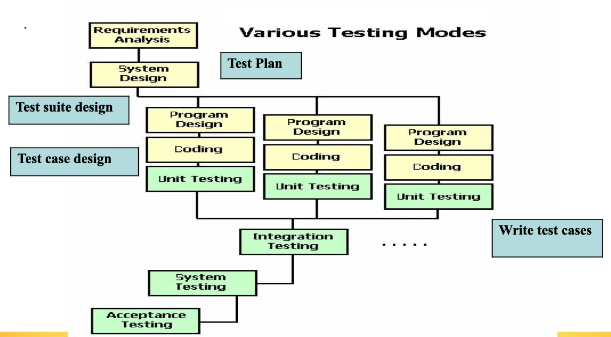
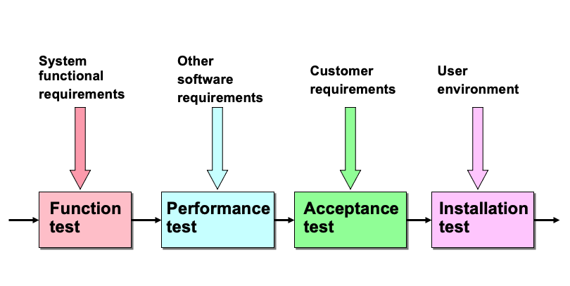

# Week 10 Software Testing

- **Testing**, proves that the minimum software product meets a set of pre-established acceptance criteria under a set of prescribes Environmental circumstances.
- Testing is part of software quality assurance (SQA)

## Reasons for software failures

- Wrong specifications
- Unreasonable requirements
- System design contains fault
- Programming code may be wrong

## Types of testing

1. **Unit Testing**, Test each module to make sure that it does what the designers intended

2. **Integration Testing**, Test the interfaces between different modules to make sure they work well together as designers intended

3. **System Testing**, Testing the system to make sure that the system does what the customer wants

## Debugging

- **Fault identification**, process of determining what fault(s) caused the failure
- **Fault correction or removal** process of making changed to the system so that the faults are removed

## Types of faults

- Logical/algorithmic faults which does not produce correct results
- Computation and precision faults, meaning code isn't yielding appropriate accuracy
- Documentation does not match the program
- Stress/overload faults,  program fails under heavey usage
- Capacity or boundary faults

## Testing process

1. Establish test objectives
2. Design tests
3. Write test cases
4. Review test cases (feasible, correct ? adequate coverage ?)
5. Execute the tests
6. Evaluate the test results

## Testing Approaches

- **Code Review**:
  - Code walk through, developer presents code informally to the review team
  - Code inspection, code is checked against standards used in definition and for efficiency, correctness and adherence to style guidelines
- **Open box testing**, examine the codes internal logic and develop a testing strategy
- **Closed box testing**, Supply range of outputs and see whether the results are consistent with the requirements

## System testing

System testing ensures the system does what the customer wants and includes:

- Function testing
- Performance testing
- Acceptance testing
- Installation testing

