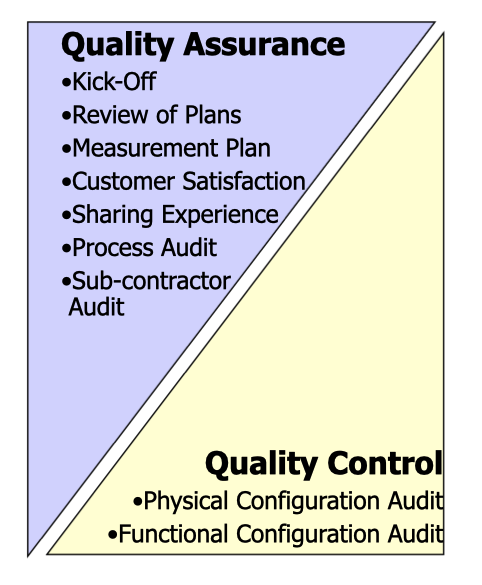

# Week 11 Software Quality

- Software quality is conformance to requirements, fitness for use, ability to satisfy implied needs etc
- Meet the specification and expectations in the most cost-effective and timely manner

## How to achieve software quality

- Deliver on schedule
- COntain cost overruns
- Reduce cycle time
- Identify and reduce risks
- Assure compliance and regulatory compliance
- Minimise defects

## Quality Triangle

- Quality
- Cost
- Time

## Quality Assurance vs Quality Control

