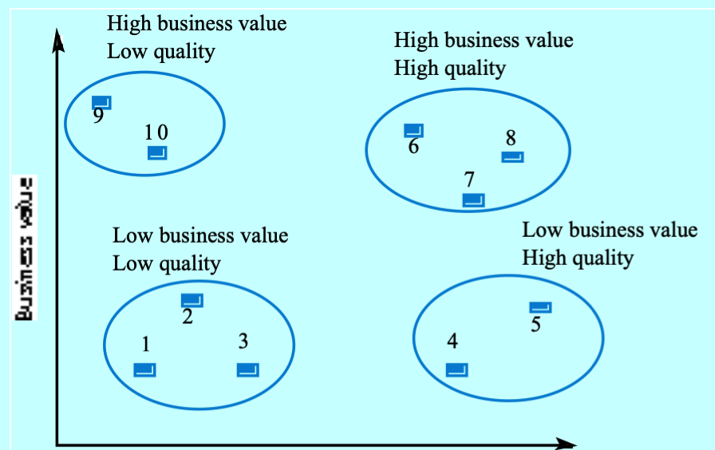

# Week 12 Software System Maintenance

- Maintenance is all the work done after a system is operational
- The ease of making existing changes to the current software system
- 40-50% is spent on understanding how to modify the system

## Types of software maintenance

- **Corrective**, fixing bugs and errors
- **Adaptive**, Changes in the operational environment
- **Perfective**,  Adding new capabilities and making changes
- **Preventative**, changing the system to improve its future maintainability and reliability

## Factors affecting maintainability

- Availability of qualified software engineers
- Understanding of system architecture
- Availability of test cases
- Availability of documentation
- Technical skills for programming language

## Maintaining the product

- Evaluate the design documentation
- Plan an approach to the desired modification/structure
- Modifying the design
- Rewrite appropriate parts of the source code
- Repeat test cases used for original system release

## Structured maintenance

1. **Analysis**, understanding the system
2. **Design**, restructure, rewrite or delete designs
3. **Code**, add functionality and add new requirements
4. **Test**, validate and fix any errors
5. **Document**, keep documentation up to date
6. **Management**, controls the process

## System quality vs business value

### Scenarios

1. Low quality & low business value - Retire system
2. Low quality & high business value - Replace by outsourcing or building a new system
3. High quality & low business value - Replace or maintain
4. High quality & high business value - Continue operations and maintenance
