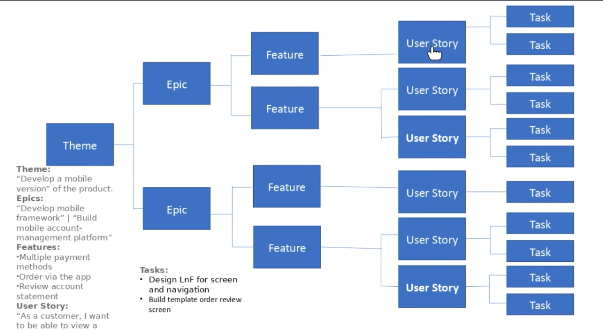

# Week5 Guest Lecture

Guest:
Company: Chamonix

## Requirements

## Requirements aren't always static

- Reality you can only have 2 out of 3
- Fixed price vs Time and materials

### Use case

- UML design
- Good at drawing relationships and flows

### User Story

- High level
- designed as an elicit conversation
- Quick at defining a requirement

## Final advice

- There is no right way, just lots of wrong ways
- Communication and conversation
- Engagement
- Feedback
- Agile  or not doesn't matter a requirement is a requirement
