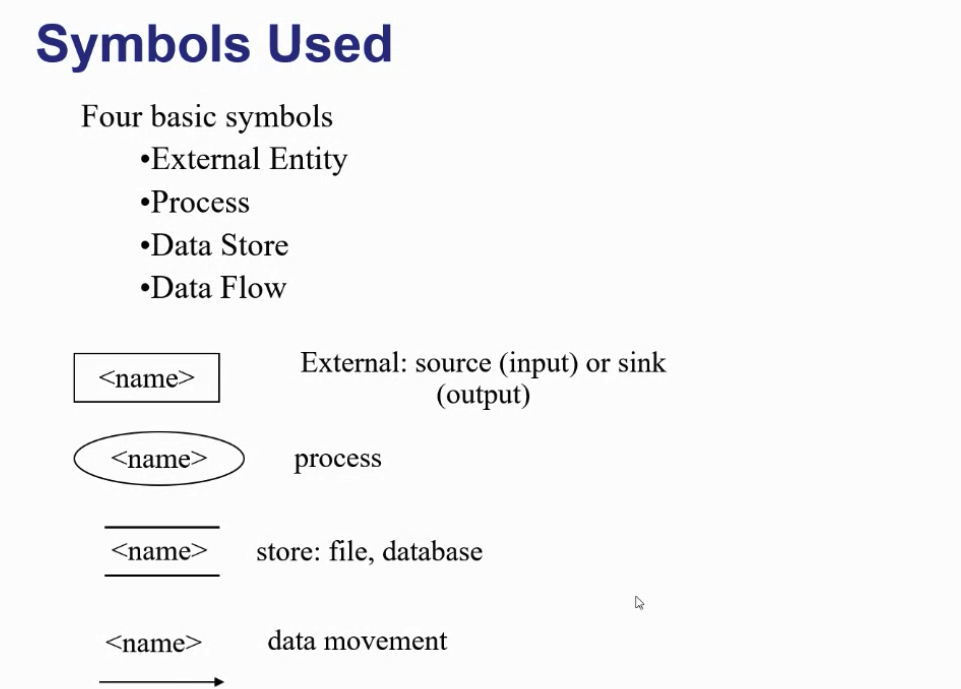
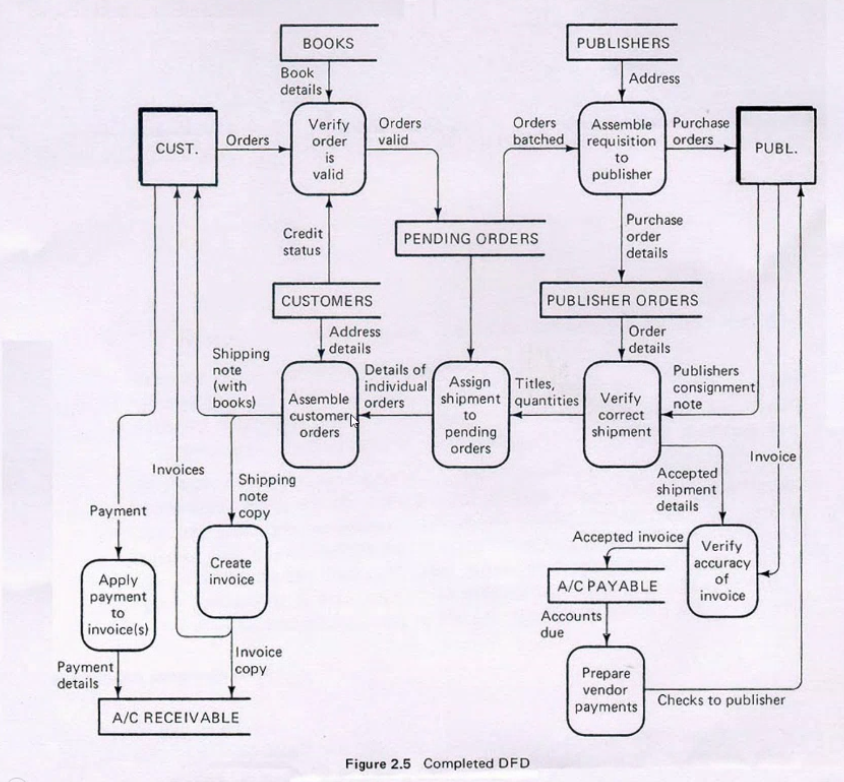
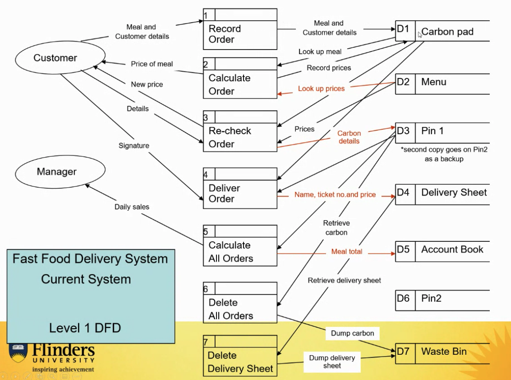
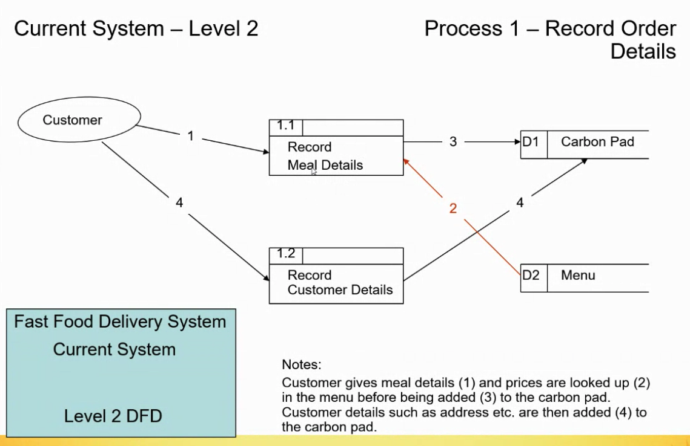
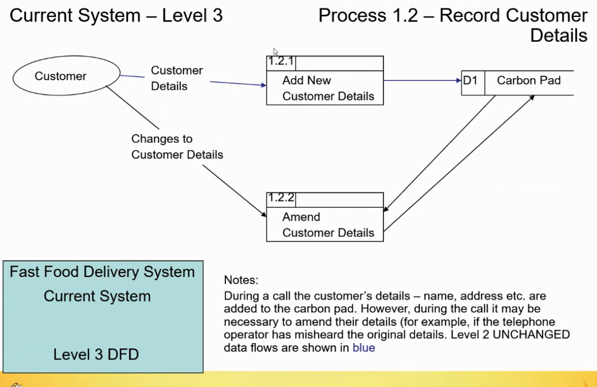

# Week6 DFD and Activity Diagram

## Data Flow Diagrams

- Tool used for requirements specification aims to identify and clarify what happens in a system and emphasises on the data involved.
- What actions cause it to get transformed
- Graphical representations illustrating the processes the data goes through
- Focus on a Data-Centric View

### Attempts to:

- Identify where data comes from and where its going
- Identify what process occurs in using/transforming data
- Alternative forms of data, source of input data , destination for output data

### DFD don't

- Black holes
- miracles
- leaving things unlabelled
- Data stores that are sources or sinks
- Data flows that are unassociated with a process
- Expect yur diagram to be perfect the first time

### Examples : Level 1

## Examples : Level 2

### Examples : Level 3

## Data Dictionary

