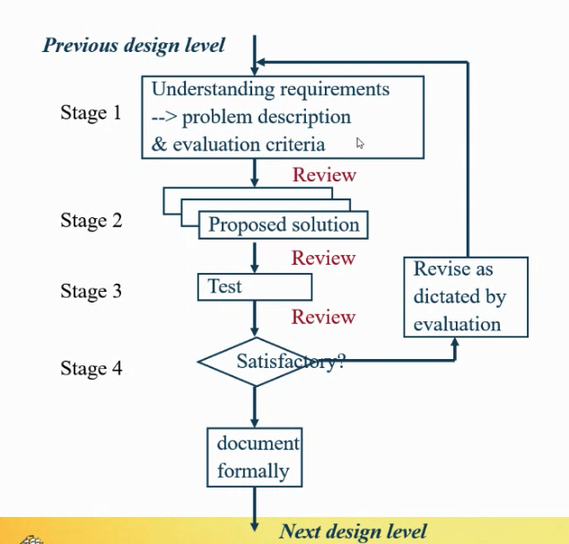
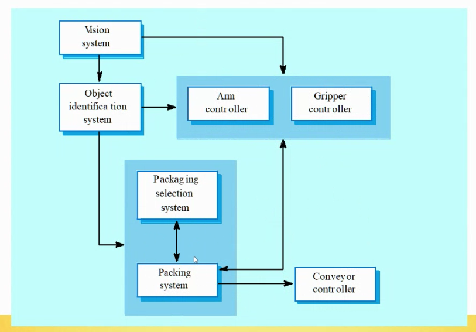
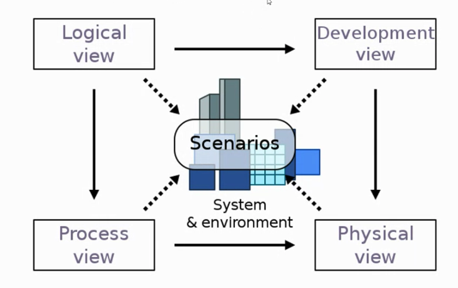
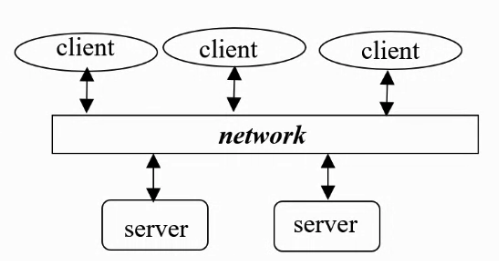
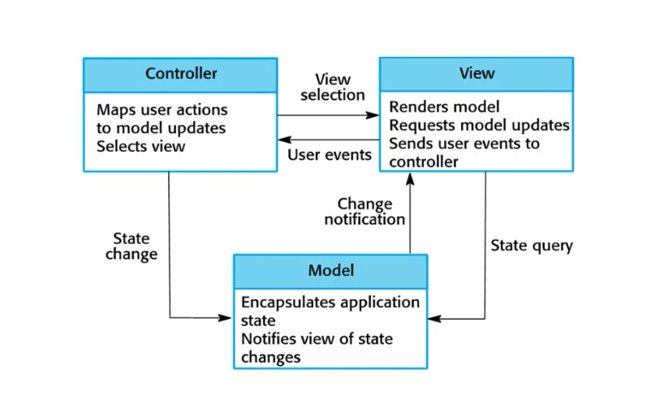
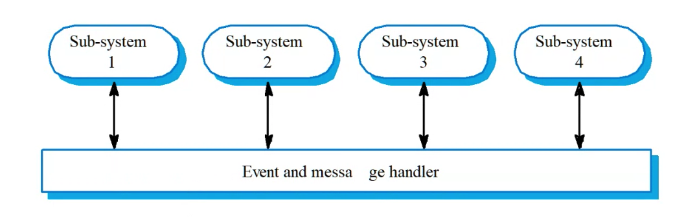

# Week 7 Software Architectural Design

Process of defining the architecture, components and interface of a systems

## Design criteria

- Simplicity
- Documentation
- Testability
- Structure, logical use of control
- Modularity, low coupling
- Discreteness, separates data, functions and timing
- Representation, abstraction
- Reusability

*Assumption is that the requirements are right
Chartist

### 1. Conceptual Design

What the system will do

### 2. Technical Design

How the system will do it

### Advantages

- Stakeholder communication
- Large scale use
- System Analysis

### Architecture and system characteristics

- Performance,
- Security, layered approach with critical assets in the inner layer
- Safety
- Availability, redundant components for fault tolerance
- Maintainability, replaceable components

### Example

### Architecture Design Decisions

- Generic/existing application architecture to use?
- How is system distributed
- What models/styles are appropriate
- How will the system be broken up into modules
- Control strategy

### 4+1 Architecture view

### Client-Server Model

- Distributed architecture model
- Standalone servers offering services

### Abstract Machine Model

- Organises a system into a series of layers, and each later talks to the layer next to each other.
- Great for security

### Model-View-Controller (MVC)

- Separates presentation and interaction from the system data, system is structured in three logical components

### Event Driven 

