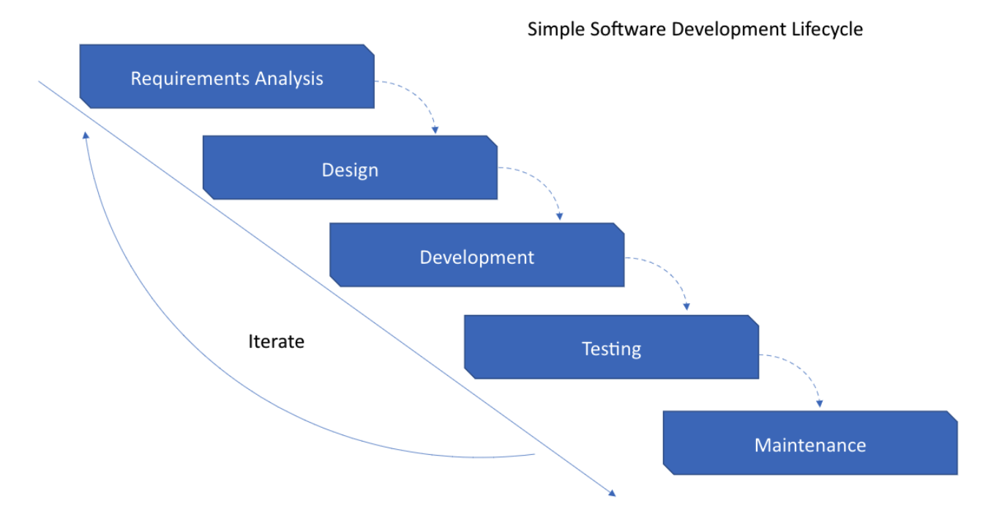
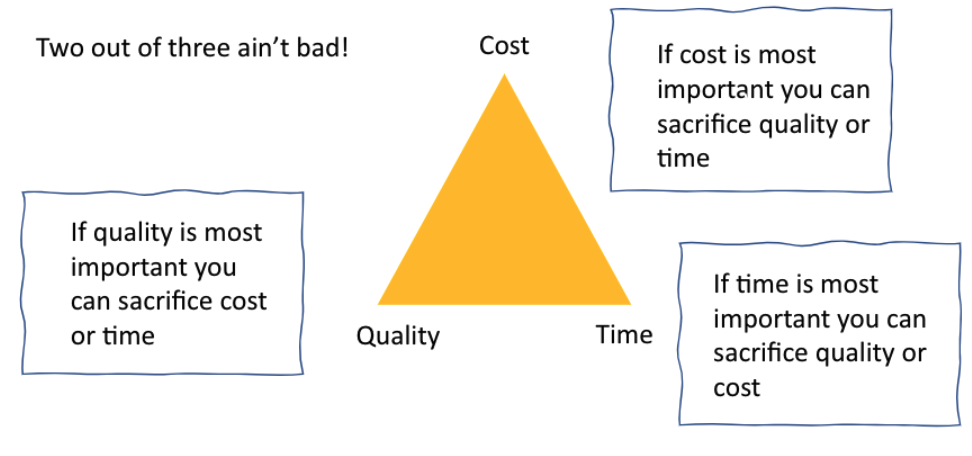

# Week 9 Guest Speaker

What is the point of a methodology

- Control
- Visibility
- Accountability
- Standards
- Budgeting

## Types of methodologies

1. Agile - What works, iterative and collaborative
2. Scrums - small teams deliver fast
3. Kanban - WIP visibility and progress
4. Extreme programming (XP) - Robust development
5. Waterfall - Full planning and phased delivery

## Cost, Quality and Time Paradigm

