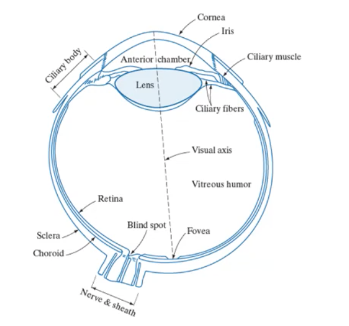
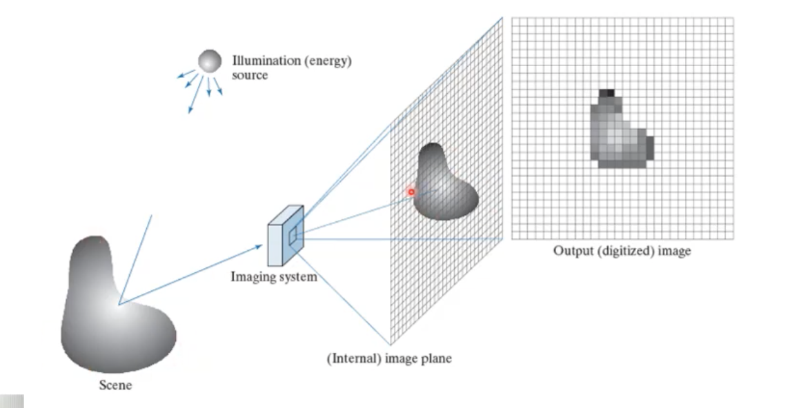

# Week3 Elements of Visual Perception

## Structure of the human eye

## Visual Illusions

- What you see and what the computer sees is totally different
- depth perception
- Simultaneous contrast - machine sees different contrasts as the same, examples are how we interpret shadows
- Depth cues - object movement and how shadows work

### Considerations

- The end client is a human, so they need to understand what they see
- Don't expect your algorithm to see the same thing that you see

## Image sensing and acquisition

- Incoming energy, how to structure the data and represent it
- Output result and digitalising the response

### Image formation and representation

The digitalization of the image

- uses a sampling and quantization process
- sampling plots the  the discretization in space
- quantization used to show the intensity of every signal
- The more information the finer and clearer and more data is on the image

## Representation

## Fundamental Maths