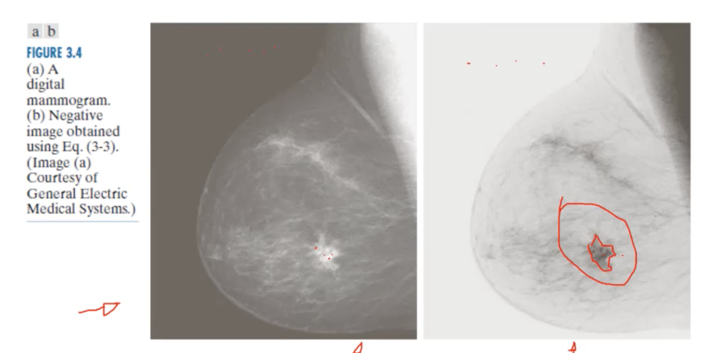
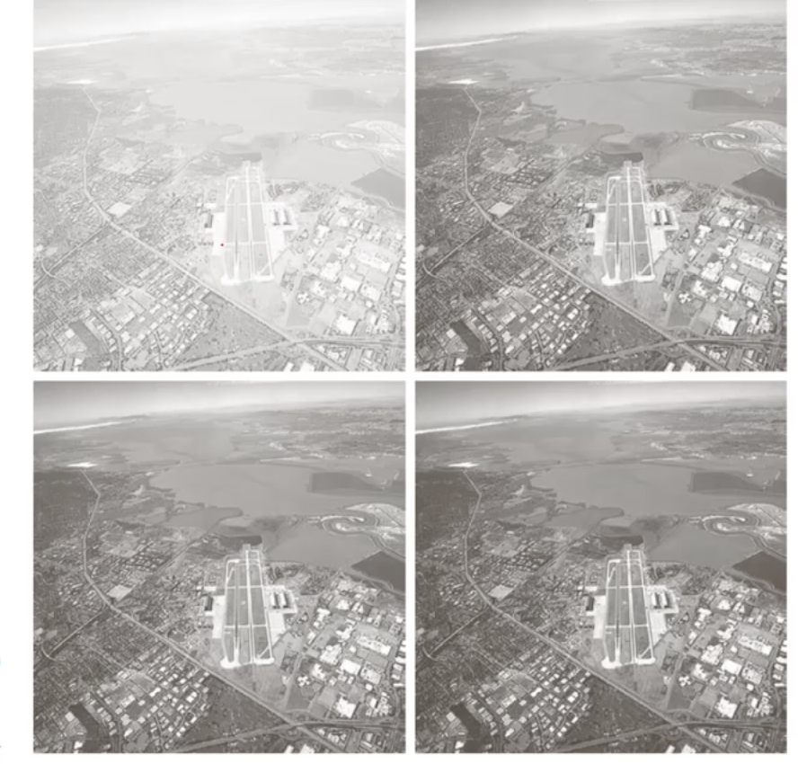
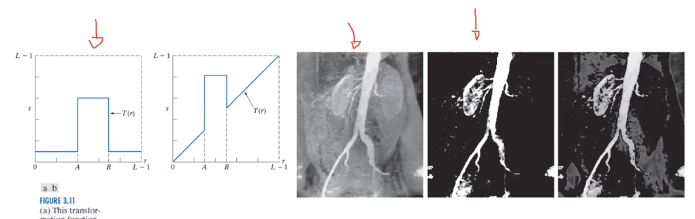
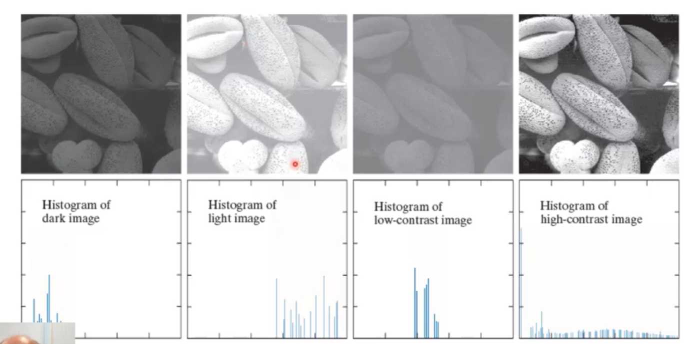
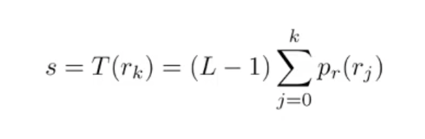
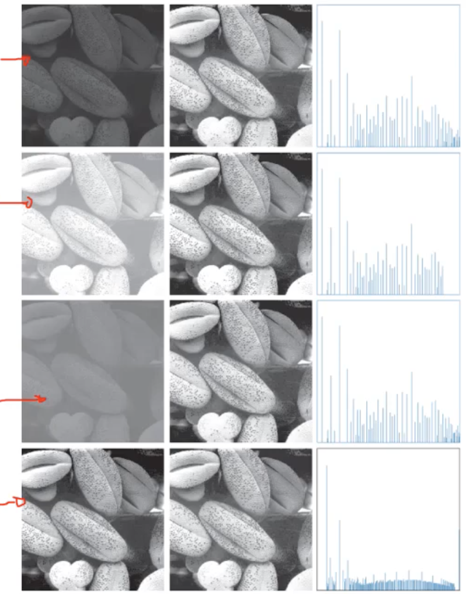
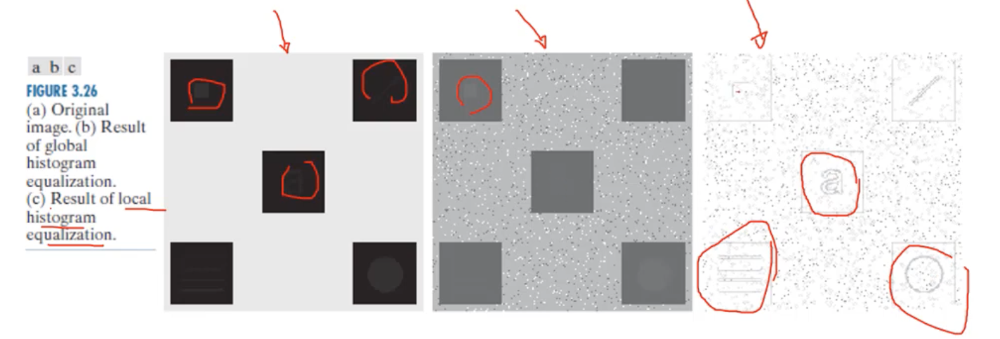
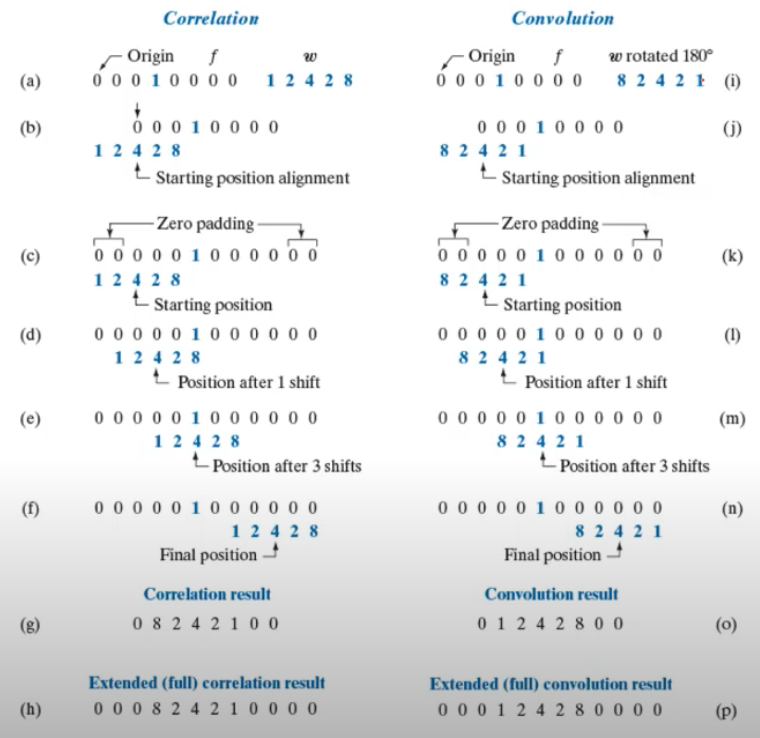
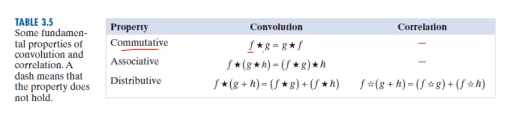
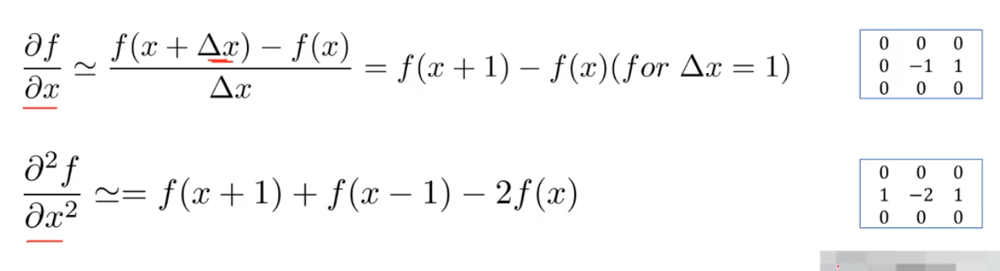

# Week4 Intensity Transformations and Spatial Filtering

## 3.1 Intensity Transformations 

- Spatial domain processes are based on `g(x,y) = T[f(x,y)]`
- `f(x,y)` input image
- `g(x,y)` output image

Point wise methods:

- **Contrast stretching**, produces an image with higher contrast
- **Thresholding**, produces a binary image

Contrast is black as it is easier for the human eyes to identify a potential cancer cell

### Gamma Correction

Darker parts are much more pronounced

### Intensity Slicing

Highlight a portion of the pixels/image and reduce everything else to show what you are interested in

## 3.2 Histogram Processing

- A histogram is an approximate representation of the distribution of numerical data
- a histogram shape is related to a the image appearance

### Histogram equalisation

- Make the histogram more uniform which helps see details we couldn't see before
- A cumulative distribution function (CDF) is a good histogram transformation function
  

on the left image are the original images, the right images are the equalized images

### Local histogram Processing

- Define a neighbourhood and move its center from pixel to pixel
- at each location
  - Obtain the histogram of the neighbourhood
  - Apply histogram equalisation or matching
  - Change the intensity of the pixel centred in the neighbourhood
  - move to the next

## 3.3 Linear Spatial Filtering (Convolution and Correlation)

**kernel** is a operator of a matrix

Convolution and correlation - sum of products

example [Image kernels explained visually](https://setosa.io/ev/image-kernels/)

### Why use convolution as a linear operator

## 3.4 Image Sharpening and derivatives

- **sharpening** (highpass) spatial filter - highlights transitions in intensity
- applications  - image printing, medical imaging, industrial inspection and autonomous driving
- derivation
- uses sharpening kernels

