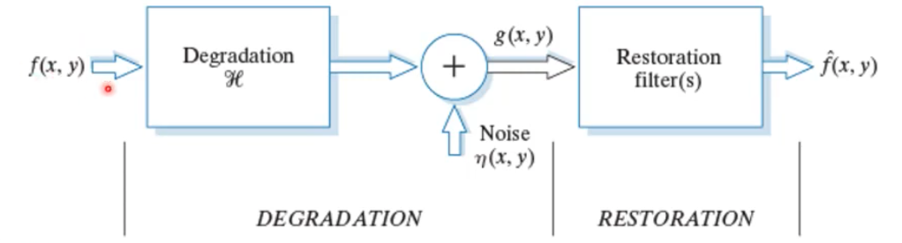
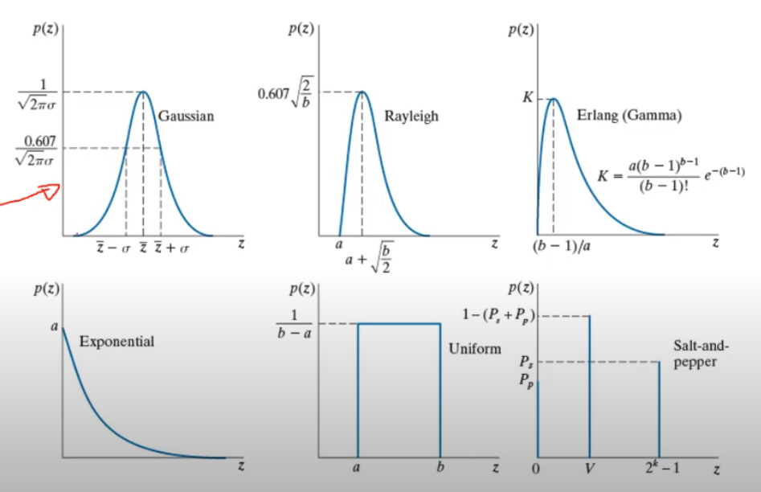
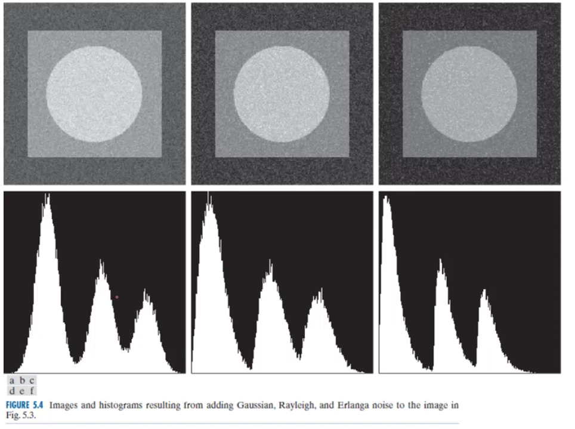
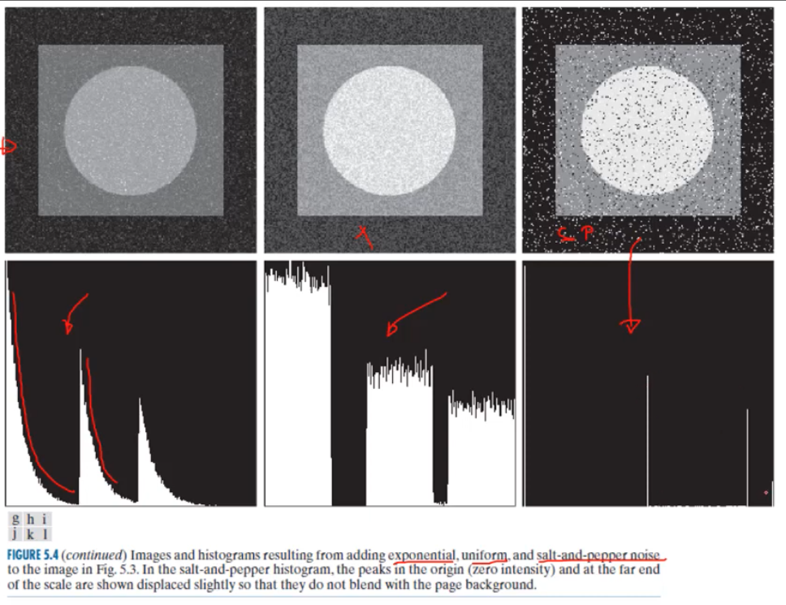

# Week5 Image Restoration and Reconstruction

## 1. Degradation and noise types

Enhancement vs degradation

### Enhancement

- Improve the image in some way
- Subjective process

### Restoration

- Recover an image that has been degraded by using prior knowledge of the degradation
- Objective process apply the inverse process

- The goal is to find an approximation `^f` that is similar to the same image `f`
- The more you know about degradation and noise, the better estimation we get

### Noise types

### Image histograms and noise types

We use **image histograms** to estimate the parameters of most kinds of noise

## 2. Estimating noise parameters

## 3. Filters based on order statistics

## 4. Modelling degradation
 