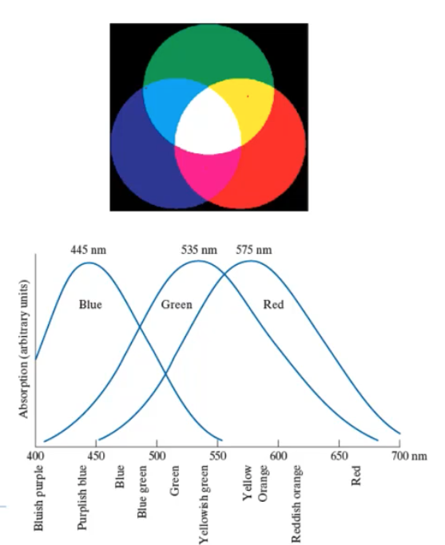
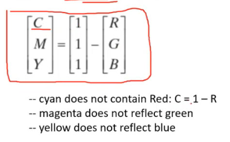
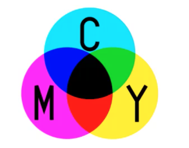
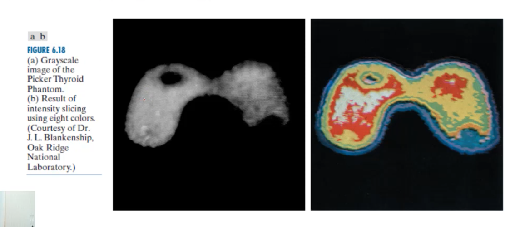
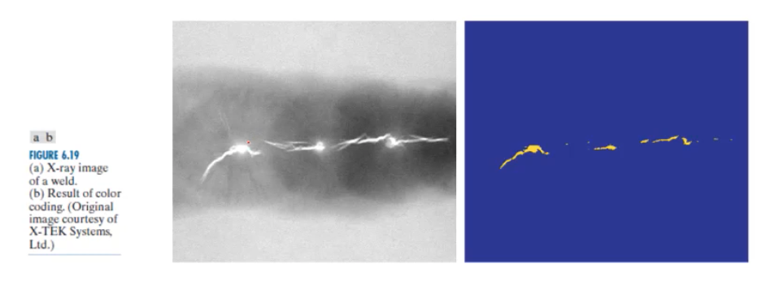
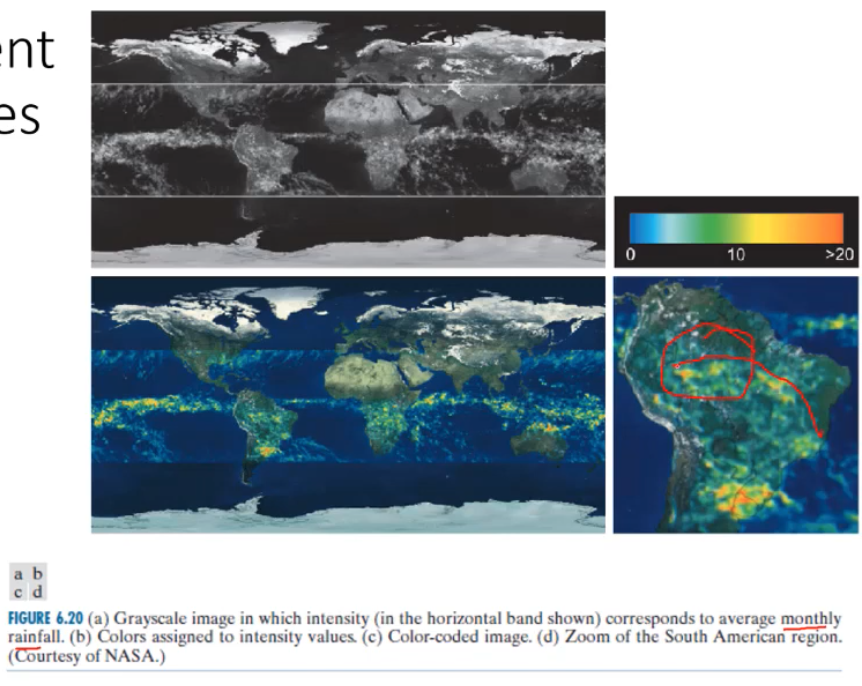
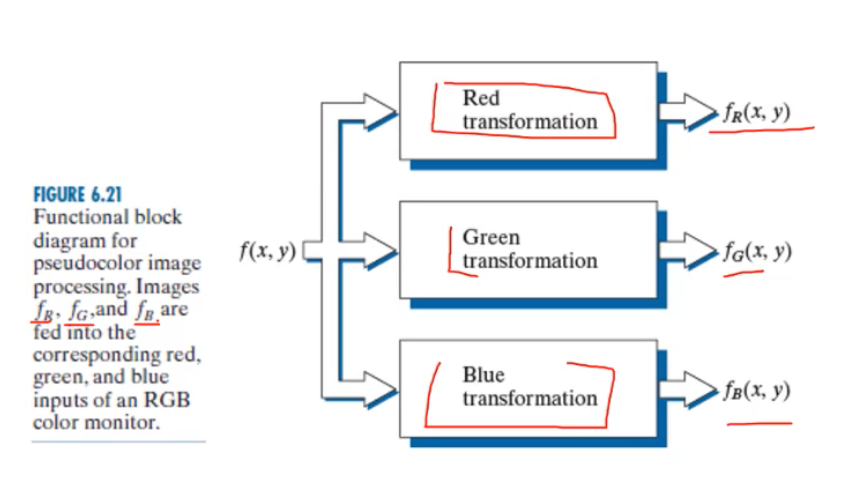

# Week6 Colour Image Processing

- [Week6 Colour Image Processing](#week6-colour-image-processing)
  - [1. Colour spaces](#1-colour-spaces)
    - [RGB](#rgb)
    - [CMY colour model](#cmy-colour-model)
    - [HSV](#hsv)
  - [2. Pseudo colour image processing](#2-pseudo-colour-image-processing)
    - [Techniques:](#techniques)
      - [1. Intensity slicing](#1-intensity-slicing)
      - [2. Colour coding](#2-colour-coding)
      - [3. Independent transformations functions on each channel](#3-independent-transformations-functions-on-each-channel)
  - [3. Full Colour image processing](#3-full-colour-image-processing)

## 1. Colour spaces

- A color image compose of more than 1 channel, with each channel composing of one color intensity for example RGB (Red, Green, Blue).
- Other primary colors are Cyan, magenta, yellow, and black (CMYK) which are 4 channels
- Other image attributes are Hue Saturation and Value (HSV)

### RGB

- Adaptive color mixing , by combining difference intensities of RGB
- 24 bits, 8 bits per channel

- **Pixel depth** - number of bits used to represent each pixel in RGB space

### CMY colour model

- Secondary colours of light
- Subtractive colour mixing
- Used for printers

### HSV

- Decouples the intensity component from the colour-carrying information (hue, saturation)
- Three channels, Hue, Saturation and Value
- Good for histogram equalization
- Separating colour components such as removing shadows

## 2. Pseudo colour image processing

- Assigning colours to grey values based on specific criteria
- Used for human visualisation
- Describing events or sequences of events

### Techniques:

#### 1. Intensity slicing

- Get a grey-scale image
- Slice it at several intensity values
- assign distinct colours to each interval
- For example pixels above the place are read and below if yellow

#### 2. Colour coding

- Give meaning to the assigned colours

#### 3. Independent transformations functions on each channel

Example is airport baggage scans using sinusoids

## 3. Full Colour image processing

Two major categories:

1. Process each greyscale image individually (them compose the colour image )
2. Work with the colour pixel directly

Techniques:

- Colour slicing
- Tone and colour corrections
- Colour histogram equalization

4. Noise in colour images

- Noise affects all three colour components
