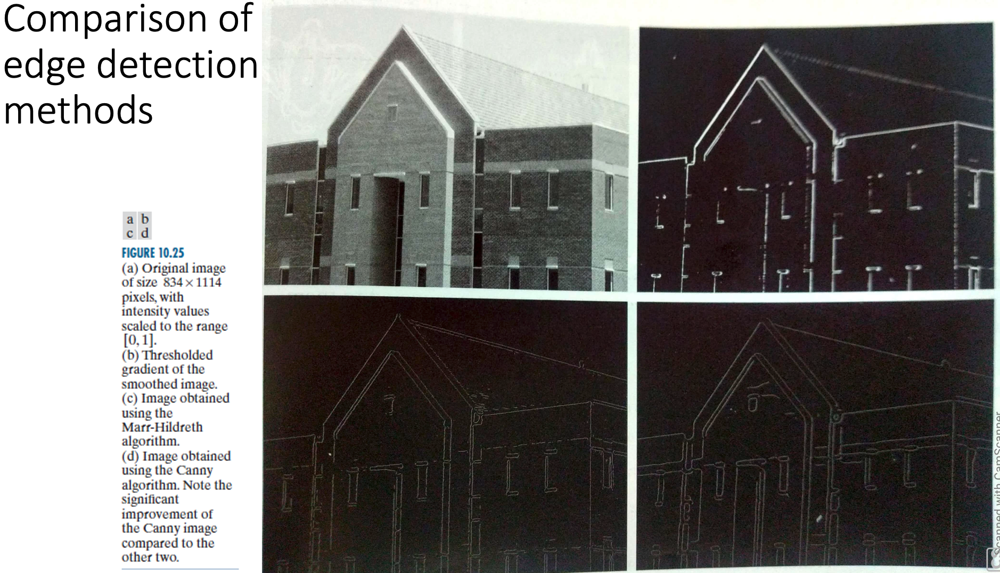
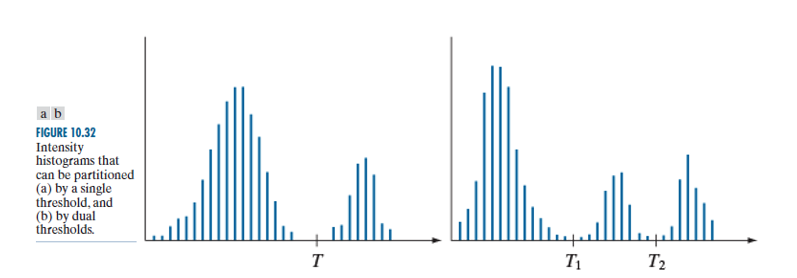
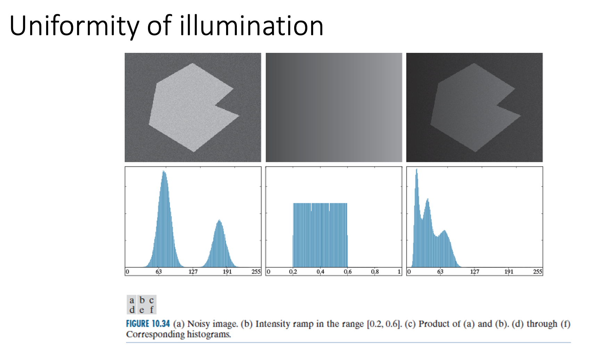
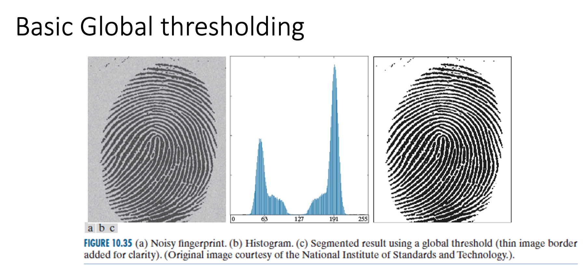
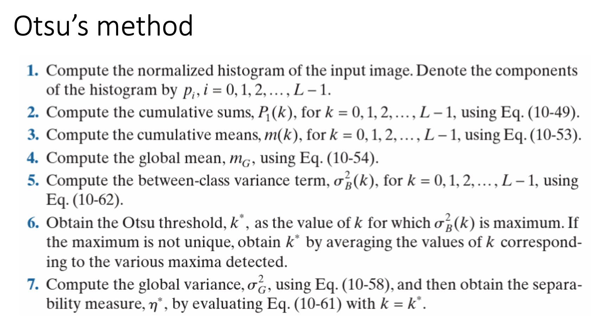
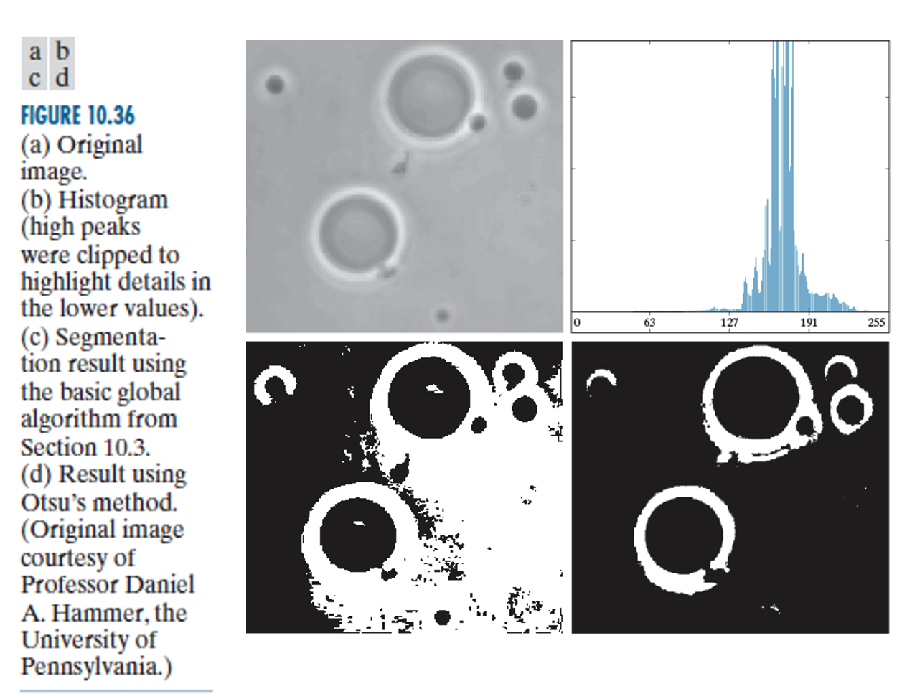
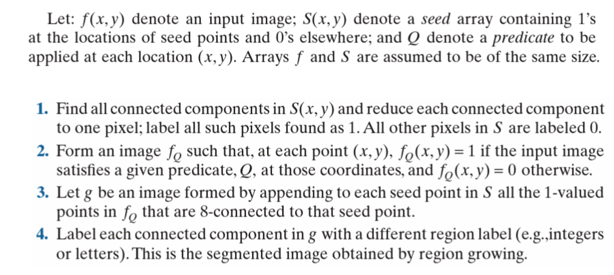
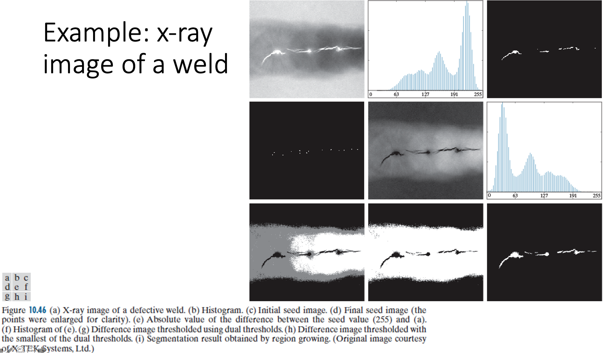
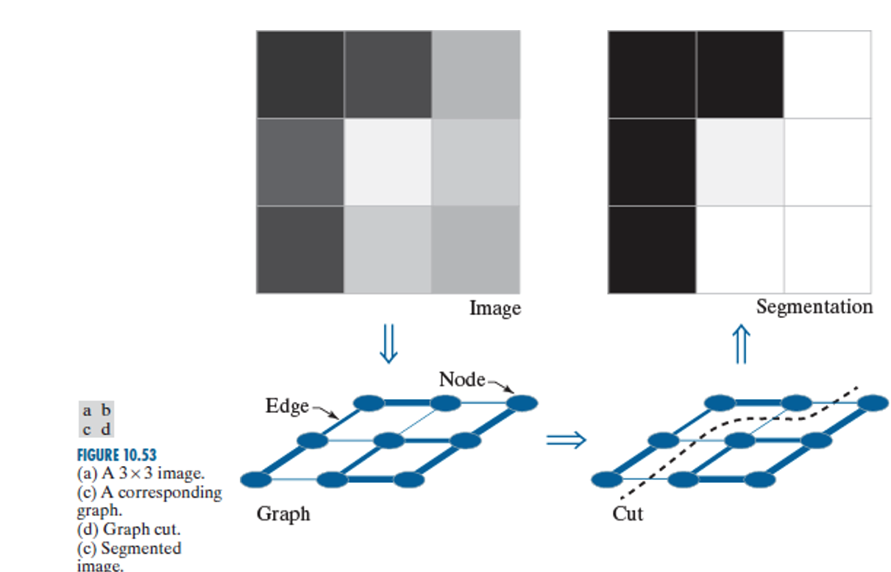
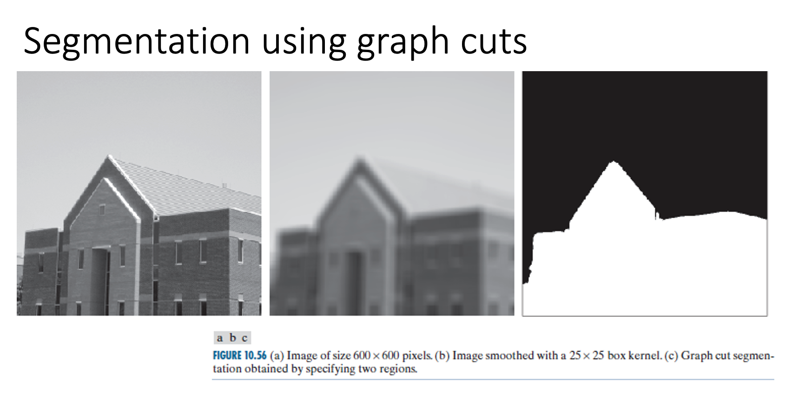

# Week8 Image Segmentation

## Segmentation algorithms

- Based in discontinuity (abrupt changes) or similarity (set of similar criteria) of intensity values

### First order derivatives

- First order derivatives produce thick edges, use a spatial convolution at every pixel location

### Second order derivatives

- Second order derivatives produce thin edges, use laplacian kernel for line detection

## Edge detection

There are various types of edges, there are **step, ramp and roof** edges

### Steps for edge detection

1. Image smoothing for noise reduction
2. Detection of edge points, by finding candidate points
3. Edge localisation, from the candidate points only edge points are selected

### Basic edge detection

- Kirsch compass kernels - strongest response in each direction
- TO find the edge magnitude and direction you convolve with all 8 kernels below, and use the kernel that gave the strongest value at that point.
- You find the edge angle at the point the kernel direction is associated with

### The Marr-Hildreth edge detectors

- Intensity changes are not independent of image scale, detection requires operators of different sizes
- A sudden intensity change gives rise to a peak in the 1st derivative

### Fundamental ideas behind LoG

- The **gaussian** part of the operator blurs the image, reducing the intensity of structures including noise.
- Also, the gaussian function is smooth in both spatial and frequency domains and is less likely to introduce artifacts

- The **Laplacian** is isotropic, invariant to rotation, responds equally to changes in intensity in any kernel direction and avoids having to use multiple kernels to calculate the strongest response at any point in the image

### The Marr-Hildreth algorithm

## Canny edge detection

Based on three objectives:

- **Low error rate**, all edges should be identified
- **Edge points should be well localized**, edges must be as close as possible to the true edges
- **Single edge point response**, the detector should return only one point for each true edge

Based on the 3 objectives, mathematically:

- Approximation to the optimal edge detectors 1st derivatives of a gaussian

1. Smooth image with a gaussian
2. Compute the Gradient magnitude using approximations of partial derivatives
3. Thing edges by applying non-maxima suppression
4. Detect edges by doubling thresholding

## Hough transform

Takes into account the shapes of the curves where the pixels lie, once detected the curves form the edges of a region boundaries of interest.

## Thresholding

Extracting the object from background by selecting a threshold T that separates these modes

### Factors for thresholding

- Separation between peaks, width and depth of the valleys Separating the histogram modes
- Noise, modes broaden as noise increases
- Relative size of object and background
- Uniformity of illumination
- Uniformity of reflectance

## Optimum global threshold: the otsu method

- Uses histogram, finds the global threshold, looks for a threshold that maximises the between-class variance.
- The idea is individual classes should be distinct with their pixels intensity values

### Otsu example

## Segmentation by region growing

Groups pixels or subregions into larger regions based on a predefined criteria for growth, by starting with a set of seed points.

### Stages

1. Determine the seed points
2. Specify the similarity criteria
3. Apply the similarity criteria difference image
4. Threshold the resulting image
5. Get regions containing seeds

## Region segmentation using graph cuts

- Partitions the image into regions by expressing the pixels as nodes in a graph
- image segmented as a weighted, undirected graph
- Separate foreground and background
- Finds the degree of similarity between pixels (nodes)
- Segmentation by cutting the weakest link

