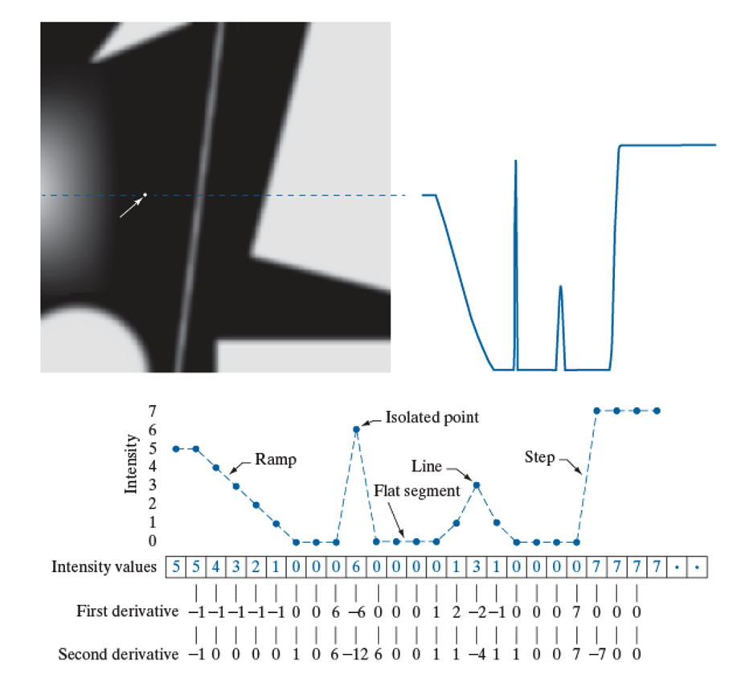
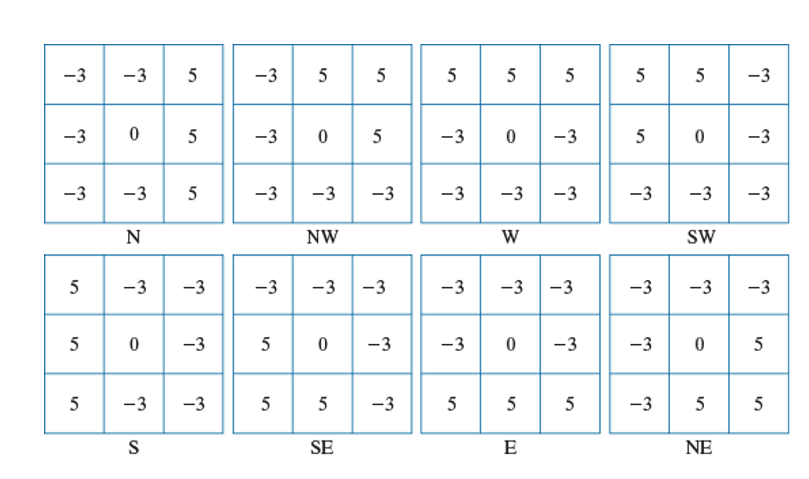

# Week8 Image Segmentation

## Segmentation algorithms

- Based in discontinuity (abrupt changes) or similarity (set of similar criteria) of intensity values

### First order derivatives

- First order derivatives produce thick edges, use a spatial convolution at every pixel location

### Second order derivatives

- Second order derivatives produce thin edges, use laplacian kernel for line detection

## Edge detection

There are various types of edges, there are **step, ramp and roof** edges

### Steps for edge detection

1. Image smoothing for noise reduction
2. Detection of edge points, by finding candidate points
3. Edge localisation, from the candidate points only edge points are selected

### Basic edge detection

- Kirsch compass kernels - strongest response in each direction
- TO find the edge magnitude and direction you convolve with all 8 kernels below, and use the kernel that gave the strongest value at that point.
- You find the edge angle at the point the kernel direction is associated with

### The Marr-Hildreth edge detectors

- Intensity changes are not independent of image scale, detection requires operators of different sizes
- A sudden intensity change gives rise to a peak in the 1st derivative

### Fundamental ideas behind LoG

- The **gaussian** part of the operator blurs the image, reducing the intensity of structures including noise.
- Also, the gaussian function is smooth in both spatial and frequency domains and is less likely to introduce artifacts

- The **Laplacian** is isotropic, invariant to rotation, responds equally to changes in intensity in any kernel direction and avoids having to use multiple kernels to calculate the strongest response at any point in the image

### The Marr-Hildreth algorithm

## Canny edge detection

## Hough transform

## Thresholding

## Optimum global threshold: the otsu method

## Segmentation by region growing

## Region segmentation using graph cuts