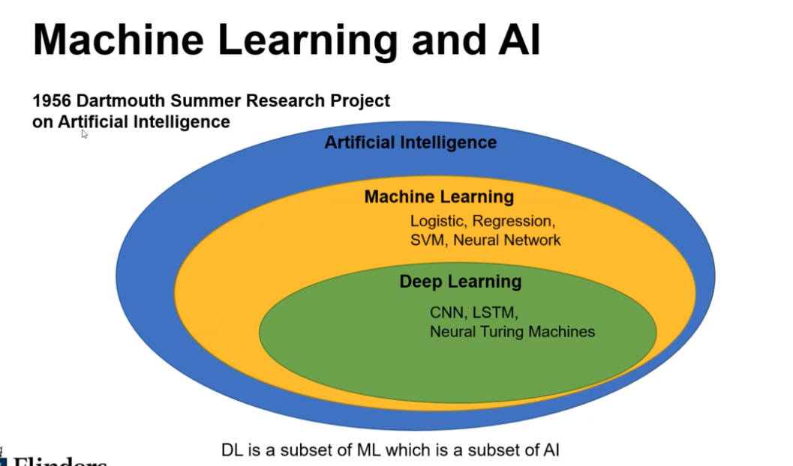

# Week 1 Machine Learning Introduction

## What is heuristic optimisation

"In mathematical optimization and computer science, heuristic (from Greek εὑρίσκω "I find,discover")", is a technique designed for solving a problem more quickly when classic methods are too slow, or for finding an approximate solution when classic methods fail to find any exact solution

**Computational Intelligence (CI)** - which takes inspiration from nature to develop intelligent computer-based systems.”(p. 1, Keller, Liu, Fogel, 2016)

- Neural Networks
- Fuzzy Systems
- Evolutionary Computation

## Machine Learning Definitions

- **Supervised Learning**, data inputted into the ML model is labelled by humans
- **Unsupervised learning**, labels aren't explicitly provided but the algorithm find the patterns

### Logistic Regression

[logistic-regression](images/logistic-regression.png)

- Uses an equation to create a curve with the data
- Uses curve to predict the outcome of a new observation
- Target variable is made up of **categories** (e.g Pass or Fail)

### Linear Regression

[linear-regression](images/linear-regression.png)

- Making a best-fit line
- Similar to logistic regression, but is used when your target variable is continuous e.g. Final mark
- Very interpretable e.g. for every hour a student puts into studying their final mark increases

### K Nearest Neighbours (KNN)

[knn](images/KNN.png)

- Predict class of  new instance based on the K nearest neighbours
- K being the number of neighbours to check
- Majority wins
- Can be slow depending on the amount of data available

### Support Vector Machine (SVM)

[svm](images/svm.png)

- Establishing a boundary between data points
- Seeks to fin the boundary with the largest margin
- Can model non-linearity with the use of the **"kernel trick"**
