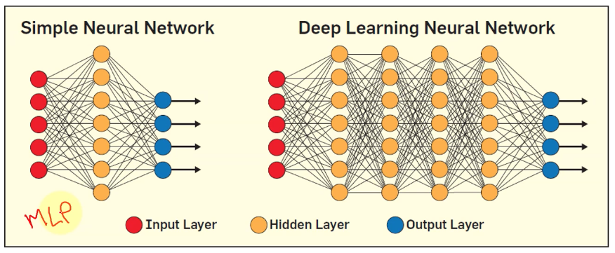
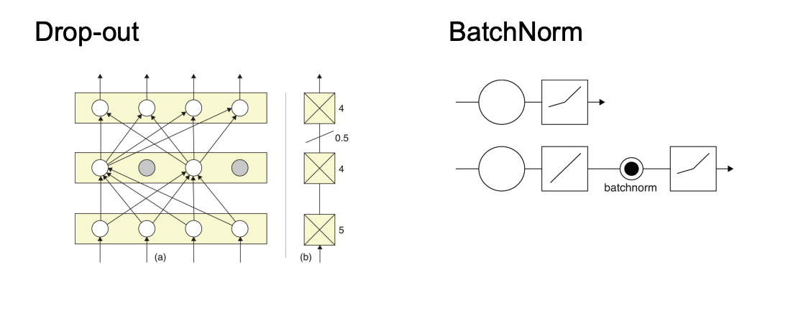

# Week10 Deep Neural Networks (DNN)

- Each layer in a neural network extracts different type of information
- There are many hidden layers which increases the parameter space
- feature engineering, detecting the features in computer vision
- More data has lead to the rise of DNN this includes GPU accelerated computation
- DNN performed automatic feature extraction without human intervention

## Regularization

Examples

[COMP2712 Deep Learning Example Part01](https://colab.research.google.com/drive/1jcpFC8ZtSlRm-d1qdisEPXqvxDHXyxMf?usp=sharing)

[COMP2712 Deep Learning Example Part02](https://colab.research.google.com/drive/1KWvhT8mUnI4PMtox6cd98eqQiw5xxEow?usp=sharing)

[COMP2712 Deep Learning Example Part03](https://colab.research.google.com/drive/1_qUCLPB7MzDBMws5I2LvJHWt5rJsiUtw?usp=sharing)
