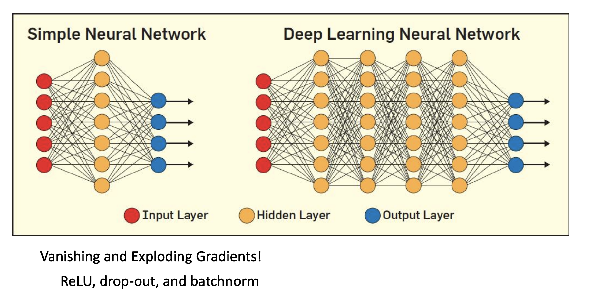
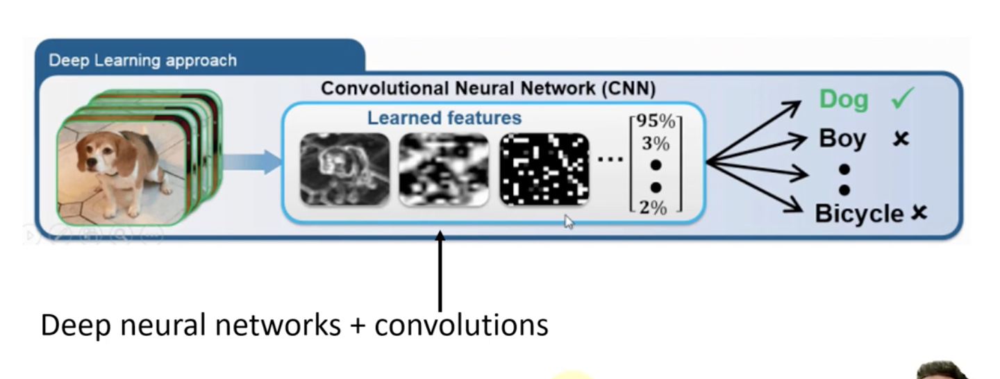
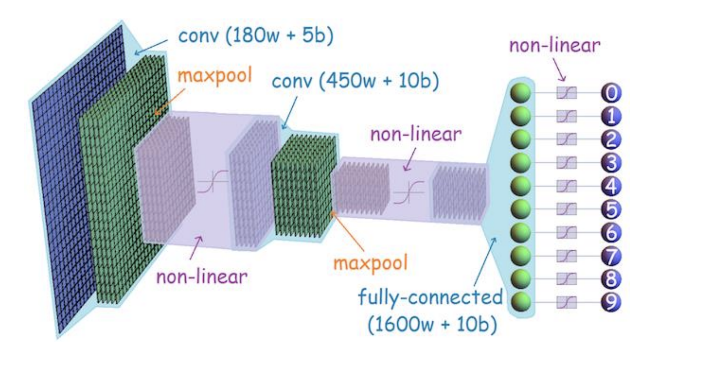
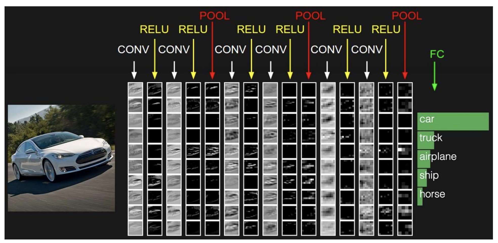
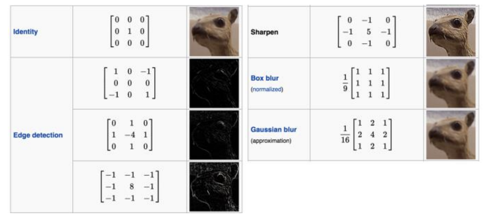
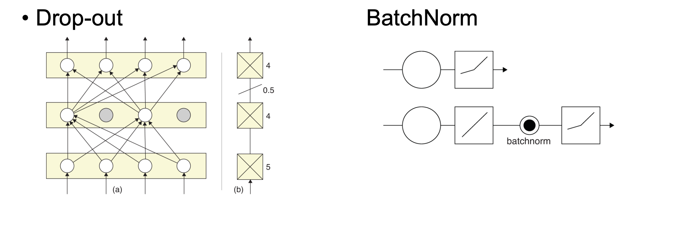
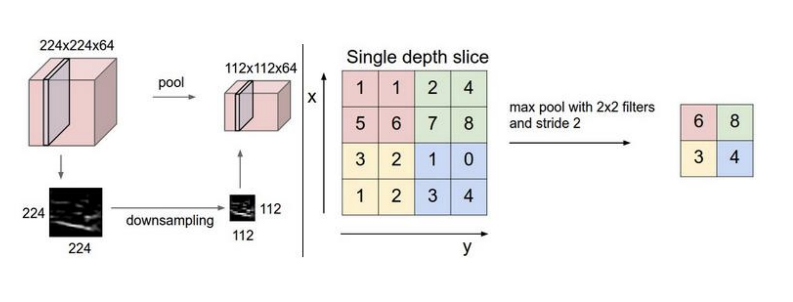
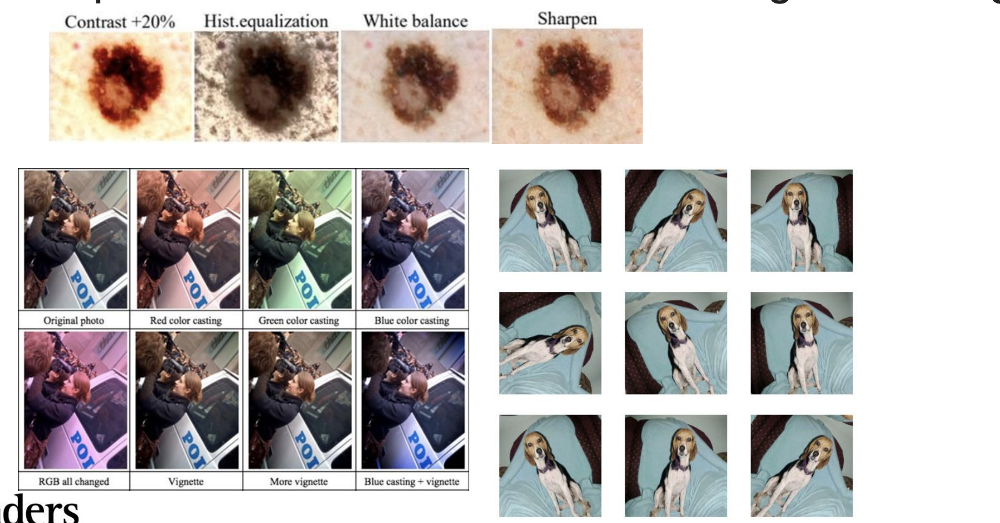

# Week11 Convolutional Neural Network

## CNN: Layer Architecture

Example of the [VGG Net](http://www.robots.ox.ac.uk/~vgg/research/very_deep/)

## What are convolutions?

[COMP2712_2021_Example_Learning1DFilter notebook](https://colab.research.google.com/drive/1PH9LriBJb1XJrMCmpROzd3EBhNpqcAJY?usp=sharing)

[COMP2712_2021_2DPatternMatchingWithConvolution notebook](https://colab.research.google.com/drive/1ZAmIKkU-enU8YDY4d3PyS1Xn0Mp-gqax?usp=sharing)

The filters applied to an image

## Pooling or Sub-sampling

## Regularisation

[CNN visualisation 1](http://www.cs.cmu.edu/~aharley/vis/)
[CNN visualisation 2](http://www.cs.cmu.edu/~aharley/vis/conv/)

## Data augmentation

Input images can be cropped, rotated, or rescaled to create new
examples with the same labels as the original training set

[COMP2712_2021_DataAugmentation notebook](https://colab.research.google.com/drive/1dLVBk9E94tOLc5BdN3ClZ2tEPUHe2TMt?usp=sharing)

### Deep Learning Pros

- Best performing method in many CV tasks
- No need for hand crafting
- Robust to natural variation
- Many different applications
- Large scale problems
- Improves with more data
- Easy parallelization on GPUs

### Cons

- Need huge amount of data
- Hard to design and tune
- Difficult to analyse/understand
- SVMs easy to deploy and get good results
- Tend to learn everything

### Deep Learning best practices

- Check/clean your data
- Shuffle the training samples
- Split your data into training and testing samples
- Use validation data as well
- Never train on test data
- Start with an existing network and adapt it
- Start smallish, keep adding layers and nodes
- Check that you can achieve zero loss on a tiny subset

### When to use Deep learning

- You have large amount of data with good quality
- You are modelling image/audio/language/time series data
- Excels in tasks where the basic unit (pixel, word) has very little
meaning in itself, but their combination has a useful meaning
- You need a model that is less reliant on handmade features and
instead can learn features from the data

[COMP2712_2021_DeepLearningExample_Part04 notebook](https://colab.research.google.com/drive/1FTl7TWxd05gj13hPC2A-IrKnNx7W9cHS?usp=sharing)

## Transfer Learning

- Big networks needs lots of data and lost of computer power
- Transfer learning is using previously trained models as a starting point for further refinement or a frontend feature extractor for a classifier

### Transfer learning workflow

1. Take layers from a previously trained model
2. Freeze them, sa as to avoid destroying any of the information they contain during future training rounds
3. Add some new, trainable layers on top of the frozen layers. They will learn to turn the old features into predictions on a new dataset.
4. Train the new layers on your dataset.

[COMP2712_2021_TransferLearning notebook](https://colab.research.google.com/drive/1_3bHIrqcdl5TyZHf3IzrhZs-UUdL99dA?usp=sharing)