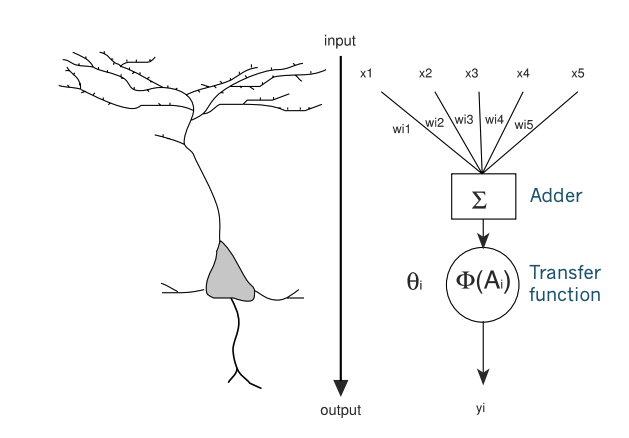
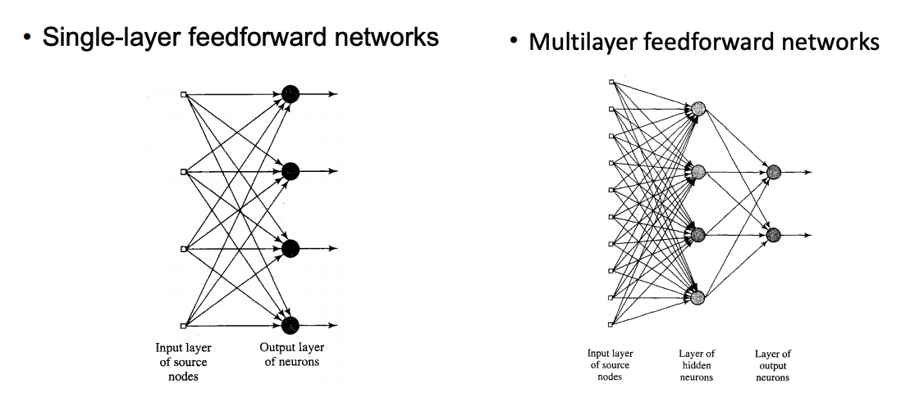
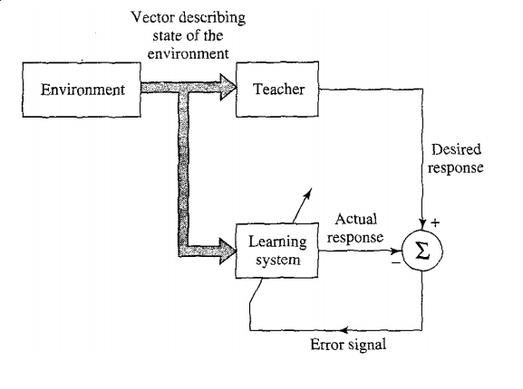
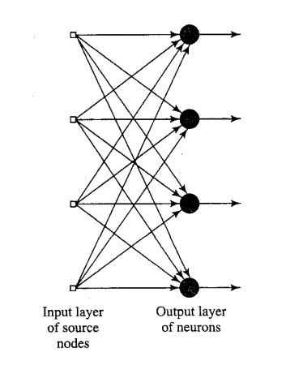
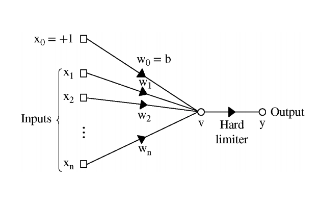
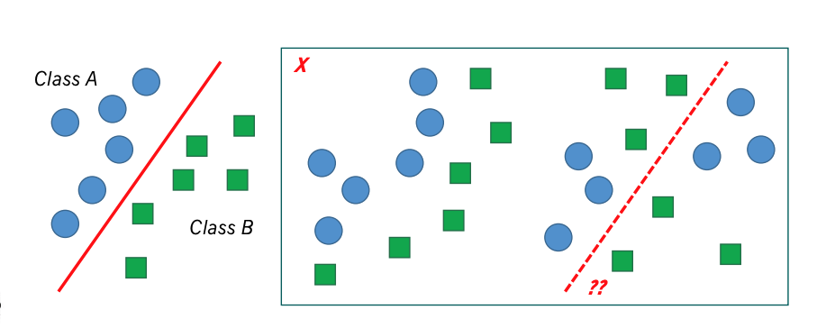
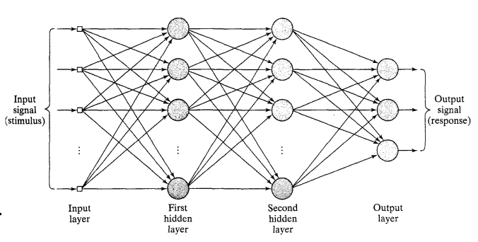

# Week2 Single Layer Neural Networks

## Connectionism

- Good fashion AI techniques are challenged by the variability of real-world data e.g. a face never looks the same
- Great failure of AI to solve “simple” real-world pattern recognition problems
- The human brain is the best example of a **pattern recognizer**, also known as **Parallel Distributed Processing (PDP)**
- **Neural engineering** aims to reproduce the functionality of the brain in
order to engineer intelligent machines

## Artificial Neural Networks (ANN)

- Interconnected networks of simple processing units, inspired by the nervous system
- Can learn from sample inputs and outputs

### ANN Strengths

- **Robustness** - Increased noise levels or network malfunctioning lead to graceful degradation by increasing the error rate an example is **Content-based retrieval**: Retrieve information by matching content, even if it is
incomplete or corrupted
- **Flexibility** - Not domain specific, can solve many different types of problems
- **Generalization** - Extraction of invariant features of the patterns, giving enough examples ANN becomes better

### Elements of a Neuron

1. A set of synapses or **connecting links**, each characterized by a weight or strength of its own
2. An **adder** for summing the input signals, weighted by their respective synapses
3. A **transfer (activation/squashing) function** for regulating the output amplitude

### Neural Computation

- McCulloch and Pitts (1943): model neurons can compute any Boolean functions

- low threshold → OR
- high threshold → AND
- negative inputs → NOT

[Neural Computation](images/neural-computation.png)

### Neural Architectures

## Learning Paradigms

- Models of how the neural network (or other learning agent) relates to its environment

1. Supervised Learning

- Learning with a teacher
- Teacher has knowledge of environment (problem/task)
- Knowledge is represented by a set of input-output examples
- Error = the difference between the desired output (according to teacher) and actual output of a network
- The objective is to make the neural network emulate the teacher (by minimizing error)

2. Unsupervised

## Perceptrons

- Simplest form of neural network for pattern classification, uses McCulloch-Pitts model;Hebbian,supervised learning (Rosenblatt, 1958)
- Single neuron perceptron can decide between two classes. Multiple neurons for more classes

## Perceptron Convergence Algorithm

- Iteratively update weights until convergence
- Each iteration is called an epoch

### Stages

1. Initialize weights w to random values
2. For each training example, compute perceptron response y
3. Updates weights (+bias) using learning rule (see previous slide)
4. Go back to step 2 Repeat until perceptron response matches desired response

### Perceptron Limitations

- Decision surface is a hyperplane, Classes must be linearly separable
- Perceptron cannot learn XOR, or parity function in general

## Multilayer Perceptrons

- Any Boolean function can be computed as long as we have at least one hidden layer
- Non-linear transfer function needed
- More layers, can solve more complex, non-linear problems

