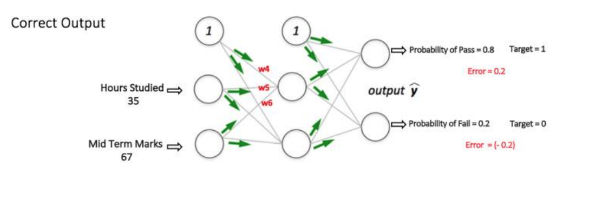
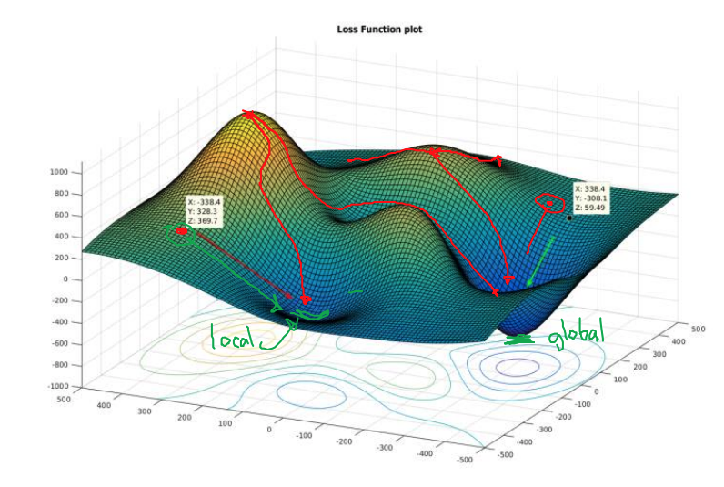

# Week3 Multi Layer Neural Networks

[Neural networks video](https://www.youtube.com/playlist?list=PLZHQObOWTQDNU6R1_67000Dx_ZCJB-3pi)

## Perceptron

- Function that takes an input runs an activation function and produces an output
- We can devise learning algorithms which can automatically tune the **weights** and **biases** of a network of artificial neurons

### Limitations

- Decision surface is a hyperplane, Classes must be linearly separable
- Perceptron cannot learn XOR, or parity function in general

## Multi-layer Perceptron (MLP)

- Perceptron (circa 1958), no layers, only linearly separable
- MLP, more layers, can solve more complex, non-linear problems
- Get the smallest network that can separate the classes

[MLP Online Classification Demo 1](https://cs.stanford.edu/people/karpathy/convnetjs/demo/classify2d.html)
[MLP Online Classification Demo 2](https://cs.stanford.edu/people/karpathy/convnetjs/)

## Error Backpropagation

1. Forward pass (weights fixed)
   1. Network input propagates layer-by-layer
   2. Network output compared to desired output
2. Backward pass (weights changing)
   1. Error signal propagated backward through the network
   2. Weights are adjusted to move network closer to desired response

### Example

- Forward pass or propagation of input to output

- Backward pass or propagation of error (loss function)
- Gradient Descent

- Weights Adjusted, New sample, feedforward

### Loss or Cost Function

- Loss function is basically it is a performance metric on how well the MLP manages to reach its goal of generating outputs as close as possible to the desired values.

`loss = (Desired output - actual output)`
`loss = Absolute value of (desired – actual)`

[Common Loss functions in machine learning](https://towardsdatascience.com/common-loss-functions-in-machine-learning-46af0ffc4d23)

### Gradient Descent

- Calculate the total error at the output nodes
- Propagate these errors back through tge network using backpropogation to calculate the gradients
- Gradient Descent to ‘adjust’ all weights in the network with an aim of reducing the error at the output layer.

#### Local Minimum

## Curse of Finite Sample Size

- Problem is there are unlimited variations and possibilities in nature, other problem is data sample may have inaccuracies or may be different all the time.

### Generalization

- Input-output mapping of the network should be correct for data never used in creating or training the network
- **Generalization** – the ability to produce satisfactory responses to patterns that were not included in the training set
  - Extra-sample error – the average prediction error for data that the neural network has never seen
  - In-sample error – is the average prediction error for data that the neural network has been trained on

[Google Colaboratory Example](https://colab.research.google.com/drive/1IsUmqqs-y0EAzmxaqjVJWSVsRnrOXyjl?usp=sharing)
