# Week4 ML Evaluation

## Issues

- Overfitting the results based on the available/training data
- In sample error
- small data sets
- Generalization

**Never report results based on the data you used to TRAIN the model**

## Types of errors

### 1. Fitting Errors

The fitting error is the mean square error between a data point and the nearest point of the fitting function 

`Error(x) = E[(y-f(x))2 | x]`

- **Bias**, how far away (on average are the model predictions)
- **Variance**, how spread out are the model predictions

#### Example of Bias and Variance

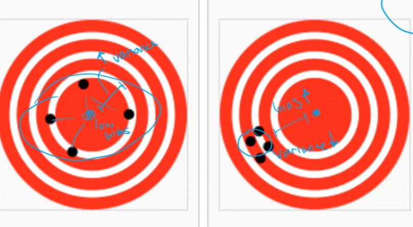

**Underfitting** - High bias & low variance,Stable but potentially poor predictions and Learned model is too simple
**Overfitting** - Low bias, high variance, Too sensitive to variations in the data and Learned model is too complex

## Model Selection

### Factors to consider

- Complexity of the actual problem
- Representativeness and size of the training set
- Complexity of the classifier

### Improving ANN Generalization

- Number of hidden layer neurons must match the problem complexity
- Training set must be large enough (training data >> synaptic weights)
- Reduce extra-sample error e.g. under train complex networks

### Cross-validation

- Widely used method for estimating extra-sample prediction error
- Subdividing the patterns for which a desired response is known into multiple sets

**Training set** - used for changing the ANN synaptic weights
**Validation set** - used for assessing the extra-sample error of the network
**Testing set** - used only on the final chosen model, the ultimate test, for comparison again other models

## Training and Evaluation Paradigms (Important)

- Train/Test split
- Cross Validation (e.g. k-fold, leave-one-out)
- Grid Search for Parameter Optimisation (not covered)
- The Problem with Accuracy
- Early Stopping

### Train/Test split

- Common splits for Train/Test are `80/20%` or `70/30%`
- Doesn't utilise all the data for the testing or training
- Could introduce bias

```python
x_train, x_test, y_train, y_test = train_test_split(x, y, test_size=0.3,random_state=0, stratify=y)
```

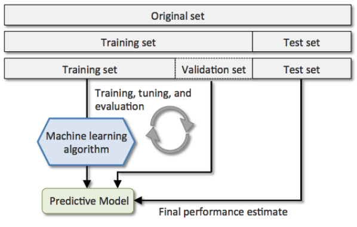

### K-fold cross-validation

- 10x10CV (10 iterations X 10 classes/instances)

- steps:
  - Introduces folds
  - Split the data into 10 chunks `k=10`
  - Train on all data
  - Evaluate on the last bit of data
  - Get 10 different estimates and combine al l the estimates together

- Advantages:
  - Use all the data for testing!
  - More data for training, around 90% of the data for training

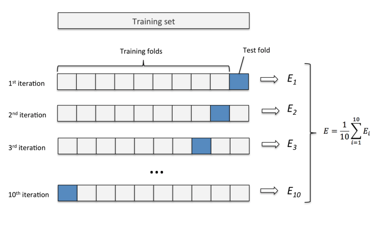

### Leave-one-out (loo) cross-validation

- A k-fold cross-validation where each fold is a single sample/instance.
- For each split, you pick a single data point to be the test set
- Can be very time consuming, particularly for large datasets
- Sometimes provides better estimates on small datasets

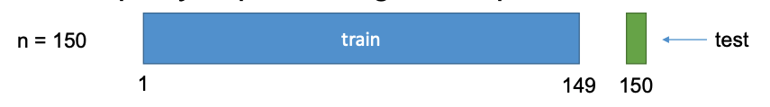

## The problem with accuracy

- Unbalanced class distribution e.g. everything is a cat (99% accurate ) because there is one dog
- Accuracy can be biased to the class with the largest number of cases
- Many real-world datasets are unbalanced
- More statistics needed such as:
  - Precision
  - Recall
  - F1-Score
  - Kappa
  - informedness

## Statistics for measuring accuracy

### 1.Confusion matrix

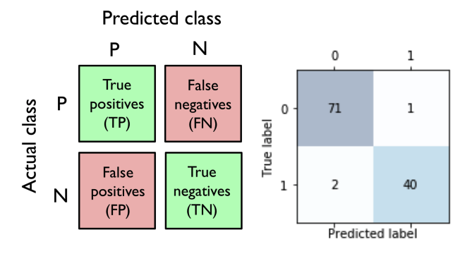

- Goal is to maximise the true positives and true negatives
- Looking for a diagonals

Accuracy is :

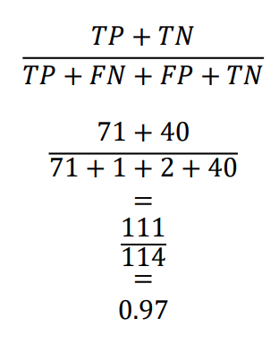

#### Precision (Vertical)

- Is the number of True Positives divided by the number of True Positives and False Positives
- Also known as the Positive Predictive Value
- Measure of a classifier’s exactness
- A low precision can indicate many False Positives.

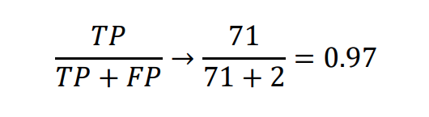

#### Recall (Horizontal)

- Is the number of True Positives divided by the number of True Positives and False Negatives
- Also known as the True Positive Rate
- Measure of a classifier’s completeness
- A low recall indicates many False Negatives

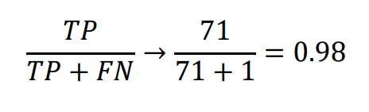

### F1 Score

- is the `2*((precision*recall)/(precision+recall))`
- Conveys the balance between the precision and the recall. Measure of a classifier’s completeness

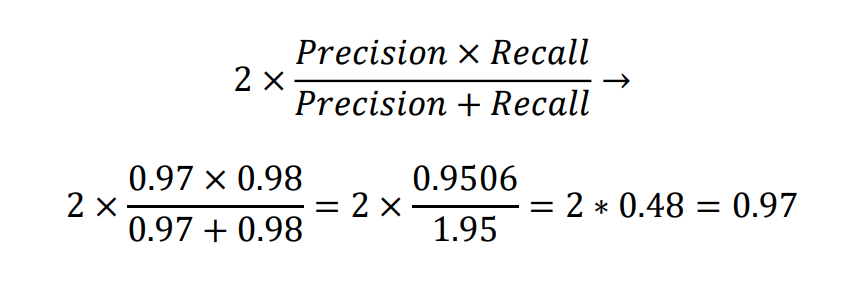

### Informedness or bookmaker informedness (BM)

Not biased by unbalance classes with range of [-1 1]

- 0 always being guessing,
- 1 perfectly correct and
- -1 perfectly incorrect

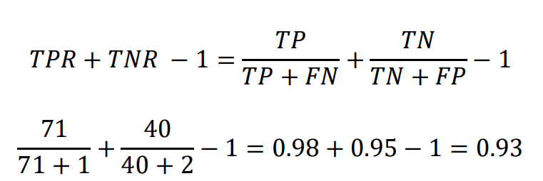

### Example

- Truth: 80 cats (0), 20 dogs (1),
- Predict: 99 cats, 1 dog

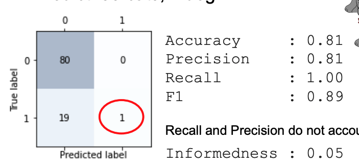