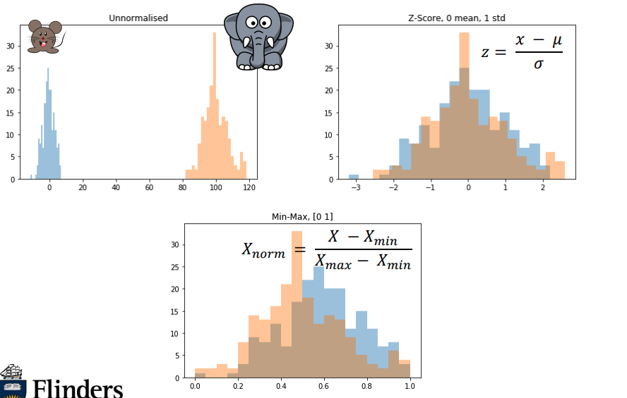
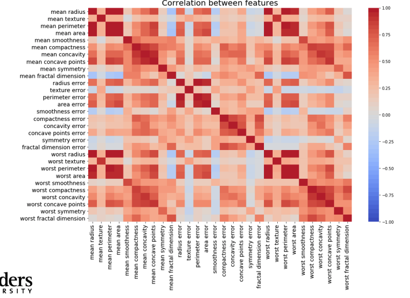
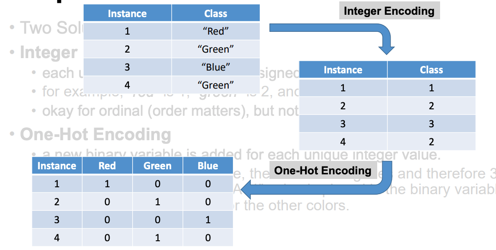

# Week 5 Feature Normalisation

## Feature Normalisation

[Google colab feature normalisation example](https://colab.research.google.com/drive/1nbxaVa7YElj9EdG78q1iHhXYDzIjLBH0?usp=sharing)

## Feature Reduction

- Principle Components Analysis (PCA)
- Reduces the original data features into uncorrelated principle components
- Each component representing a different set of correlated features with different amounts of variation.
- Can reduce from 100's to of 10s feature

[Google colab example on feature reduction](https://colab.research.google.com/drive/1rOL7B6PGb-bovZ7z26K0daqTCzErZJpX?usp=sharing)

### PCA Limitations

- **Model performance**, PCA can lead to a reduction in model performance on datasets with no or low feature correlation or does not meet the assumptions of linearity
- **Classification accuracy**, Variance based PCA framework does not consider the differentiating characteristics of the classes. Also, the information that distinguishes one class from another might be in the low variance components and may be discarded.
- **Outliers**, PCA is also affected by outliers, and normalization of the
data needs to be an essential component of any workflow.
- **Interpretability**, Each principal component is a combination of original features and does not allow for the individual feature importance to be recognized.

## Output transformation

- Categorical variables are often called nominal e.g pet variable has values "dogs" and "cat"

### Integer Encoding

- each unique category value is assigned an integer value.
- for example, “red” is 1, “green” is 2, and “blue” is 3.
- okay for ordinal (order matters), but not for true nominal

### One-Hot Encoding

- a new binary variable is added for each unique integer value.
- In the “color” variable example, there are 3 categories and therefore 3
binary variables are needed. A “1” value is placed in the binary variable
for that color and “0” values for the other colors.

### Example

[Exploring feature reduction with PCA with ML (Google Colab)](https://colab.research.google.com/drive/1TqDnU8D5M4mNd9hmpDJRofiuj7V9l5Gc?usp=sharing)

[ML Review Feature Normalisation: Output](https://colab.research.google.com/drive/1LkHD_QTzqhmo6URWHxwlLXE8rytW02kD?usp=sharing)