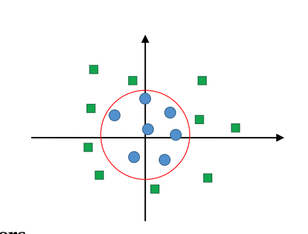

# Week Structured Vector Machine (SVM)

- Classifying technique
- Perceptron-like linear classifiers
- Improved **generalization** (how well you do on the test data)properties using **margin maximization**
- Big margin = reduced chance of misclassification

## Optimal Hyperplane

- We have to find the optimal hyperplane that can best separate the two classes
- Assuming two classes yi={-1,1} and samples made up of features x
- For implementing an SVM we must select **w** (weight) and **b**(bias) so that they satisfy

## Soft margins

- Relax constraints by permitting some errors/outliers
- Data points on the wrong side of the margin boundary incur a penalty that increases with the distance from it

- Objective function to minimize changes to

- **Capacity parameter** C is a constant chosen by the user
- Controls the trade-off between error and margin
- Small C allows for more error: softer (more mis-classification)
- Large C restricts the amount of error: harder
- C can range, for example, 10-6 to 106

Different kinds of errors:

- label error – maybe human error → large outliers
- attribute error – small measurement imprecision
- noise error – variable unmodelled/unwanted factors
- model error – distributions overlap – not separable

Soft versus Hard margins

- Soft Margin SVMs always have a solution and are more robust to outliers (more resilient models)
- Hard Margin SVMs do not require any parameters to be guessed

## The Kernel trick

[Colab kernel ](https://colab.research.google.com/drive/1MHb1zhfTqAquSqgQkOJuNKxR1fuiFA1F?usp=sharing#scrollTo=azx3kD0NM1Qi)

## Which kernel?

- Data-dependent, linear first and see if it improves with non-linear kernels
- Slower training with non-linear

## Compared to MLPs

- Number of hidden neurons = number of support vectors
- Performance close to theoretical optimum