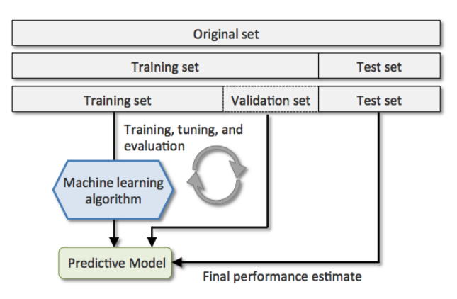
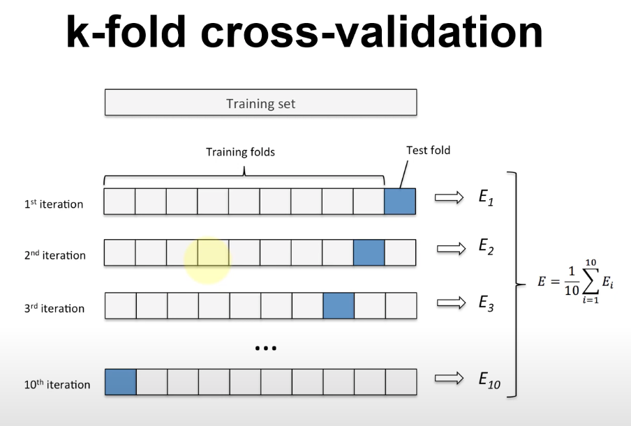
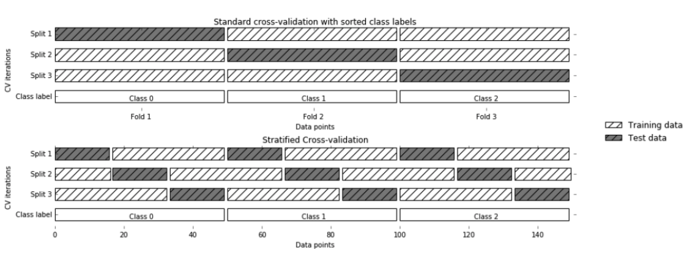
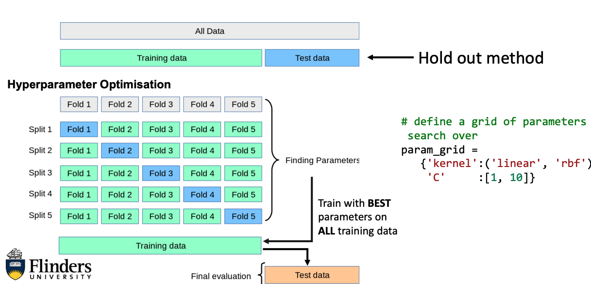
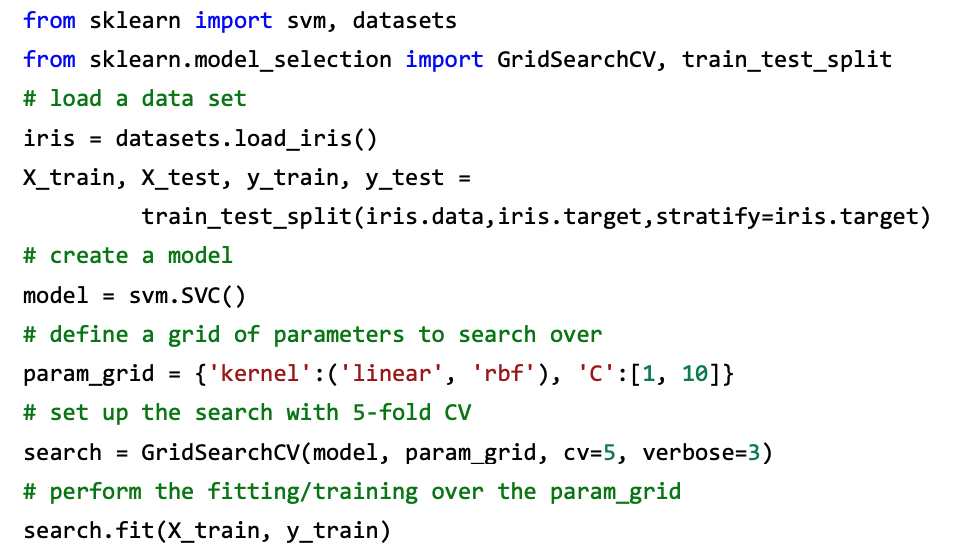
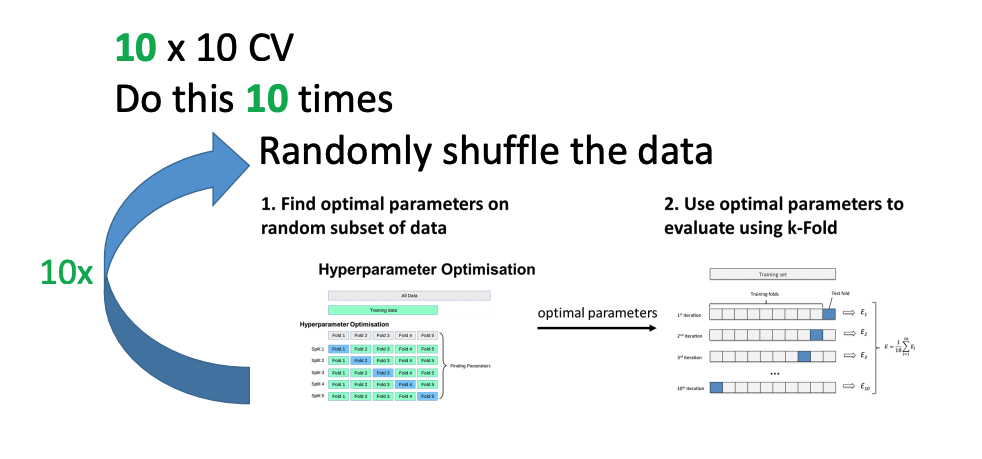

# Week 8 Hyperparameter and Inferential Statistics

What parameters can we use for our models

- Adjusting parameters during the training phase, e.g., the neuron weights
- A **hyperparameter** is a parameter whose value is used to control the learning process, e.g. using either linear or rbf kernel
- **Systematically** evaluate different parameter settings
- Grid Search explores all possible combinations

## Training and Evaluation Paradigms

### Train/Test split

- Split data by 80/20% or 70/30%
- doesn't use all data for testing
- Could introduce bias

### Cross Validation (e.g. k-fold, leave-one-out)

- Usually a 10-CV
- Uses all the data fro testing
- More data for training

- **Stratification**: maintain class distribution between train and test
  

### Grid Search for Parameter Optimisation

[Grid search scikit learn](https://scikit-learn.org/stable/modules/grid_search.html)

[Colab on grid search](https://colab.research.google.com/drive/1IiSgOAQ1qyUKpkEHRuHqPNtyEupbRg6J?usp=sharing)

[Google Colab example](https://colab.research.google.com/drive/16vyQCvOohnMeiugWDAhlB4jprvAcAr9K?usp=sharing)

## GridSearch

- Usually only small subset of parameters have a large impact on the predictive or computation performance 
- Others can be left to their default values. Read the Docs!
- Do NOT use accuracy for the GridSearch (scoring) - Precision, Recall, and even f1-score can be biased (that’s bad), Informedness (or MCC or Kappa, similar, but available in scikit)

[alternate scoring](https://colab.research.google.com/drive/1Sr5meBqa5ziRqDJcyGsXvQ_EhwgTPSuG?usp=sharing)

## 10 x 10 CV and Statistics

### 10 CV

- Test the generalisation performance of a classifier on all data
- Not a single classifier, but 10 instances of a classifier

### 10 x 10 CV

- Do this 10 times
  - Randomly shuffle the data
  - Perform a 10 CV
- Can calculate mean and standard deviation on performance measures
- Not a single classifier, but 10 x 10 = 100 instances of a classifier!!

[pract4 10x10 CV](https://colab.research.google.com/drive/1nZobuO7rMfZUv7sEKfMGBqKOAcREo1X0?usp=sharing)
[Statistical comparison of models using grid search](https://scikit-learn.org/stable/auto_examples/model_selection/plot_grid_search_stats.html)

[colab example of statistics](https://colab.research.google.com/drive/1t4LMyy_8R9O7fgKleSY7GWn3v7Wlm9Ih?usp=sharing)
