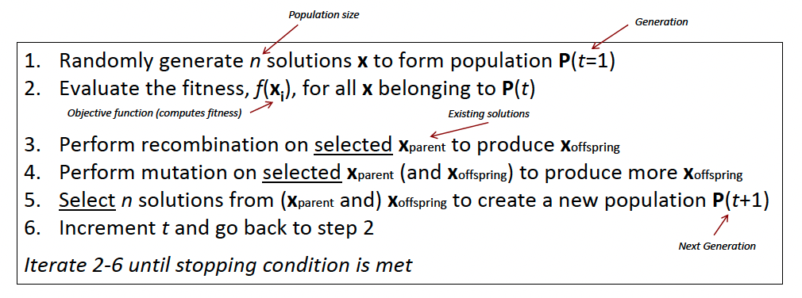
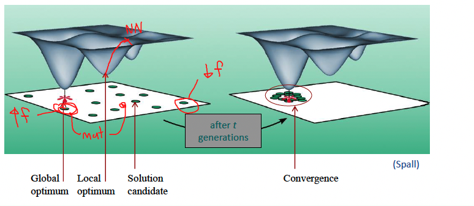

# Week 9 Evolutionary Algorithms Ontologies

## Evolutionary Meta-Heuristic

## Fitness Landscape

Visualising the relationship between performance and solution parameters

**Exploration** - Discovering promising areas in the search space (gaining information on the the problem)

**Exploitation** - Optimising within a promising area (using the gained information)

Optimal balance is necessary:

- Limited exploration leads to convergence on local optimal (aggressive selection, small mutations)
- Limited exploitation slows down the search process (lenient selection, large mutations)

## Benefits of EA

- Widely applicable
- Global optimizer
- Provides alternative solutions
- Easy to combine with other methods

## Drawbacks

- Computationally expensive - Inefficient; scales badly with problem dimensionality
- No guarantee to find the global optimum within a realistic time frame
- Has many parameters that need to be tuned
- Weak theoretical basis compared to other methods

## Ontology of Generic EAs

**Evolutionary computation (EC)** refers to computer-based problem solving systems that use computational models of evolutionary processes

- natural selection
- survival of the fittest
- reproduction

## Representation Scheme

Nature of the data structure (genome) that describes the solution candidates

- Genetic Algorithms (GAs)
  - Binary strings (010111100101)
- Evolution Strategies (ES)
  - Continuous/Real valued strings (0.45, 0.57)
- Evolutionary Programming (EP)
  - originally: finite state machines
  - now: similar to ES
- Genetic Programming (GP)
  - Discrete valued trees

### 1. Genetic Algorithms

- Operates on binary strings, Population of binary chromosomes encodes candidate solutions
- Good heuristic for solving discrete optimization (esp. combinatorial) problems

### 2. Binary Representation

- Binary vectors of fixed length
- 