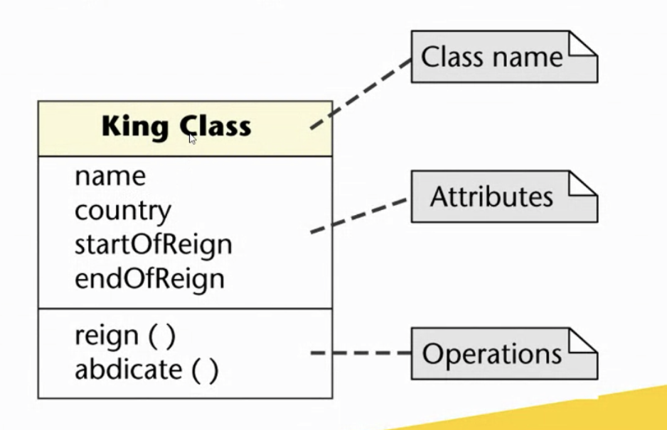
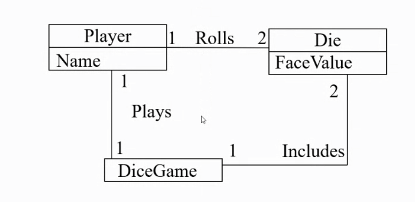
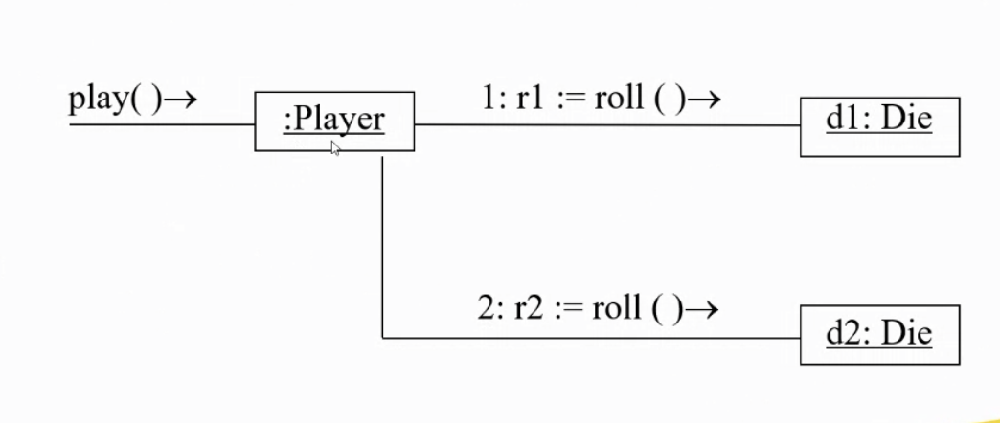
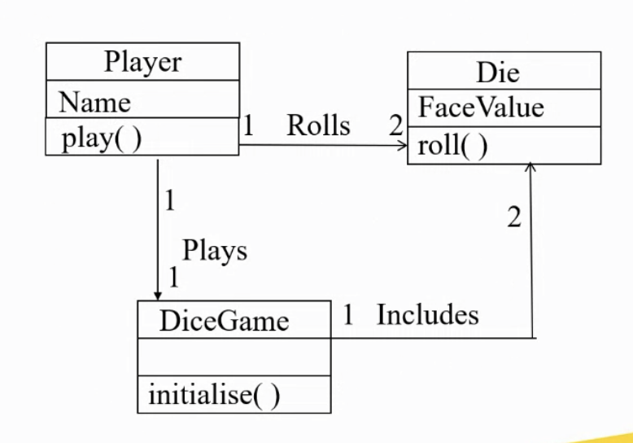

# Week2 The Object Oriented Paradigm

## Unified Modelling Language (UML)

- Visual language for specifying, building and documenting the artifacts of a software system.
- UML is a set of diagrams representing various aspects of the system
- Used by IT professionals to communicate quickly and accurately

### UML Notations for Classes : Boxes

1. Top Box - Class name
2. Middle Box  - Attributes
3. Lowest Box  - Operations

Example - A **king** is an instance of a **King Class**

**Use case**- narrative description of domain processes in a structured prose format

|Example||
|:---|:---:|
|Use case |Play a game|
|Actor|Player|
|Description|This use case begins when the player picks |

### Conceptual Model

Identifies for the relevant perspective, the concepts, attributes and relationships in the domain that are considered important

### Interaction/Communication Diagram

Captures the allocation of responsibilities to objects and how they interact via messages

### Design Class Diagram

Describes the software components

