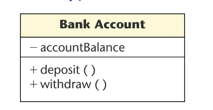
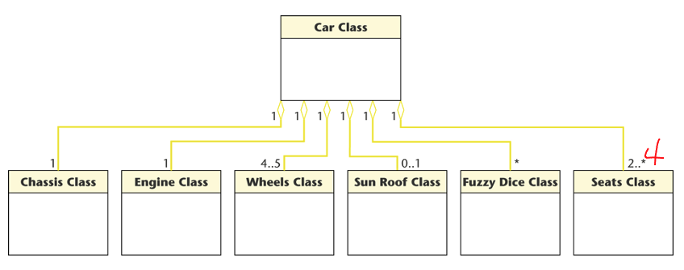

# Week3 Object Oriented Analysis

## Class Diagrams

- Describes the types of objects in a system
  - Shows the attributes and operations of a class 
  - Records constraints that apply to the connections between objects
  - Depicts static relationships that exists between them

Class diagrams describes:

- Types of objects, classes in a system
- Optional attributes and operations of classes
- various kinds of static relationships between them
- constraints that apply on the ways objects are connected

Basic class diagram components are:

- Classes as a rectangle
- Class identification (attributes and operations)
- Associations between classes represented by lines between the class rectangles

### Example Class Diagram

- The bank account class has 2 operations which is `deposit()` or `withdraw()` 

### Notations

`bank account : Bank Account Class`

- Underlining denotes an object
- Colon denotes "an instance of"
- Bold face and initial upper case letters in Bank Account Class denote that this is a class

### Visibility Prefixes

UML visibility prefixes (used for information hiding)

- Prefix  **+** indicates that an attribute or operation is public
  - Visible everywhere
- Prefix **–** denotes that the attribute or operation is private
  - Visible only in the class in which it is defined
- Prefix **#** denotes that the attribute or operation is protected
  - Visible either within the class in which it is defined or within subclasses of that class

### Class Diagrams: Visibility Prefixes

Attribute accountBalance is visible only within the Bank Account Class Operations deposit and withdraw are accessible from anywhere within the information system

## Aggregation

- Open diamonds denotes aggregation, Aggregation is the UML term for the part–whole relationship

**Example**: “A car consists of a chassis, an engine, wheels, and seats”  

## Multiplicity

- The numbers next to the ends of the lines denote multiplicity
- The number of times that the one class is associated with the other class

**Example**: “A car consists of one chassis, one engine, 4 or 5 wheels, an optional sun roof, zero or more fuzzy dice hanging from the rear-view mirror, and 2 or more seats”

## Composition

- Composition is depicted by a solid diamond
- Also models the part–whole relationship
- In addition, every part may belong to only one whole
- If the whole is deleted, so are the parts

**Example**: 

- A number of different chess boards
- Each square belongs to only one board
- If a chess board is thrown away, all 64 squares on that board go as well

## Inheritance

- Inheritance is a required feature of object orientation
- Inheritance is a special case of generalization
  - The UML notation for generalization is an open triangle
  - Sometimes the open triangle is labelled with a discriminator

## Generalization

- Every instance of Asset Class or its subclasses has an attribute assetType (the discriminator)
- This attribute can be used to **distinguish between instances of the subclasses**

## Associations

The association between the two classes may be modelled as a class (association class)

**Example**: Suppose the radiologist consults the lawyer on a number of occasions, each one for a different length of time

## Conceptual Model

- Representation of concepts* in a problem domain
- shows entity or participating objects i.e.
  - “real world” concepts (conceptual classes)
  - associations between concepts
  - attributes of concepts

### Stage 1

- Use the (common) Concept Category list to identify candidate concepts from the SRS and use cases plus any other information sources
- Use noun phase identification* to identify candidate concepts 

The (common) Concept Category list (modified from Larman)

- physical thing, container, contained, place
- description or specification
- external system
- organisation
- role
- event
- process, activity, transaction, transaction step
- policy, procedure, rule
- catalogue, record (various forms), manual, book
- service
- monetary item

### Stage 2

- Add the necessary* associations between them
  - knowledge of the relationship needs to be known for some duration; 
  - not redundant nor derivable

- Add the necessary* attributes
  - information about attribute needs to be remembered
  - simple, common or pure DataTypes (i.e. not requiring a unique identity)

### Conceptual modelling process

### Example: Attributes in the NextGen POS Partial Domain Model

