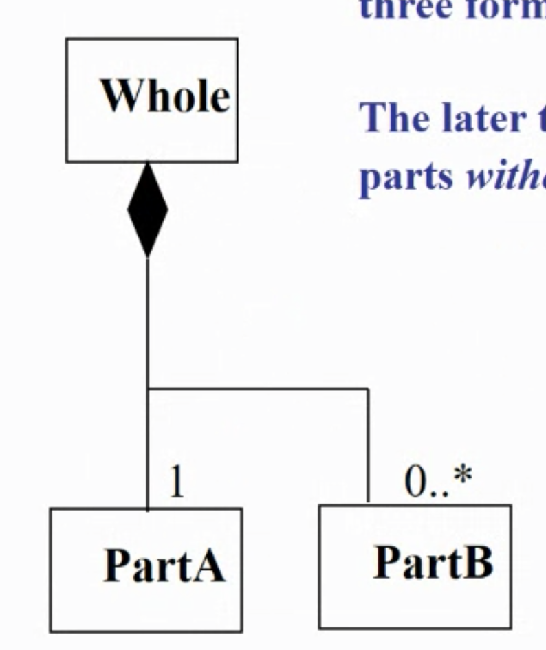

# Week4 Conceptual Modelling

## Steps to constructing a conceptual model

1. Identify conceptual classes
2. Identify relationships
3. Identify attributes

### Identifying relationships

#### 1. Generalisation/specialization

- Generalisation is a relationship between a general and a special abstract date type such that the special type adds properties* to the general and behaves in a way that is compatible with it

#### 2. Aggregation

- Aggregation is an association in which the involved elements represent a whole-part hierarchy
- The multiplicity a is rarely not 1 so it can be omitted

#### 3. Association

- Association describes a connection of some form not covered by the other types

#### 4. Composition

- The later two emphasize the non-existence of the parts without the whole.

### Attributes

- Is a (data) element present in the same way in any object of a class
- Attributes are shown in the second Compartment of the class Box

## Example

### Domain model (same as conceptual class diagram)

