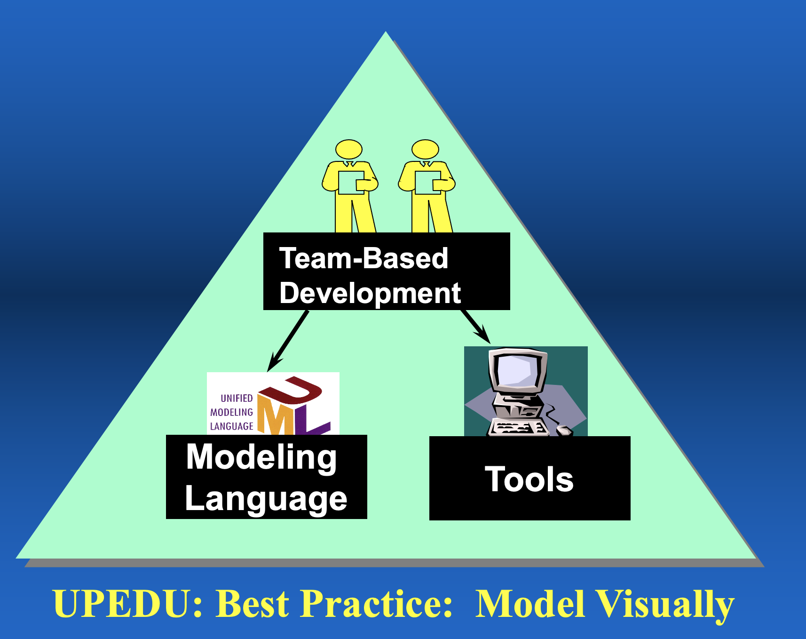
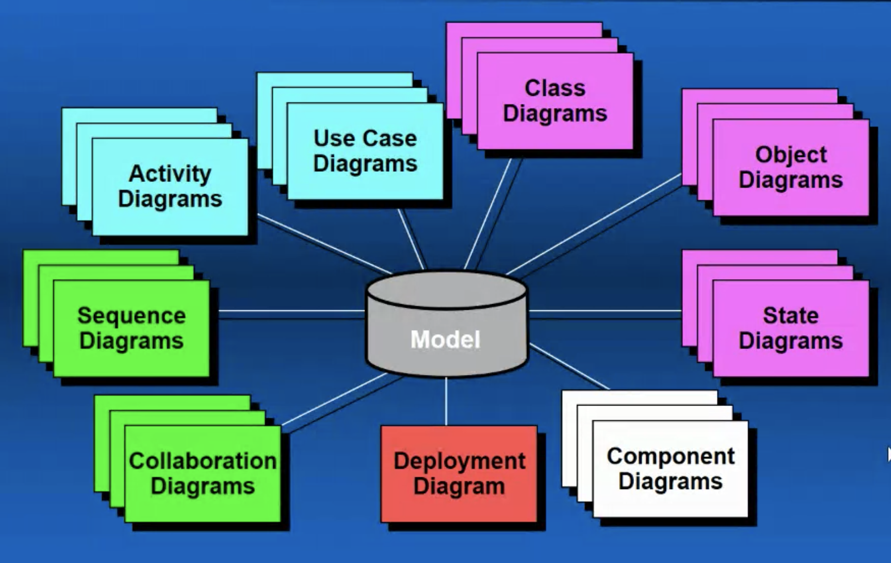
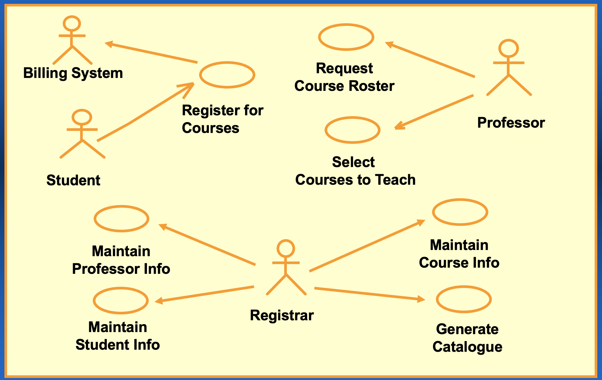
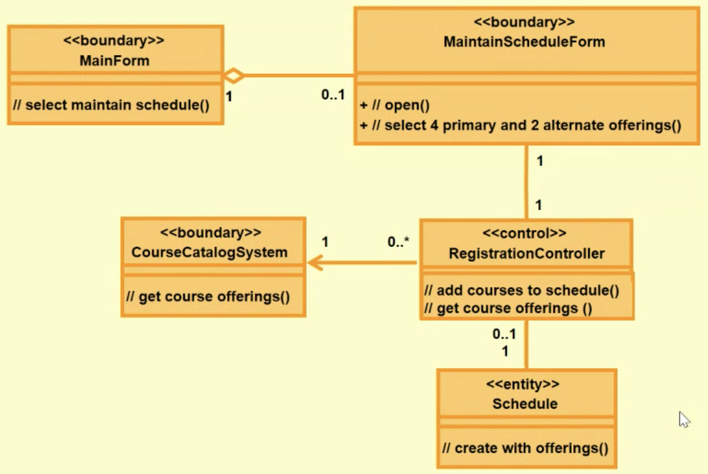
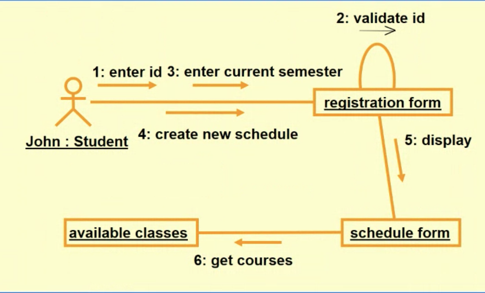
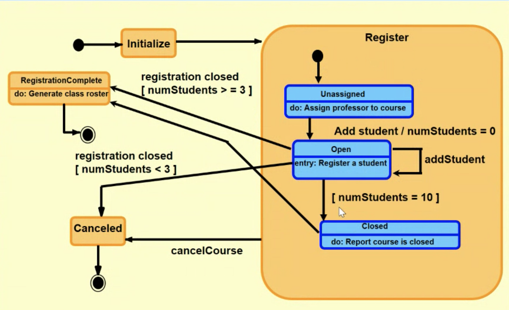

# Week5-models-and-tools

- UML is a modelling language specifically designed to facilitate modelling of a software system without reference to the implementation approaches.
- The efficiency of a software process is associated with the use of Computer-Assisted Software Engineering (CASE) tools.

## UML provide standardised diagrams

## Eliciting modelling diagrams

- Use Case Diagram
- Class Diagram
- Component Diagram
- Sequence diagram
- Collaboration diagram
- State diagram

## Use case diagram

## Class Diagram

## Collaboration/sequence Diagram

## State Transition Diagram

