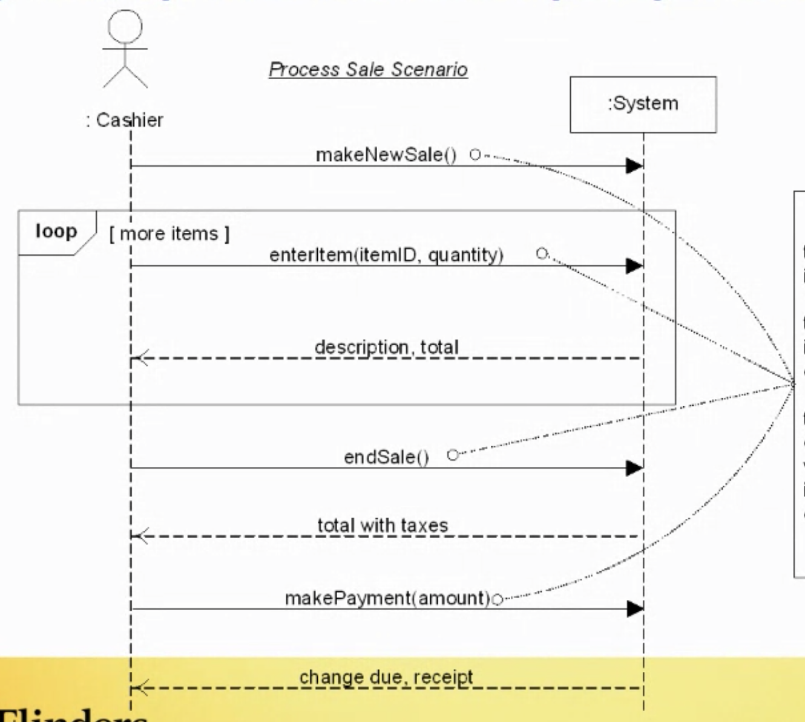
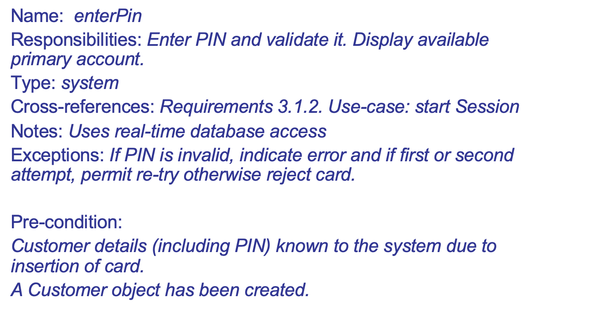

# Week7 System Sequence Diagram

## System Operations and Operation Contract

**system operations** –operations that the system as a black box offers in its public interface.
**contract** defines the responsibilities and pre/post-conditions that apply to the use of an operation.  

### Example

