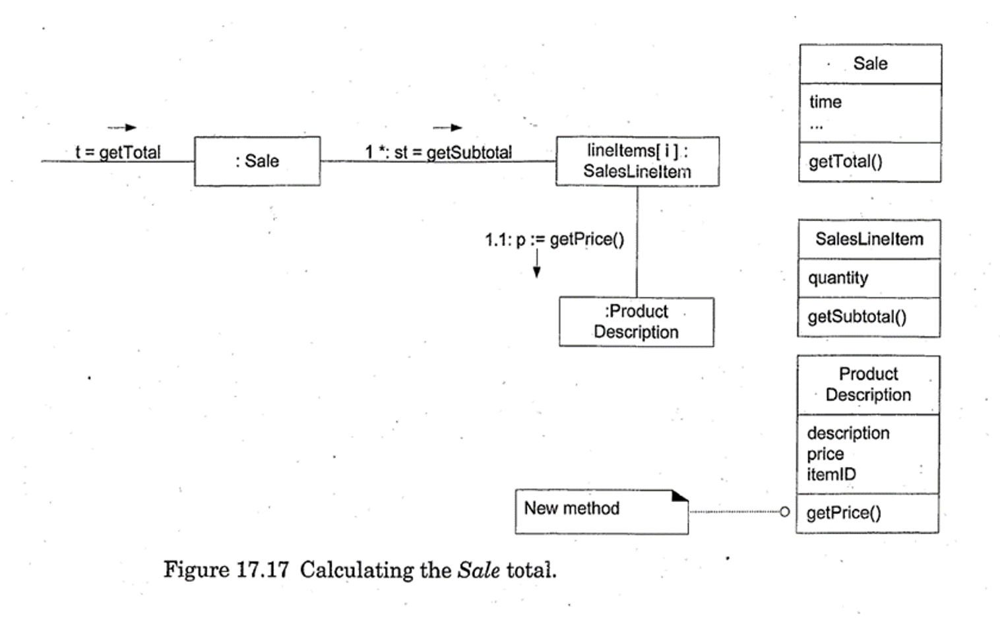
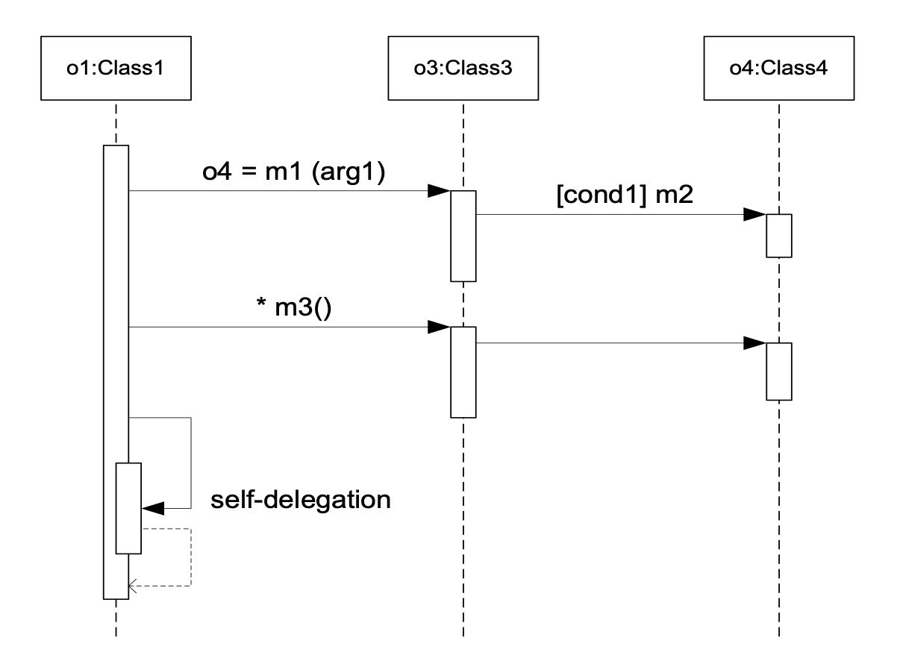
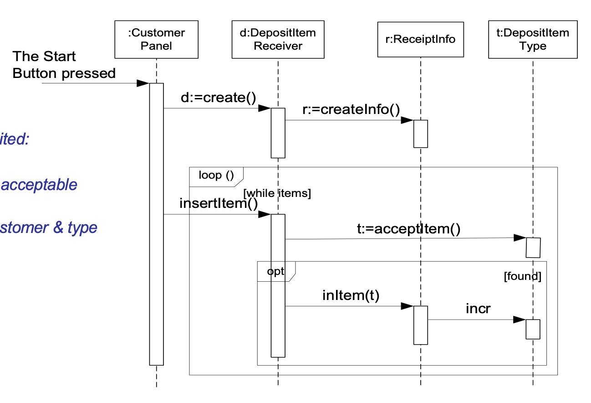
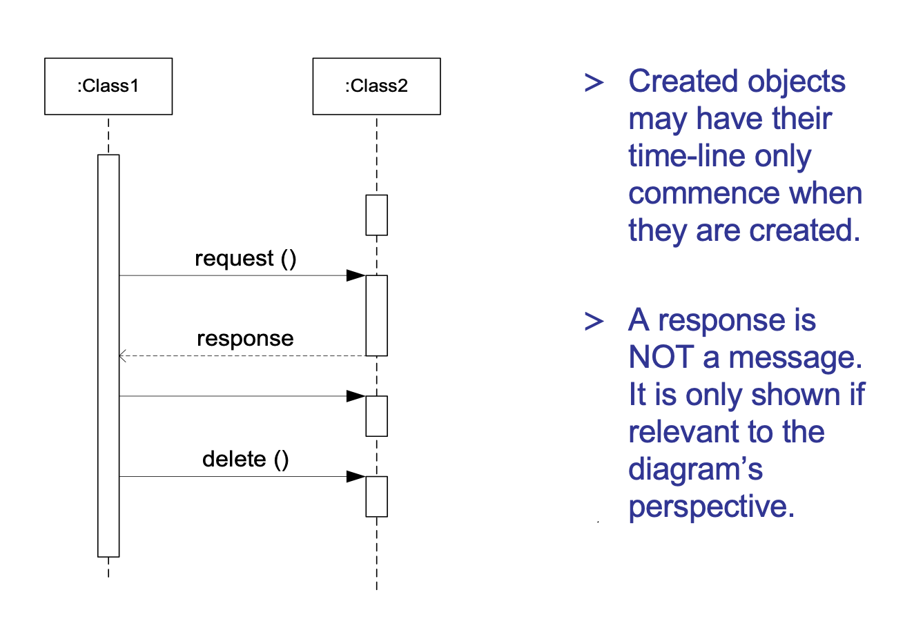
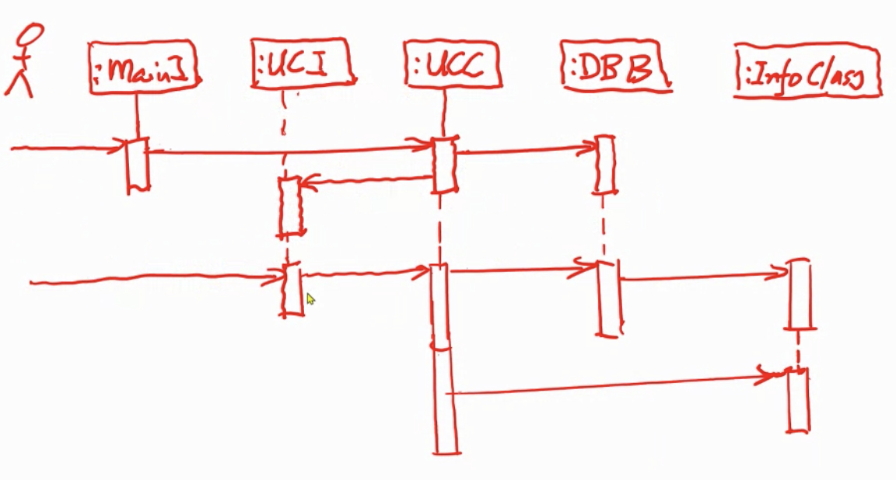
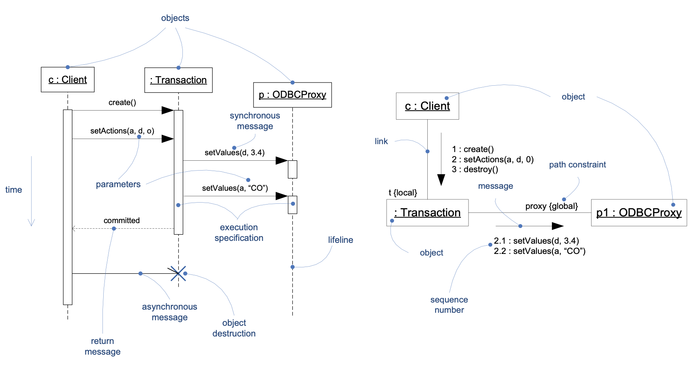
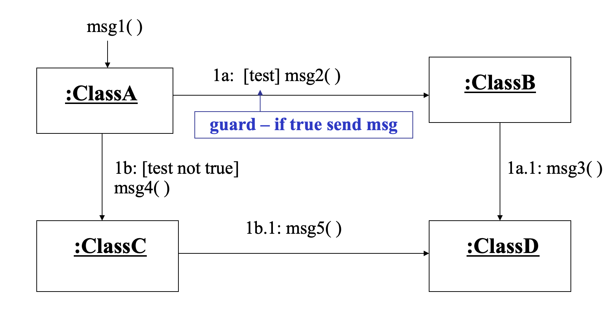

# Week9 More Interaction Diagram

Generating, specifying and capturing behaviour with UML

- Sequence diagram
- Communication diagram

## Messages, Operations and Methods

**Message** - passes an object the information on the activity (potential state change) that it is to carry out

**Operation** - service provided by an object (its responsibility)

## sequence diagrams

focus: chronological course of communication

## communication (collaboration) diagrams

focus: relations between objects, their topography

