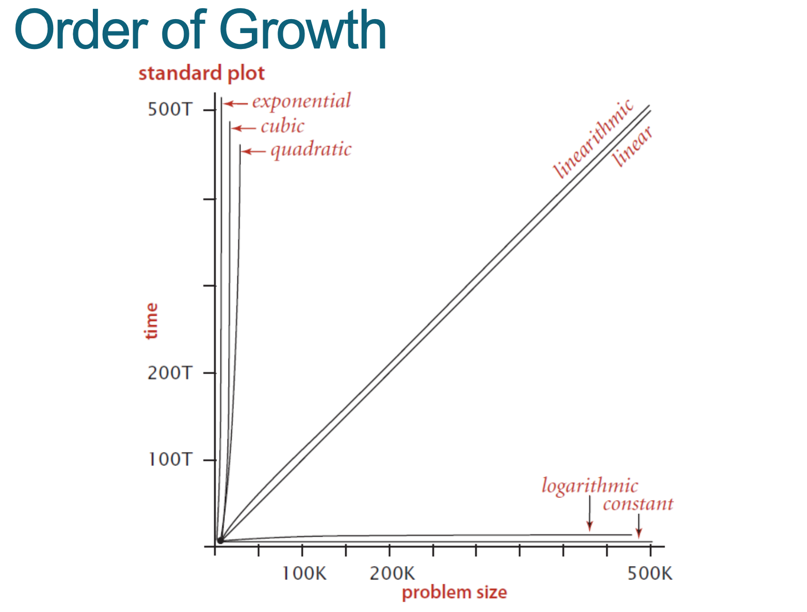

# Week 1

## Table of Contents

1. [Algorithms](#Algorithms)
2. [References](#References)

<!-- - Big(O) - log n, n log n, 0(1), 2n, n
- Sorting algorithms
- Hashing - Constant time lookup
- Binary search -  splits arr in half -->

## Algorithms

An algorithm is an explicit sequence of steps to be
performed in order to solve a problem

### Examples of algorithms

- Search engines
- Database transactions (Sales and inventory)
- Compression algorithms (GIFs, MPEG)

### Choosing an algorithm

When making the decision on which algorithm to choose which are designed to solve the same problem

1. 🎯**Accuracy** - The expected result to reach a high enough accuracy to be acceptable, in speech recognition
2. ⌛**Time Complexity** - How long the algorithm takes to run
3. 💾**Space Complexity** - Amount of disk space or memory an algorithm requires to run

This all depends on the priorities of your algorithm e.g. Speech recognition (IOS siri) prioritizes quick response time over accuracy

### Time Space Complexity

Running empirical tests on the algorithms of different sizes of inputs, and measure the results to figure out the time space complexity

## Big O notation
## Searches
### Binary Search *O(log n)*
This algorithm halves the size of the problem every time
### Exponential growth  *O(2n)*
This algorithm has exponential time complexity

## References
