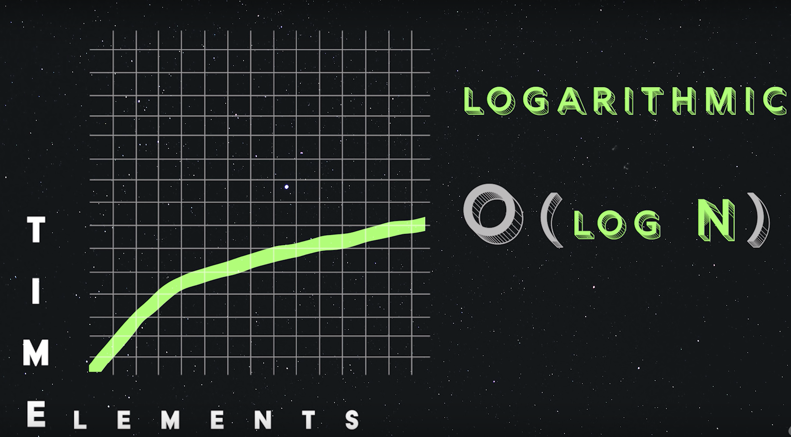
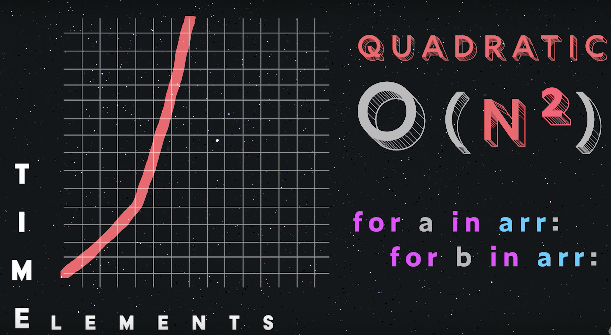

# Week 1 - Analysis of Algorithms

## Table of Contents

1. [Algorithms](#Algorithms)
2. [References](#References)
3. [Big O notation](#Big%20O%20notation)

## Algorithms

An algorithm is an explicit sequence of steps to be
performed in order to solve a problem

### Examples of algorithms

- Search engines
- Database transactions (Sales and inventory)
- Compression algorithms (GIFs, MPEG)

### Choosing an algorithm

When making the decision on which algorithm to choose which are designed to solve the same problem

1. 🎯**Accuracy** - The expected result to reach a high enough accuracy to be acceptable, in speech recognition
2. ⌛**Time Complexity** - How long the algorithm takes to run
3. 💾**Space Complexity** - Amount of disk space or memory an algorithm requires to run

This all depends on the priorities of your algorithm e.g. Speech recognition (IOS siri) prioritizes quick response time over accuracy

### Time Space Complexity

Running empirical tests on the algorithms of different sizes of inputs, and measure the results to figure out the time space complexity

## Big O notation

### 1.Linear complexity `O (n)`

Takes one unit of time to loop over each element in an array, used in sequential search's


```javascript
const array = ['a', 'b', 'c'];

array.forEach((element) => {
  return element;
});
```

### 2.Logarithmic Complexity `O (log N)`

In a `sorted` array we can use a `binary search` which search's a sorted array by repeatedly dividing the search interval in half.

`Binary Search` - Algorithm halves the size of the problem every time



### Example of Binary vs Sequential search


### 3.Constant time complexity `O (1)`

Most efficient no matter how big the array is it will always take the same amount of time
e.g. Looking up a element in an array by its index


### 4. Quadratic Complexity `O (N^2)`

Where the number of inputs is rasied to the power of 2 e.g. Loop within a loop



```javascript
// Double loop
for a in arr:
  for b in arr:
```

### Exponential Complexity `O (2^N)`

Finding every possibility


## Space time complexity tables


## References

- [Big-O Notation in 100 Seconds (Video)](https://www.youtube.com/watch?v=g2o22C3CRfU)
